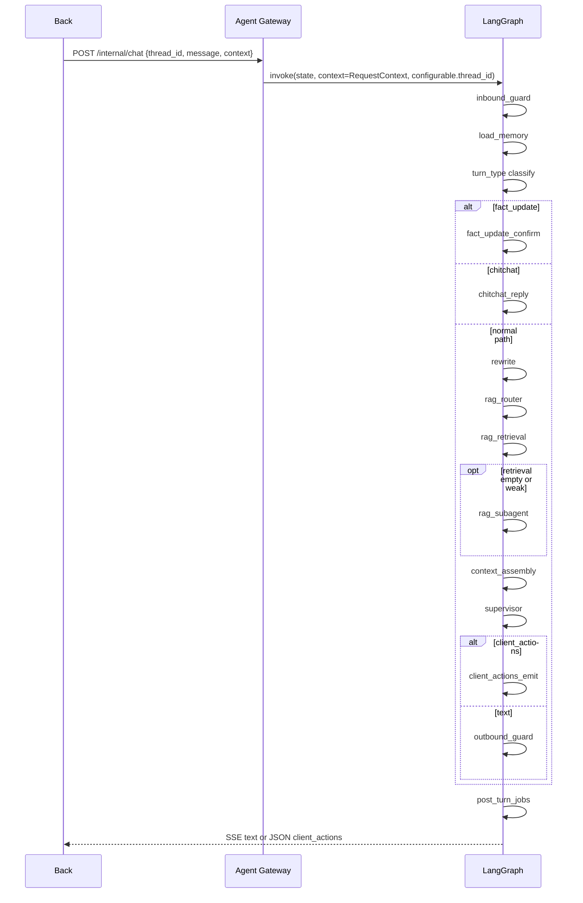

# commonAgent

Front -> Back -> Agent 三层通用智能体项目。目标是提供一个有长期记忆、RAG、LangGraph/deepagents 主 Agent、客户端工具指令与最小前后端占位的可演进架构。

> 本文件是当前运行架构与入口。执行任务前先读 [AGENTS.md](AGENTS.md)、本文件、[docs/progress.md](docs/progress.md) 和对应的 [docs/prompts/](docs/prompts/) 任务卡。

## 当前状态

| 项 | 状态 |
|----|------|
| 核心任务 | 01-48 已完成 |
| Agent | FastAPI Gateway + LangGraph 主图 + Postgres Checkpointer + mem0 + RAG |
| Back | FastAPI 占位服务，注入 demo context，转发 Agent |
| Front | 静态单页，sessionStorage `thread_id`，SSE 展示，`client_actions` demo |
| 进度文档 | [docs/progress.md](docs/progress.md) |

## 文档秩序

本仓库的文档层级固定如下：

1. [AGENTS.md](AGENTS.md)：跨工具 AI 工作规则与治理规则。
2. [README.md](README.md)：当前运行架构、API、状态、环境和边界契约。
3. [docs/progress.md](docs/progress.md)：任务状态、依赖和变更日志。
4. [docs/prompts/](docs/prompts/)：单个可执行任务的范围和测试计划。
5. [docs/prd/](docs/prd/)：设计意图、历史决策和未来规划。
6. `docs/maps/`：基于当前代码结构生成的导航地图，不引入新契约。

更新原则：

- `README.md` 只写当前事实，不提前描述未来结构。
- `docs/prd/` 可保留草案和历史，不覆盖 README 的当前契约。
- `docs/maps/` 只回答维护问题，指向实现和测试入口，不承担设计决策职责。
- 如果任务改变架构、API、状态/context、memory、RAG、`client_actions`、目录布局或环境变量，必须在同一次变更中同步更新相关文档。
- 如果要改变 AI 工作规则或文档治理规则，先说明问题、替代规则、收益和风险，并取得用户同意，再改 [AGENTS.md](AGENTS.md)。

重构后的代码导航见：

- [chat-turn-pipeline.md](/Users/liurixing/Documents/codes/ai/commonAgent/docs/maps/chat-turn-pipeline.md)
- [state-fields.md](/Users/liurixing/Documents/codes/ai/commonAgent/docs/maps/state-fields.md)
- [llm-calls.md](/Users/liurixing/Documents/codes/ai/commonAgent/docs/maps/llm-calls.md)
- [rag-flow.md](/Users/liurixing/Documents/codes/ai/commonAgent/docs/maps/rag-flow.md)
- [client-actions.md](/Users/liurixing/Documents/codes/ai/commonAgent/docs/maps/client-actions.md)
- [failure-modes.md](/Users/liurixing/Documents/codes/ai/commonAgent/docs/maps/failure-modes.md)

## 目录结构

```text
commonAgent/
├── AGENTS.md
├── README.md
├── front/                 # 静态单页：thread_id、SSE、client_actions demo
├── back/                  # Front 入口：demo context、工具白名单、转发 Agent
├── agent/
│   ├── src/
│   │   ├── contracts/     # 跨模块 typed contracts：routing / execution / path / context / rag / sse / events / llm
│   │   ├── domain/        # 纯领域逻辑：RAG merge / BM25 / formatting / retrieval service
│   │   ├── gateway/       # Agent HTTP：chat / history / ingest schemas and routes
│   │   ├── graph/         # LangGraph build、state、context、nodes facade、executors
│   │   ├── guardrails/    # 入站 / 出站护栏
│   │   ├── infrastructure/# LLM Gateway、Qdrant store、LangSmith adapter
│   │   ├── memory/        # checkpoint、history、summary、profile、mem0、post_turn
│   │   ├── observability/ # event collector、path contract、tracing facade
│   │   ├── rag/           # rewrite / router / ingest / retriever facade
│   │   └── settings/      # .env -> Settings
│   ├── evals/             # 本地 seed 与评测说明
│   ├── scripts/           # trace / RAG eval / LangSmith dataset 辅助脚本
│   └── tests/
├── docs/
│   ├── maps/              # 当前代码导航地图
│   ├── prd/               # 设计草案与历史决策
│   ├── progress.md
│   └── prompts/           # 可执行任务卡
└── .cursor/skills/        # Cursor 适配层，核心规则回指 AGENTS.md
```

## 运行边界

| 层级 | 职责 |
|------|------|
| Front | 对话 UI、`thread_id` 持久化、SSE 渲染、`client_actions` 确认与执行 |
| Back | 鉴权入口、计算 `role_id`、过滤工具白名单、转发 Agent |
| Agent | 记忆装配、RAG、LangGraph 主图、deepagents、护栏、SSE、历史和 ingest API |

硬约束：

- Agent 仅内网可达，浏览器必须经过 Back。
- `thread_id` 是 checkpoint 会话键。
- `user_id`、`role_id`、`tools[]` 是每轮 request context，不能从 checkpoint state 取权限。
- 外部工具只以 `client_actions` 形式发给客户端执行；Agent 不执行、不等待、不 resume。
- Back 拥有鉴权、角色计算和外部工具白名单过滤权。
- Front 拥有 `thread_id` 保存和客户端动作执行权。

## Graph 契约

图入口在 [build.py](/Users/liurixing/Documents/codes/ai/commonAgent/agent/src/graph/build.py:1)，按 `context_schema + configurable.thread_id + state_schema` 调用：

```python
graph.invoke(
    {"messages": [HumanMessage(content=message)]},
    context=request_context.model_dump(),
    config={"configurable": {"thread_id": thread_id}},
)
```

运行期契约：

- `AgentState.messages` 是跨轮持久化的权威对话历史。
- 其余单轮字段通过 `EphemeralValue` 挂在 [state.py](/Users/liurixing/Documents/codes/ai/commonAgent/agent/src/graph/state.py:1)，不可依赖上一轮残留。
- `GraphContextSchema` 只携带 `user_id`、`role_id`、`tools[]`，作为每轮上下文，不进入 checkpoint 作为权限依据。
- `ContextBundle` 是模型上下文单一来源，包含 `system_prompt`、`model_messages`、`budget`、`sources`；执行器和 trace 读同一份 bundle。

## 单轮流水线

主图拓扑在 [build.py](/Users/liurixing/Documents/codes/ai/commonAgent/agent/src/graph/build.py:1)，节点实现在 [graph/nodes/](/Users/liurixing/Documents/codes/ai/commonAgent/agent/src/graph/nodes/__init__.py:1)。



路径规则：

- `fact_update` 走模板确认快速路径，跳过 rewrite、RAG、Supervisor 和 outbound guard。
- `chitchat` 走轻量执行器，默认模板，可选小模型。
- `knowledge_query` 直接进入 RAG，跳过 router 小模型。
- `ambiguous` 或旧规则无法确定时，才使用 rewrite/router 小模型与 deepagents。
- `post_turn` 异步调度 summary 和 mem0 写入，不阻塞当前响应。

## RAG 与记忆

RAG：

- 兼容入口在 [retriever.py](/Users/liurixing/Documents/codes/ai/commonAgent/agent/src/rag/retriever.py:1)，真实编排在 [service.py](/Users/liurixing/Documents/codes/ai/commonAgent/agent/src/domain/rag/service.py:1)。
- Qdrant 适配在 [kb_store.py](/Users/liurixing/Documents/codes/ai/commonAgent/agent/src/infrastructure/qdrant/kb_store.py:1)，按 `role_id` 过滤。
- dense 检索失败时继续本地 BM25 fallback，不把整段 RAG 置空。
- dense + lexical 候选先 merge，再 rerank，再格式化为带 `[doc:.../chunk:...]` 标记的知识片段。
- RagSubAgent 只在主检索为空或弱命中时做二查。

记忆：

- 完整对话保存在 Postgres checkpointer，键是 `thread_id`。
- 用户偏好保存在本地 mem0 OSS `Memory` + 本地/内网 Qdrant，键是 `user_id`。
- `mem0_memories` 在 state 中只保留 list[str]；归一化视图在 `memory_profile`。
- `rolling_summary`、mem0、RAG、tools schema、messages 都受 `ContextBudget` 约束。

mem0 约束：

- 只允许本地 OSS `Memory` + 本地/内网 Qdrant。
- 禁止 mem0 cloud、`MemoryClient`、`MEM0_API_KEY`、`api.mem0.ai`。
- `MEM0_MOCK=false`、`QDRANT_MOCK=false` 是运行时默认值；测试需显式配置 mock。

## LLM Gateway

所有 provider 调用都从 [gateway.py](/Users/liurixing/Documents/codes/ai/commonAgent/agent/src/infrastructure/llm/gateway.py:1) 进入，业务模块只声明 `ModelUseCase`，不直接构造 provider client。

| `ModelUseCase` | 用途 | 默认配置来源 |
|----------------|------|-------------|
| `MAIN_ANSWER` | deepagents Supervisor 主回复 | `OPENAI_MODEL_NAME` |
| `RAG_ANSWER` | 简单知识问答执行器 | `OPENAI_MODEL_NAME` |
| `REWRITE` | 指代消解 | `REWRITE_MODEL_NAME` |
| `ROUTER` | RAG 路由分类 | `RAG_ROUTER_MODEL_NAME` |
| `CHITCHAT` | 寒暄轻量回复 | `CHITCHAT_MODEL_NAME` |
| `MEM0_WRITE` | mem0 infer 写入 | `MEM0_LLM_MODEL_NAME` |
| `SUMMARY` | rolling summary | `OPENAI_MODEL_NAME` |
| `EMBEDDING` | embedding | `EMBEDDING_MODEL` |
| `RERANK` | rerank | `RERANK_MODEL` |

Gateway 负责：

- 模型名、token 限额、timeout、streaming policy 解析。
- chat / embedding / rerank client 构造。
- rerank HTTP 失败时回退到稳定顺序分数。
- metadata 统一输出给 tracing 和测试。

## client_actions 契约

`client_actions` 是客户端动作，不是 Agent 侧 tool call。契约定义在 [schemas.py](/Users/liurixing/Documents/codes/ai/commonAgent/agent/src/gateway/schemas.py:1)。

```json
{
  "client_actions": [
    {
      "tool": "jumpPage",
      "args": { "page": "pageA" },
      "requires_approval": false
    }
  ]
}
```

边界规则：

- Agent 只产出结构化动作，不执行工具，也不等待结果。
- Back 注入 `tools[]` 白名单，并把 `requires_approval` 透传给 Front。
- Front 负责确认、执行以及本地 UI 后果。
- 带 `tools[]` 的回合禁用 live token streaming，避免 `client_actions` JSON 被拆成自然语言 token。

## API

Agent Gateway：

```http
GET /health
POST /internal/chat
GET /internal/threads/{thread_id}/messages?cursor=&limit=20
POST /internal/kb/ingest
```

`POST /internal/chat` 请求体：

```json
{
  "thread_id": "uuid-or-session-id",
  "message": "用户输入",
  "context": {
    "user_id": "u1",
    "role_id": "role-sales",
    "tools": []
  }
}
```

响应：

- 纯文本：`text/event-stream`，事件契约由 [sse.py](/Users/liurixing/Documents/codes/ai/commonAgent/agent/src/contracts/sse.py:1) 校验。
- 客户端动作：`application/json`，body 为 `{ "text": null, "client_actions": [...] }`。

Back：

- `POST /api/chat`：接收 Front `{thread_id, message}`，注入 demo context，转发 Agent。
- `GET /health`：存活检查。

Front：

- 默认请求 `http://127.0.0.1:8080/api/chat`。
- `thread_id` 保存在 sessionStorage；刷新保留，新开会话重新生成。

## 可观测与评测

可观测：

- typed 事件定义在 [events.py](/Users/liurixing/Documents/codes/ai/commonAgent/agent/src/contracts/events.py:1)。
- 事件收集器在 [events.py](/Users/liurixing/Documents/codes/ai/commonAgent/agent/src/observability/events.py:1)。
- LangSmith 适配在 [metadata_mapper.py](/Users/liurixing/Documents/codes/ai/commonAgent/agent/src/infrastructure/langsmith/metadata_mapper.py:1)。
- 业务逻辑优先 emit 事件，再由 LangSmith adapter 映射 metadata；兼容 facade 仍保留。

评测：

- 本地 seed 在 [seed.json](/Users/liurixing/Documents/codes/ai/commonAgent/agent/evals/seed.json)。
- `expected_answer` 与 `expected_path` 分开维护。
- RAG 样例可带 `kb_fixture`、`expected_doc_ids`、`forbidden_doc_ids` 做 role 过滤评测。

## 本地运行

环境要求：

- Python >= 3.11
- [uv](https://docs.astral.sh/uv/)
- Node.js/npm
- Postgres
- Qdrant
- OpenAI 兼容 LLM / Embedding / Rerank provider
- 可选 LangSmith

启动顺序：

```bash
# 终端 1 - Agent
cd agent
uv sync
cp .env.example .env
uv run uvicorn src.main:app --host 127.0.0.1 --port 18080

# 终端 2 - Back
cd back
uv sync
cp .env.example .env
uv run uvicorn src.main:app --host 127.0.0.1 --port 8080

# 终端 3 - Front
cd front
npm install
npm run start
```

LangGraph 开发入口：

```bash
cd agent
uv run langgraph dev
```

本地 Postgres 示例：

```bash
docker exec -it my-postgres psql -U postgres -c "CREATE DATABASE common_agent;"
```

## 环境变量

Agent 环境契约以 [agent/.env.example](/Users/liurixing/Documents/codes/ai/commonAgent/agent/.env.example) 为准，并与 [config.py](/Users/liurixing/Documents/codes/ai/commonAgent/agent/src/settings/config.py:1)、`agent/.env` 同步。

| 分组 | 关键变量 | 用途 |
|------|----------|------|
| LangSmith | `LANGSMITH_API_KEY`、`LANGCHAIN_TRACING_V2`、`LANGCHAIN_PROJECT`、`LANGCHAIN_ENDPOINT` | tracing |
| Main LLM | `OPENAI_API_KEY`、`OPENAI_BASE_URL`、`OPENAI_MODEL_NAME` | 主回复模型 |
| Rewrite / Chitchat | `REWRITE_MODEL_NAME`、`REWRITE_MAX_TOKENS`、`REWRITE_TIMEOUT_SECONDS`、`REWRITE_SKIP_ENABLED`、`REWRITE_FORCE`、`CHITCHAT_USE_LLM`、`CHITCHAT_MODEL_NAME`、`CHITCHAT_MAX_TOKENS`、`CHITCHAT_TIMEOUT_SECONDS` | 小任务模型 |
| Router | `RAG_ROUTER_MODE`、`RAG_ROUTER_MODEL_NAME`、`RAG_ROUTER_MAX_TOKENS`、`RAG_ROUTER_TIMEOUT_SECONDS` | RAG 路由 |
| Embedding / Rerank | `EMBEDDING_MODEL`、`EMBEDDING_MODEL_DIMS`、`RERANK_MODEL`、`RERANK_TOP_K` | 检索基础设施 |
| Qdrant / mem0 | `QDRANT_*`、`MEM0_*` | KB 与用户记忆 |
| Context Budget | `MEMORY_PROFILE_MAX_FACTS`、`MEM0_FREE_TEXT_MAX_FACTS`、`SUMMARY_MAX_CHARS`、`RAG_CHUNK_MAX_CHARS`、`RAG_CONTEXT_MAX_CHARS`、`TOOLS_SCHEMA_MAX_CHARS`、`MODEL_MESSAGE_MAX_TURNS`、`MODEL_MESSAGE_MAX_CHARS` | 上下文预算 |
| Postgres / Gateway / Guardrails | `DATABASE_URL`、`AGENT_HOST`、`AGENT_PORT`、`GUARDRAILS_ENABLED` | 服务入口与护栏 |

Back 变量见 [back/.env.example](/Users/liurixing/Documents/codes/ai/commonAgent/back/.env.example)：`AGENT_URL`、`BACK_HOST`、`BACK_PORT`、`DEMO_USER_ID`、`DEMO_ROLE_ID`、`DEMO_TOOLS_FILE`、`AGENT_TIMEOUT_SECONDS`。

## 验证入口

任务 48 的文档检查：

```bash
rg -n "agent-major-refactor|chat-turn-pipeline|state-fields|llm-calls|rag-flow|client-actions|failure-modes" README.md docs
rg -n "文档秩序|Governance|Source Of Truth|source of truth|用户同意|approval" AGENTS.md README.md docs
rg -n "TODO|待补|旧结构" README.md docs/maps docs/progress.md
```

常用测试：

```bash
cd agent
uv run pytest tests/test_graph_compile.py tests/test_state_lifecycle.py tests/test_context_assembly.py -v
uv run pytest tests/test_llm_gateway.py tests/test_rag_boundaries.py tests/test_client_actions.py tests/test_chat_sse.py -v
make test

cd /Users/liurixing/Documents/codes/ai/commonAgent/back
uv run pytest tests/test_back_forward.py -v
```

补充脚本：

```bash
cd agent
./scripts/fetch_trace.sh --latest
uv run python scripts/run_rag_eval.py --seed evals/seed.json --json
uv run python scripts/sync_langsmith_dataset.py --dataset-name common-agent-seed --seed evals/seed.json --dry-run
```

没有 Postgres/Qdrant/LLM 本地服务时，优先运行 mock 或单元测试，并在任务记录中说明跳过项。

## PRD 说明

[docs/prd/agent-major-refactor.md](/Users/liurixing/Documents/codes/ai/commonAgent/docs/prd/agent-major-refactor.md) 与同目录其他 PRD 属于设计历史、学习记录或未来规划，不替代本 README 的当前运行契约。只有当任务实际落地并同步更新 README 后，相关设计才算进入当前 source of truth。
