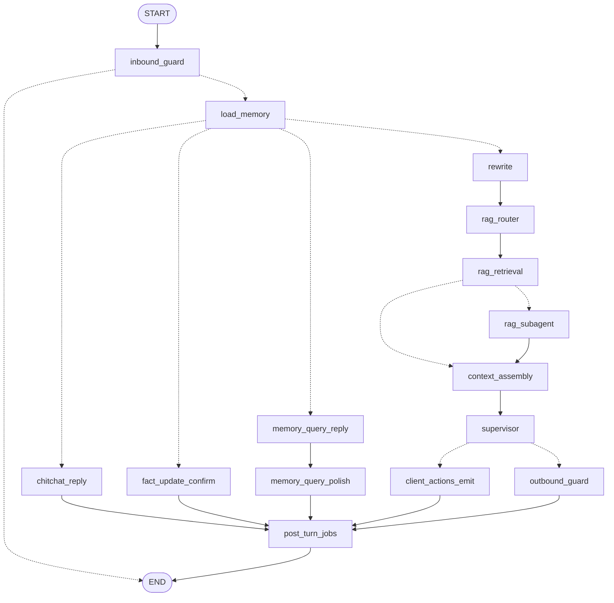
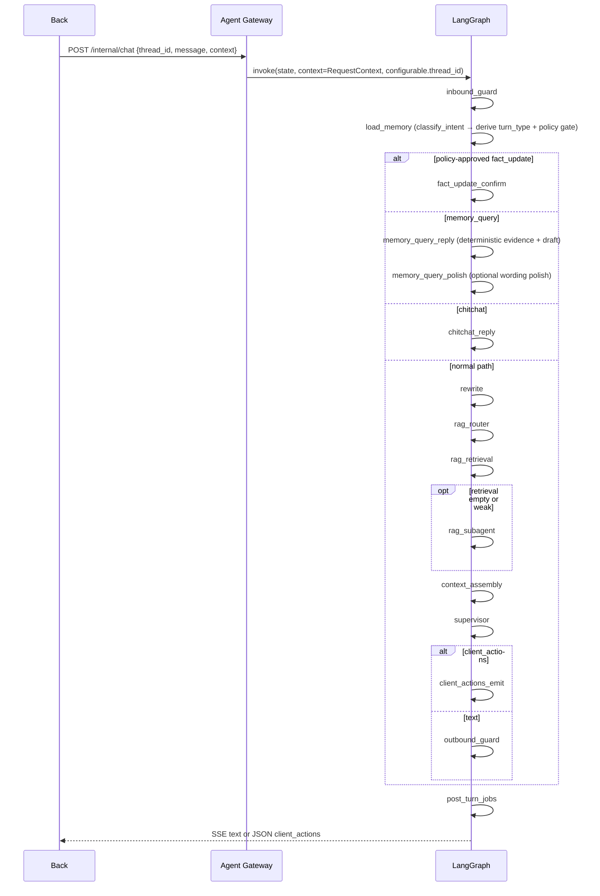

# commonAgent

Front -> Back -> Agent 三层通用智能体项目。目标是提供一个有长期记忆、RAG、LangGraph/deepagents 主 Agent、客户端工具指令与最小前后端占位的可演进架构。

> 本文件是当前运行架构与入口。执行任务前先读 [AGENTS.md](AGENTS.md)、本文件、[docs/progress.md](docs/progress.md) 和对应的 [docs/prompts/](docs/prompts/) 任务卡。

## 当前状态

| 项 | 状态 |
|----|------|
| 核心任务 | 01-92 已完成（Agent 核心 01-80 + 演示平台 81-92） |
| Agent | FastAPI Gateway + LangGraph 主图 + 控制面 + Postgres Checkpointer/Store + langmem + RAG（`role_ids[]` OR 检索） |
| Back | Cookie Session、Postgres `common_agent_back`、学生/账号/RAG meta、按 Session 注入 `role_ids[]` 并转发 Agent |
| Front | Vue 3 + TS + Pinia + Naive UI SPA（dev `5173`，proxy → Back）；全局 ChatDrawer SSE + `client_actions` |
| 演示手册 | [docs/demo-walkthrough.md](docs/demo-walkthrough.md) |
| 进度文档 | [docs/progress.md](docs/progress.md) |

## 文档秩序

本仓库的文档层级固定如下：

1. [AGENTS.md](AGENTS.md)：跨工具 AI 工作规则与治理规则。
2. [README.md](README.md)：当前运行架构、API、状态、环境和边界契约。
3. [docs/progress.md](docs/progress.md)：任务状态、依赖和变更日志。
4. [docs/prompts/](docs/prompts/)：单个可执行任务的范围和测试计划。
5. [docs/prd/](docs/prd/)：设计意图、历史决策和未来规划。
6. `docs/maps/`：基于当前代码结构生成的导航地图，不引入新契约。

更新原则：

- `README.md` 只写当前事实，不提前描述未来结构。
- `docs/prd/` 可保留草案和历史，不覆盖 README 的当前契约。
- `docs/maps/` 只回答维护问题，指向实现和测试入口，不承担设计决策职责。
- 如果任务改变架构、API、状态/context、memory、RAG、`client_actions`、目录布局或环境变量，必须在同一次变更中同步更新相关文档。
- 如果要改变 AI 工作规则或文档治理规则，先说明问题、替代规则、收益和风险，并取得用户同意，再改 [AGENTS.md](AGENTS.md)。

重构后的代码导航见：

- [chat-turn-pipeline.md](/Users/liurixing/Documents/codes/ai/commonAgent/docs/maps/chat-turn-pipeline.md)
- [state-fields.md](/Users/liurixing/Documents/codes/ai/commonAgent/docs/maps/state-fields.md)
- [llm-calls.md](/Users/liurixing/Documents/codes/ai/commonAgent/docs/maps/llm-calls.md)
- [rag-flow.md](/Users/liurixing/Documents/codes/ai/commonAgent/docs/maps/rag-flow.md)
- [client-actions.md](/Users/liurixing/Documents/codes/ai/commonAgent/docs/maps/client-actions.md)
- [failure-modes.md](/Users/liurixing/Documents/codes/ai/commonAgent/docs/maps/failure-modes.md)
- [control-plane.md](/Users/liurixing/Documents/codes/ai/commonAgent/docs/maps/control-plane.md)
- [demo-platform.md](/Users/liurixing/Documents/codes/ai/commonAgent/docs/maps/demo-platform.md)

## 目录结构

```text
commonAgent/
├── AGENTS.md
├── README.md
├── front/                 # Vue 3 SPA（演示平台，Vite 入口 index.html）
├── back/                  # Session 鉴权、业务 CRUD、context 注入、转发 Agent
├── agent/
│   ├── src/
│   │   ├── contracts/     # 跨模块 typed contracts：routing / execution / path / context / rag / sse / events / llm / intent / fallback
│   │   ├── domain/        # 纯领域逻辑：RAG merge / BM25 / formatting / retrieval service
│   │   ├── gateway/       # Agent HTTP：chat / history / ingest schemas and routes
│   │   ├── graph/         # LangGraph build、state、context、nodes facade、executors
│   │   ├── guardrails/    # 入站 / 出站护栏
│   │   ├── infrastructure/# LLM Gateway、Qdrant store、LangSmith adapter
│   │   ├── intent/        # 控制面：signals / rules / structured classifier / policy / fallback / feedback
│   │   ├── memory/        # checkpoint、history、summary、profile、Store/langmem、post_turn
│   │   ├── observability/ # event collector、path contract、tracing facade
│   │   ├── rag/           # rewrite / router / ingest / retriever facade
│   │   └── settings/      # .env -> Settings
│   ├── evals/             # 本地 seed 与评测说明
│   ├── scripts/           # trace / RAG eval / LangSmith dataset 辅助脚本
│   └── tests/
├── docs/
│   ├── maps/              # 当前代码导航地图
│   ├── prd/               # 设计草案与历史决策
│   ├── progress.md
│   └── prompts/           # 可执行任务卡
└── .cursor/skills/        # Cursor 适配层，核心规则回指 AGENTS.md
```

## 运行边界

| 层级 | 职责 |
|------|------|
| Front | Vue SPA：登录、业务 CRUD、RAG 管理、对话抽屉、`thread_id`（sessionStorage）、SSE、`client_actions` |
| Back | Cookie Session、用户/角色/学生/KB meta、`role_ids[]` 与 `tools[]` 并集、thread 归属、转发 Agent |
| Agent | 记忆装配、RAG（多 `role_id` OR）、LangGraph 主图、deepagents、护栏、SSE、历史和 ingest API |

硬约束：

- Agent 仅内网可达，浏览器必须经过 Back。
- `thread_id` 是 checkpoint 会话键。
- `user_id`、`role_ids[]`、`tools[]` 是每轮 request context，不能从 checkpoint state 取权限；`role_id` 单字段仅为 deprecated alias。
- 外部工具只以 `client_actions` 形式发给客户端执行；Agent 不执行、不等待、不 resume。
- Back 拥有鉴权、角色计算和外部工具白名单过滤权。
- Front 拥有 `thread_id` 保存和客户端动作执行权。

## Graph 契约

图入口在 [build.py](/Users/liurixing/Documents/codes/ai/commonAgent/agent/src/graph/build.py:1)，按 `context_schema + configurable.thread_id + state_schema` 调用：

```python
graph.invoke(
    {"messages": [HumanMessage(content=message)]},
    context=request_context.model_dump(),
    config={"configurable": {"thread_id": thread_id}},
)
```

运行期契约：

- `AgentState.messages` 是跨轮持久化的权威对话历史。
- 其余单轮字段通过 `EphemeralValue` 挂在 [state.py](/Users/liurixing/Documents/codes/ai/commonAgent/agent/src/graph/state.py:1)，不可依赖上一轮残留。
- `GraphContextSchema` 只携带 `user_id`、`role_ids[]`、`tools[]`，作为每轮上下文，不进入 checkpoint 作为权限依据。
- `ContextBundle` 是模型上下文单一来源，包含 `system_prompt`、`model_messages`、`budget`、`sources`；执行器和 trace 读同一份 bundle。
- `IntentDecision` 是运行时唯一意图权威来源，当前由确定性 `classify_intent()`（signals/rules）在 `load_memory` 阶段生成。
- `turn_type` / `turn_type_reason` 是从 `IntentDecision` 派生的兼容路由字段，供 rewrite/router/executor、path metrics 与 seed 使用；旧 `graph.turn_type.classify_turn_type()` 仅为兼容 adapter，内部委托同一 authority。
- Policy Gate 只决定事实写入快速路径是否准入；被拒绝的旧 `fact_update` 不会模板确认，也不会调度记忆写入。
- `FallbackDecision` 是 Agent 级降级记录，统一写入 path metrics、LangSmith metadata 和 `FALLBACK_TRIGGERED` 事件。

## 单轮流水线

主图拓扑在 [build.py](/Users/liurixing/Documents/codes/ai/commonAgent/agent/src/graph/build.py:1)，节点实现在 [graph/nodes/](/Users/liurixing/Documents/codes/ai/commonAgent/agent/src/graph/nodes/__init__.py:1)。

当前编译拓扑可通过 `cd agent && uv run python scripts/print_graph_mermaid.py` 生成：





路径规则：

- `fact_update` 只有通过 Policy Gate 且 slot fill 成功后才走模板确认快速路径，跳过 rewrite、RAG、Supervisor 和 outbound guard；确认话术含已解析字段摘要（如「已记住：姓名=张三」）。
- `memory_query` 走记忆回答执行器：`memory_query_reply` 生成确定性证据与草稿，`memory_query_polish` 默认用小模型润色话术（`MEMORY_QUERY_POLISH_USE_LLM=true`；关闭或失败时回退模板草稿）；跳过 rewrite、RAG、deepagents，并且 `post_turn` 不写入用户记忆。
- `chitchat` 走轻量执行器，默认模板，可选小模型。
- `knowledge_query` 直接进入 RAG，跳过 router 小模型。
- `ambiguous` 或旧规则无法确定时，才使用 rewrite/router 小模型与 deepagents。
- `post_turn` 异步调度 summary 与用户记忆写入，不阻塞当前响应；有 `memory_write_record` 时走 structured Store profile put，否则走 langmem inferred 慢路径。

## 控制面

控制面在 [intent/](/Users/liurixing/Documents/codes/ai/commonAgent/agent/src/intent/__init__.py:1) 与 [contracts/intent.py](/Users/liurixing/Documents/codes/ai/commonAgent/agent/src/contracts/intent.py:1) 中落地，用于把“用户想做什么”“是否允许快速执行”“失败后如何降级”从执行器中拆出来。

当前运行契约：

- `classify_intent()` 是纯确定性入口：normalize -> signals -> rules，不读 graph state，不调用 LLM，不执行副作用。
- `turn_type_decision_from_intent()` 从 `IntentDecision.turn_type` / `turn_type_reason` 派生兼容 `TurnTypeDecision`；主图与 adapter 共用这一契约。
- `IntentDecision` 包含 `speech_act`、`domain`、`operation`、`route`、`confidence`、`risk`、`reasons`、`evidence` 和 `needs_clarification`，并通过 `route` 派生兼容 `turn_type`。
- `INTENT_CLASSIFIER` 小模型结构化分类器已经有模型用途、schema 校验、repair 和冲突 fallback，但当前 graph 热路径不调用它；它服务于低置信控制面评测和后续接入。
- Policy Gate 当前只准入高置信、低风险、显式属性和值的 `fact_update` 记忆写入快速路径；第一人称疑问会被拒绝并走 `memory_query` 或保守路径。
- `memory_query` 是一等运行路径，回答“我是谁”“我叫什么”“我公司在哪”等记忆读取问题；只基于 `memory_profile` / `user_memories` / 当前 thread 里可靠证据回答，缺失时诚实说明。小模型润色仅改写表达，不得增删事实；校验失败回退 deterministic draft。
- Fallback Manager 用 `FallbackDecision` 记录 intent 低置信/分类失败、policy denied、memory missing、RAG 空/弱命中、tool unavailable、schema/LLM fallback、output guard 等降级；`intent_conflict` 字段保留兼容但常态为 `false`。
- Feedback/Eval 闭环使用 `IntentFeedback`、[intent_seed.json](/Users/liurixing/Documents/codes/ai/commonAgent/agent/evals/intent_seed.json) 和本地 eval runner，将人工纠错或 fallback conflict 转成可回归 seed。

控制面不会绕过三层边界：Back 仍负责鉴权、角色和工具白名单；Agent 只做意图、策略、回答和结构化 `client_actions`；Front 仍负责客户端动作执行。

## RAG 与记忆

RAG：

- 兼容入口在 [retriever.py](/Users/liurixing/Documents/codes/ai/commonAgent/agent/src/rag/retriever.py:1)，真实编排在 [service.py](/Users/liurixing/Documents/codes/ai/commonAgent/agent/src/domain/rag/service.py:1)。
- Qdrant 适配在 [kb_store.py](/Users/liurixing/Documents/codes/ai/commonAgent/agent/src/infrastructure/qdrant/kb_store.py:1)，按 `role_ids[]` **should OR** 过滤（单角色与旧行为一致）。
- RAG 是否进入检索由控制面派生的有效 `turn_type`、Policy Gate 结果和 RAG router 共同决定；旧 [rag/intent.py](/Users/liurixing/Documents/codes/ai/commonAgent/agent/src/rag/intent.py:1) 只保留局部启发式兼容，不是全局意图权威。
- dense 检索失败时继续本地 BM25 fallback，不把整段 RAG 置空。
- dense + lexical 候选先 merge，再 rerank，再格式化为带 `[doc:.../chunk:...]` 标记的知识片段。
- RagSubAgent 只在主检索为空或弱命中时做二查；二查后仍无可靠来源时返回无来源模板，不交给 deepagents 猜测。

记忆：

- 完整对话保存在 Postgres checkpointer，键是 `thread_id`。
- 用户长期记忆保存在 **LangGraph Postgres Store**（与 checkpointer 同 `DATABASE_URL`），键是 `user_id`；**pgvector 必开**（运维见下文「Postgres + pgvector」）。
- Store 分两层 namespace（见 [contracts/memory_store.py](/Users/liurixing/Documents/codes/ai/commonAgent/agent/src/contracts/memory_store.py)）：
  - **Profile** `("users", user_id, "profile")`：结构化字段 upsert（name、birthday、city 等）。
  - **Collection** `("users", user_id, "facts")`：langmem inferred 自由文本 facts，pgvector 语义检索。
- `user_memories` 在 state 中只保留 `list[str]`（profile + collection 合并后的 canonical fact 文本）；归一化视图在 `memory_profile`。
- `rolling_summary`、用户记忆、RAG、tools schema、messages 都受 `ContextBudget` 约束。
- `memory_query` 只读可靠记忆证据，不触发写入；`post_turn` 会识别该路径并跳过 memory write。润色小模型不计入 supervisor `llm_call_count`。

记忆写入采用 **Single Extraction Point + 双轨** 策略（见 [agent-structured-memory-write.md](/Users/liurixing/Documents/codes/ai/commonAgent/docs/prd/agent-structured-memory-write.md)）：

| 路径 | 触发条件 | 抽取 | 存储 |
|------|----------|------|------|
| **Structured Write** | Policy 通过的 `fact_update` 且 slot fill 成功 | 控制面确定性 slot fill → `StructuredMemoryRecord` | `store_structured_record()` → Store profile `put` |
| **Inferred Write** | 其他会调度 post_turn 的回合（如 `chitchat`） | langmem `create_memory_store_manager` + `MEMORY_EXTRACT` 小模型 | `extract_and_store()` → Store collection |

双轨 **互斥**：同一 turn 若已有 `memory_write_record`，`post_turn` 不得再对该 turn 做 inferred 抽取。

Structured Write 链路：

1. `load_memory`：Policy Gate 通过后，`build_structured_memory_record()` 从 `IntentSignals` 确定性 slot fill，写入单轮 ephemeral `memory_write_record`；fill 失败则拒绝快路径（`policy_denied_reason=structured_fill_failed`）。
2. `fact_update_confirm`：要求 `memory_write_record` 存在，输出 `已记住：{label}={value}。后续我会据此为你提供个性化回答。`
3. `post_turn_jobs`：读取 record，调用 `store_structured_record()`（canonical fact + metadata，无 LLM 二次抽取）。

契约与实现：

- 写入契约：[contracts/memory_write.py](/Users/liurixing/Documents/codes/ai/commonAgent/agent/src/contracts/memory_write.py)
- Slot fill / canonical 文本：[structured_record.py](/Users/liurixing/Documents/codes/ai/commonAgent/agent/src/memory/structured_record.py)
- Structured / inferred write：[write.py](/Users/liurixing/Documents/codes/ai/commonAgent/agent/src/memory/write.py)、[langmem_manager.py](/Users/liurixing/Documents/codes/ai/commonAgent/agent/src/memory/langmem_manager.py)
- Store 工厂 / 读路径：[store.py](/Users/liurixing/Documents/codes/ai/commonAgent/agent/src/memory/store.py)、[read.py](/Users/liurixing/Documents/codes/ai/commonAgent/agent/src/memory/read.py)
- 双轨路由：[post_turn.py](/Users/liurixing/Documents/codes/ai/commonAgent/agent/src/memory/post_turn.py)

可观测：`memory_write.mode`（`structured` \| `inferred`）、`memory_store.*`、`memory_write.record.attribute` 写入 path metrics；Policy 通过的 `fact_update` 在 structured 路径上 **不应** 出现 `stored_empty`（eval regression 覆盖）。

用户记忆约束：

- 仅使用 LangGraph Postgres Store + langmem；禁止第三方托管记忆 SaaS。
- `MEMORY_STORE_MOCK=false`、`QDRANT_MOCK=false` 是运行时默认值；测试需显式配置 mock。
- RAG 知识库仍独立使用 Qdrant `QDRANT_COLLECTION_KB`，与用户记忆 Store 分离。

## LLM Gateway

所有 provider 调用都从 [gateway.py](/Users/liurixing/Documents/codes/ai/commonAgent/agent/src/infrastructure/llm/gateway.py:1) 进入，业务模块只声明 `ModelUseCase`，不直接构造 provider client。

| `ModelUseCase` | 用途 | 默认配置来源 |
|----------------|------|-------------|
| `MAIN_ANSWER` | deepagents Supervisor 主回复 | `OPENAI_MODEL_NAME` |
| `RAG_ANSWER` | 简单知识问答执行器 | `OPENAI_MODEL_NAME` |
| `REWRITE` | 指代消解 | `REWRITE_MODEL_NAME` |
| `ROUTER` | RAG 路由分类 | `RAG_ROUTER_MODEL_NAME` |
| `CHITCHAT` | 寒暄轻量回复 | `CHITCHAT_MODEL_NAME` |
| `MEMORY_EXTRACT` | langmem inferred 抽取（inferred 慢路径） | `MEMORY_EXTRACT_MODEL_NAME` |
| `SUMMARY` | rolling summary | `OPENAI_MODEL_NAME` |
| `EMBEDDING` | embedding | `EMBEDDING_MODEL` |
| `RERANK` | rerank | `RERANK_MODEL` |
| `INTENT_CLASSIFIER` | 结构化 intent 候选分类 | `INTENT_CLASSIFIER_MODEL_NAME` |
| `MEMORY_QUERY_POLISH` | memory_query 话术润色（仅表达，默认开启） | `MEMORY_QUERY_POLISH_MODEL_NAME` |

Gateway 负责：

- 模型名、token 限额、timeout、streaming policy 解析。
- chat / embedding / rerank client 构造。
- rerank HTTP 失败时回退到稳定顺序分数。
- metadata 统一输出给 tracing 和测试。

## client_actions 契约

`client_actions` 是客户端动作，不是 Agent 侧 tool call。契约定义在 [schemas.py](/Users/liurixing/Documents/codes/ai/commonAgent/agent/src/gateway/schemas.py:1)。

```json
{
  "client_actions": [
    {
      "tool": "jumpPage",
      "args": { "page": "pageA" },
      "requires_approval": false
    }
  ]
}
```

边界规则：

- Agent 只产出结构化动作，不执行工具，也不等待结果。
- Back 注入 `tools[]` 白名单，并把 `requires_approval` 透传给 Front。
- Agent 的动作路径同时受 intent route、executor router、工具白名单和解析校验约束；未授权、不可构造或 schema 无效时走 tool fallback。
- Front 负责确认、执行以及本地 UI 后果。
- 带 `tools[]` 的回合禁用 live token streaming，避免 `client_actions` JSON 被拆成自然语言 token。

## API

Agent Gateway：

```http
GET /health
POST /internal/chat
GET /internal/threads/{thread_id}/messages?cursor=&limit=20
POST /internal/kb/ingest
GET /internal/kb/documents?role_id=
GET /internal/kb/documents/{doc_id}?role_id=
DELETE /internal/kb/documents/{doc_id}?role_id=
```

KB 管理分工（演示平台）：

- **向量 + chunk 预览**：Qdrant（Agent list/get/delete）；`GET .../documents/{doc_id}` 仅返回 chunk 列表，**不**拼原文。
- **原文 + 列表 meta**：Back `kb_document_meta`；ingest **成功后双写**；详情/编辑 **正文读 meta.raw_content**。

Back 演示平台（admin）：

- `POST /api/admin/kb/documents`：校验 admin → 转发 Agent ingest → 成功 upsert meta（含 `raw_content`、`chunks_written`、`tokens_estimated`）。
- `GET/PATCH/DELETE /api/admin/kb/documents`：读/写 meta；详情 chunk 概览代理 Agent；删除同时清 Qdrant 与 meta。
- 上传限制：≤2MB；`.txt`/`.md`；UTF-8（JSON `content` 字段同样校验）。

`POST /internal/chat` 请求体：

```json
{
  "thread_id": "uuid-or-session-id",
  "message": "用户输入",
  "context": {
    "user_id": "u1",
    "role_ids": ["role-sales"],
    "tools": []
  }
}
```

响应：

- 纯文本：`text/event-stream`，事件契约由 [sse.py](/Users/liurixing/Documents/codes/ai/commonAgent/agent/src/contracts/sse.py:1) 校验。
- 客户端动作：`application/json`，body 为 `{ "text": null, "client_actions": [...] }`。

Back（演示平台，库 `common_agent_back`）：

- 认证：`POST /api/auth/login` · `POST /api/auth/logout` · `GET /api/me`（Cookie Session）。
- 对话：`POST /api/chat`（Session 注入 `user_id`、`role_ids[]`、`tools[]`）· `GET /api/threads/{thread_id}/messages`（归属 403）。
- 业务：`/api/students` CRUD；admin：`/api/admin/roles` · `/api/admin/users` · `/api/admin/kb/documents`。
- `GET /health`：存活检查。
- 迁移与种子：`cd back && uv run alembic upgrade head && uv run python -m db.seed`（见 [back/.env.example](back/.env.example)）。

Front（Vue SPA）：

- dev：`cd front && npm run dev` → `http://127.0.0.1:5173`（Vite proxy → Back `:8080`，`withCredentials`）。
- `thread_id` 在 sessionStorage；ChatDrawer 消费 SSE / `client_actions`。
- 逐步演示：[docs/demo-walkthrough.md](docs/demo-walkthrough.md)。

## 可观测与评测

可观测：

- typed 事件定义在 [events.py](/Users/liurixing/Documents/codes/ai/commonAgent/agent/src/contracts/events.py:1)。
- 事件收集器在 [events.py](/Users/liurixing/Documents/codes/ai/commonAgent/agent/src/observability/events.py:1)。
- LangSmith 适配在 [metadata_mapper.py](/Users/liurixing/Documents/codes/ai/commonAgent/agent/src/infrastructure/langsmith/metadata_mapper.py:1)。
- 业务逻辑优先 emit 事件，再由 LangSmith adapter 映射 metadata；兼容 facade 仍保留。
- 控制面事件包含 intent classified、policy evaluated、executor chosen、fallback triggered；`intent.conflict` 常态为 `false`。
- path metrics 会输出 `fallback.*`、`intent.*`、`policy.*`、`memory_query.*`、`memory_query.polish.*`、`memory_write.mode`、`memory_write.record.attribute`、`executor`、`llm_call_count` 和各阶段 should/called。

评测：

- 本地 seed 在 [seed.json](/Users/liurixing/Documents/codes/ai/commonAgent/agent/evals/seed.json)。
- 控制面 seed 在 [intent_seed.json](/Users/liurixing/Documents/codes/ai/commonAgent/agent/evals/intent_seed.json)，覆盖 `fact_update`、`memory_query`、`knowledge_query`、`client_action`、`ambiguous`、`general_chat`、`chitchat`、`safety_refusal`。
- 结构化记忆写入 seed 在 [memory_write_seed.json](/Users/liurixing/Documents/codes/ai/commonAgent/agent/evals/memory_write_seed.json)，覆盖 `structured_fact_update`、`inferred_general_chat`、`regression_store_empty`；本地 runner：`scripts/run_memory_write_eval.py`。
- memory_query 润色 seed 在 [memory_query_polish_seed.json](/Users/liurixing/Documents/codes/ai/commonAgent/agent/evals/memory_query_polish_seed.json)，覆盖姓名/地址/偏好/缺失/thread fallback/篡改与不确定表述；本地 runner：`scripts/run_memory_query_polish_eval.py`（mock LLM + 输出校验，默认 `--json`）。
- `expected_answer` 与 `expected_path` 分开维护。
- RAG 样例可带 `kb_fixture`、`expected_doc_ids`、`forbidden_doc_ids` 做 role 过滤评测。
- `IntentFeedback` 可将用户纠错、人工 trace review、path contract 失败或 fallback conflict 转成 `intent_seed.json` 行。

## 本地运行

环境要求：

- Python >= 3.11
- [uv](https://docs.astral.sh/uv/)
- Node.js/npm
- Postgres
- Qdrant
- OpenAI 兼容 LLM / Embedding / Rerank provider
- 可选 LangSmith

一键本地启动（OrbStack/Docker + Agent + Back + Front）：

```bash
chmod +x dev.sh   # 首次
./dev.sh          # 或 ./dev.sh up
```

启动顺序：OrbStack/Docker（`my-postgres`、`qdrant_rag`）→ Back 迁移/seed → Agent `:18080` → Back `:8080` → Front `:5173`。  
前提：已配置 `agent/.env`、`back/.env`（LLM、数据库密码等）。  
Compose 定义见 [`docker-compose.dev.yml`](docker-compose.dev.yml)；若容器已存在则 `docker start`，不会重建数据库。

| 命令 | 说明 |
|------|------|
| `./dev.sh` / `./dev.sh up` | 启动全套 |
| `./dev.sh status` | 容器、进程 PID、HTTP 健康检查 |
| `./dev.sh logs agent` | 实时跟踪 Agent 日志 |
| `./dev.sh logs back` | 实时跟踪 Back 日志 |
| `./dev.sh logs front` | 实时跟踪 Front 日志 |
| `./dev.sh logs all` | 同时跟踪三个服务 |
| `./dev.sh down` | 停止 Agent / Back / Front（Docker 容器保持运行） |
| `./dev.sh down --all` | 停止应用并停止 Postgres / Qdrant 容器 |
| `./dev.sh restart` | 先 `down` 再 `up` |

日志文件（根目录 `.dev/`，已 gitignore）：

| 服务 | 路径 |
|------|------|
| Agent | `.dev/agent.log` |
| Back | `.dev/back.log` |
| Front | `.dev/front.log` |

也可直接查看，例如 `tail -f .dev/back.log` 或 `tail -n 100 .dev/agent.log`。

启动成功后访问：`http://127.0.0.1:5173`（种子账号 admin/123456，alice\|bob/demo123）。

手动分终端启动：

```bash
# 终端 1 - Agent
cd agent
uv sync
cp .env.example .env
uv run uvicorn src.main:app --host 127.0.0.1 --port 18080

# 终端 2 - Back（需 Postgres 库 common_agent_back）
cd back
uv sync
cp .env.example .env
uv run alembic upgrade head
uv run python -m db.seed
uv run uvicorn src.main:app --host 127.0.0.1 --port 8080

# 终端 3 - Front（Vue SPA，dev 默认 5173，proxy → Back :8080）
cd front
npm install
npm run dev
# 浏览器 http://127.0.0.1:5173 — 种子 admin/123456，alice|bob/demo123
```

演示脚本与排障见 [docs/demo-walkthrough.md](docs/demo-walkthrough.md)。

LangGraph 开发入口：

```bash
cd agent
uv run langgraph dev
```

本地 Postgres（Checkpointer + LangGraph Store **同库**）：

LangMem 迁移后，**Checkpointer**（thread 对话）与 **LangGraph Store**（用户长期记忆）共用 `agent/.env` 中的 **`DATABASE_URL`**、同一 `common_agent` 库；Store 首次 `setup()` 会新建独立表，不影响已有 checkpoint 表。

| 层 | 内容 | 读取方式 | 需要 pgvector |
|----|------|----------|---------------|
| **Profile** | 姓名、城市、公司等结构化字段 | 按 `user_id + attribute` 直接 `get` | 否 |
| **Collection** | inferred 自由文本事实 | 按当前问题做语义 search | **是** |

#### 路径 A：新建带 pgvector 的容器（推荐）

适用于 OrbStack / Docker 新环境。镜像版本建议与 Postgres 主版本一致（如 PG 18 → `pgvector/pgvector:pg18`）：

```bash
docker pull pgvector/pgvector:pg18

docker run -d \
  --name my-postgres \
  -e POSTGRES_PASSWORD=postgres \
  -e POSTGRES_DB=common_agent \
  -p 5432:5432 \
  pgvector/pgvector:pg18
```

`agent/.env` 示例（与 checkpoint 相同）：

```text
DATABASE_URL=postgresql://postgres:<password>@localhost:5432/common_agent
```

#### 路径 B：已有普通 `postgres` 镜像（OrbStack 本地 `my-postgres`）

若已用 `postgres:latest` 跑 checkpoint、不想丢库，可在**同一容器**内安装 pgvector 包后启用扩展（版本号按 `SELECT version();` 调整，如 PG 18 → `postgresql-18-pgvector`）：

```bash
# 1. 安装 extension 包（容器内）
docker exec my-postgres bash -c \
  'DEBIAN_FRONTEND=noninteractive apt-get update -qq && apt-get install -y postgresql-18-pgvector'

# 2. 在 DATABASE_URL 指向的库启用（每个 database 一次）
docker exec my-postgres psql -U postgres -d common_agent \
  -c "CREATE EXTENSION IF NOT EXISTS vector;"
```

> **注意**：路径 B 的 apt 安装写在容器文件系统里；若**删除并重建**容器且仍用普通 `postgres` 镜像，需重装 pgvector 包。长期建议换路径 A 镜像并挂载原数据卷，或改用 [pgvector 安装文档](https://github.com/pgvector/pgvector) 在宿主机/DBA 层安装。

已有实例、不能换镜像时：由 DBA 在服务器安装 pgvector 后再执行 `CREATE EXTENSION vector;`。

#### 向量维度须与 Embedding 一致

Store 的 pgvector index 维度必须与 `EMBEDDING_MODEL_DIMS`（见 `agent/.env.example`，默认 `1024`）一致。任务 70 会从 settings 读取该值。

若更换 embedding 模型导致维度变化，需按 LangGraph Store 文档 **重建 index**，或在可接受丢失用户记忆时清空 Store 表后重新 `setup()`（与 Qdrant KB 重建类似）。

#### 验证清单

在仓库根目录或 `agent/` 下，加载 `agent/.env` 后执行：

```bash
# 1. 连接库
psql "$DATABASE_URL" -c "SELECT 1"

# 2. pgvector 已启用
psql "$DATABASE_URL" -c "SELECT extname, extversion FROM pg_extension WHERE extname = 'vector';"

# 3. checkpoint 仍可用（单元测试）
cd agent && uv run pytest tests/test_checkpointer.py -v -k "not integration"

# 4. 有 live Postgres 时：checkpoint + Store 同库 integration
cd agent && uv run pytest tests/test_checkpointer.py tests/test_langmem_store_spike.py -v -m integration
```

期望：`extname = vector` 有版本号；integration 中 `test_postgres_store_semantic_index_requires_pgvector` 通过（不再 skip）。

#### 生产简述

- **备份**：Store 表与 checkpoint 表同在 Postgres，沿用现有 DB 备份策略。
- **连接池**：Store 与 Checkpointer 各用独立 pool（任务 70）；留意 `max_connections`。
- **索引调优**：数据量增大后再调 HNSW `lists` 等参数；第一期默认值即可。

若库尚未创建：

```bash
docker exec -it my-postgres psql -U postgres -c "CREATE DATABASE common_agent;"
```

## 环境变量

Agent 环境契约以 [agent/.env.example](/Users/liurixing/Documents/codes/ai/commonAgent/agent/.env.example) 为准，并与 [config.py](/Users/liurixing/Documents/codes/ai/commonAgent/agent/src/settings/config.py:1)、`agent/.env` 同步。

| 分组 | 关键变量 | 用途 |
|------|----------|------|
| LangSmith | `LANGSMITH_API_KEY`、`LANGCHAIN_TRACING_V2`、`LANGCHAIN_PROJECT`、`LANGCHAIN_ENDPOINT` | tracing |
| Main LLM | `OPENAI_API_KEY`、`OPENAI_BASE_URL`、`OPENAI_MODEL_NAME` | 主回复模型 |
| Rewrite / Chitchat / Intent / Polish | `REWRITE_MODEL_NAME`、`REWRITE_MAX_TOKENS`、`REWRITE_TIMEOUT_SECONDS`、`REWRITE_SKIP_ENABLED`、`REWRITE_FORCE`、`CHITCHAT_USE_LLM`、`CHITCHAT_MODEL_NAME`、`CHITCHAT_MAX_TOKENS`、`CHITCHAT_TIMEOUT_SECONDS`、`INTENT_CLASSIFIER_MODEL_NAME`、`INTENT_CLASSIFIER_MAX_TOKENS`、`INTENT_CLASSIFIER_TIMEOUT_SECONDS`、`MEMORY_QUERY_POLISH_USE_LLM`、`MEMORY_QUERY_POLISH_MODEL_NAME`、`MEMORY_QUERY_POLISH_MAX_TOKENS`、`MEMORY_QUERY_POLISH_TIMEOUT_SECONDS` | 小任务模型 |
| Router | `RAG_ROUTER_MODE`、`RAG_ROUTER_MODEL_NAME`、`RAG_ROUTER_MAX_TOKENS`、`RAG_ROUTER_TIMEOUT_SECONDS` | RAG 路由 |
| Embedding / Rerank | `EMBEDDING_MODEL`、`EMBEDDING_MODEL_DIMS`、`RERANK_MODEL`、`RERANK_TOP_K` | 检索基础设施 |
| Qdrant KB | `QDRANT_*` | 知识库向量检索 |
| User Memory Store | `MEMORY_STORE_*`、`MEMORY_READ_LIMIT`、`MEMORY_EXTRACT_*` | LangGraph Store + langmem |
| Context Budget | `MEMORY_PROFILE_MAX_FACTS`、`MEMORY_FREE_TEXT_MAX_FACTS`、`SUMMARY_MAX_CHARS`、`RAG_CHUNK_MAX_CHARS`、`RAG_CONTEXT_MAX_CHARS`、`TOOLS_SCHEMA_MAX_CHARS`、`MODEL_MESSAGE_MAX_TURNS`、`MODEL_MESSAGE_MAX_CHARS` | 上下文预算 |
| Postgres / Gateway / Guardrails | `DATABASE_URL`、`AGENT_HOST`、`AGENT_PORT`、`GUARDRAILS_ENABLED` | 服务入口与护栏 |

Back 变量见 [back/.env.example](/Users/liurixing/Documents/codes/ai/commonAgent/back/.env.example)：`AGENT_URL`、`SESSION_SECRET`、`CORS_ORIGINS`（含 `5173`）、`AGENT_DATABASE_URL` / `DATABASE_URL`（`common_agent_back`）、`ADMIN_SEED_PASSWORD`、`DEMO_*`（无 Session 时的转发回退）、`AGENT_TIMEOUT_SECONDS`。

## 验证入口

任务 68 的文档检查：

```bash
rg -n "StructuredMemoryRecord|structured.*write|infer=False|Single Extraction|memory_write_record|双轨" README.md docs/maps docs/prd docs/progress.md
rg -n "infer=True.*fact_update|stored_empty" README.md docs/maps
rg -n "TODO|待补|尚未落地" README.md docs/maps docs/progress.md
```

任务 62 的文档检查：

```bash
rg -n "IntentDecision|turn_type|classify_turn_type|classify_intent|单源|唯一权威|兼容派生" README.md docs/maps docs/prd docs/progress.md
rg -n "双轨|shadow|intent_conflict|legacy_turn_type|is_user_fact_statement" README.md docs/maps docs/prd
rg -n "文档秩序|Governance|Source Of Truth|source of truth|用户同意|approval" AGENTS.md README.md docs
rg -n "TODO|待补|旧结构|未来会" README.md docs/maps docs/progress.md
```

常用测试：

```bash
cd agent
uv run pytest tests/test_intent_authority_contract.py tests/test_intent_authority_characterization.py tests/test_turn_type.py -v
uv run pytest tests/test_intent_contracts.py tests/test_policy_gate.py tests/test_memory_query_executor.py tests/test_fallback_manager.py -v
uv run pytest tests/test_intent_shadow_graph.py tests/test_graph_invoke_mock.py tests/test_path_contract.py -v
uv run pytest tests/test_intent_feedback.py tests/test_intent_eval_seed.py tests/test_intent_eval_runner.py -v
uv run pytest tests/test_memory_write_eval_seed.py tests/test_memory_write_eval_runner.py tests/test_fact_update_fast_path.py -v
uv run pytest tests/test_memory_query_polish.py tests/test_memory_query_polish_eval_seed.py tests/test_memory_query_polish_eval_runner.py -v
uv run python scripts/run_intent_eval.py --seed evals/intent_seed.json --json
uv run python scripts/run_memory_write_eval.py --seed evals/memory_write_seed.json --json
uv run python scripts/run_memory_query_polish_eval.py --seed evals/memory_query_polish_seed.json --json
uv run pytest tests/test_graph_compile.py tests/test_state_lifecycle.py tests/test_context_assembly.py -v
uv run pytest tests/test_llm_gateway.py tests/test_rag_boundaries.py tests/test_client_actions.py tests/test_chat_sse.py -v
make test

cd /Users/liurixing/Documents/codes/ai/commonAgent/back
uv run pytest tests/test_back_forward.py -v
```

补充脚本：

```bash
cd agent
./scripts/fetch_trace.sh --latest
uv run python scripts/run_rag_eval.py --seed evals/seed.json --json
uv run python scripts/run_intent_eval.py --seed evals/intent_seed.json --json
uv run python scripts/run_memory_write_eval.py --seed evals/memory_write_seed.json --json
uv run python scripts/run_memory_query_polish_eval.py --seed evals/memory_query_polish_seed.json --json
uv run python scripts/sync_langsmith_dataset.py --dataset-name common-agent-seed --seed evals/seed.json --dry-run
uv run python scripts/sync_langsmith_dataset.py --dataset-name common-agent-intent-seed --seed evals/intent_seed.json --dry-run
```

没有 Postgres/Qdrant/LLM 本地服务时，优先运行 mock 或单元测试，并在任务记录中说明跳过项。

## PRD 说明

[docs/prd/agent-major-refactor.md](/Users/liurixing/Documents/codes/ai/commonAgent/docs/prd/agent-major-refactor.md)、[docs/prd/agent-control-plane-intent-fallback.md](/Users/liurixing/Documents/codes/ai/commonAgent/docs/prd/agent-control-plane-intent-fallback.md)、[docs/prd/agent-intent-authority-consolidation.md](/Users/liurixing/Documents/codes/ai/commonAgent/docs/prd/agent-intent-authority-consolidation.md)、[docs/prd/agent-structured-memory-write.md](/Users/liurixing/Documents/codes/ai/commonAgent/docs/prd/agent-structured-memory-write.md)、[docs/prd/agent-memory-query-polish.md](/Users/liurixing/Documents/codes/ai/commonAgent/docs/prd/agent-memory-query-polish.md)、[docs/prd/demo-admin-console.md](/Users/liurixing/Documents/codes/ai/commonAgent/docs/prd/demo-admin-console.md) 与同目录其他 PRD 属于设计历史、学习记录或未来规划，不替代本 README 的当前运行契约。演示平台（任务 81-92）、结构化记忆写入（63-68）、memory_query 润色（76-80）已落地并同步 README；OAuth、PDF 上传、学生行级隔离等 PRD 二期项仍未实现。只有当任务实际落地并同步更新 README 后，相关设计才算进入当前 source of truth。
