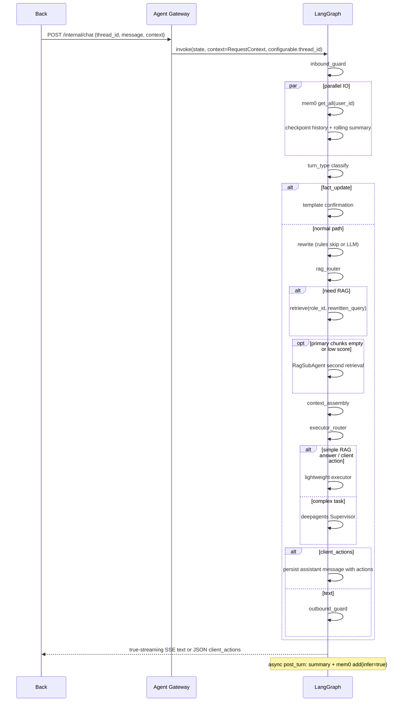

# commonAgent

Front -> Back -> Agent 三层通用智能体项目。目标是提供一个有长期记忆、RAG、LangGraph/deepagents 主 Agent、客户端工具指令与最小前后端占位的可演进架构。

> 本文件是项目架构与运行入口，已经替代旧的架构文档和 Agent 局部 README。任何 AI 或工程师执行任务前，先读 [AGENTS.md](AGENTS.md)，再读本文件、[docs/progress.md](docs/progress.md) 和具体 [docs/prompts/](docs/prompts/) 任务卡。

## 当前状态

| 项 | 状态 |
|----|------|
| 核心任务 | 01-29 已完成，另含 13.5 修复任务；30-40 为运行时优化待执行任务 |
| Agent | FastAPI Gateway + LangGraph 主图 + Postgres Checkpointer + mem0 + RAG |
| Back | 占位 FastAPI，模拟鉴权、注入 context、转发 Agent |
| Front | 占位单页，sessionStorage `thread_id`，SSE 展示，client_actions demo |
| 进度文档 | [docs/progress.md](docs/progress.md) |

## AI 执行规则

1. 先读本 README，确认全局契约和当前目标态。
2. 再读 [docs/progress.md](docs/progress.md)，确认依赖、完成状态和最近变更。
3. 若执行任务卡，只做当前 [docs/prompts/](docs/prompts/) 中指定的一张卡；执行前必须检查任务卡的 `## 建议执行模型`，模型/reasoning 不匹配时先提醒用户切换，除非用户明确要求直接执行。
4. 若修改任务卡导致架构、API、记忆、RAG、`client_actions` 或目录契约变化，必须同步修改本 README。
5. 修改 `.env` 契约时同步 `agent/.env.example` 或 `back/.env.example`，真实密钥不要入库。
6. 不要把 `user_id` / `role_id` / `tools[]` 写进 checkpoint state 当权限依据；每轮必须从 request context 读取。
7. 外部工具只通过 `client_actions` 返回给客户端执行；Agent 不执行、不等待、不 resume，Back 也不把工具执行结果自动回灌 Agent。

## 目标与边界

| 层级 | 职责 | 第一期状态 |
|------|------|------------|
| Front | 对话 UI、`thread_id`、解析并执行 `client_actions`、审批弹窗 | 占位 + 最小演示 |
| Back | 登录/鉴权、计算 `role_id`、过滤工具白名单、转发 Agent | 占位 + demo context |
| Agent | 记忆组装、RAG、Supervisor/SubAgent、护栏、SSE、历史和 ingest API | 核心实现 |

硬约束：

- Agent 仅内网可达，浏览器不直连 Agent。
- `thread_id` 是 checkpoint 会话键；`user_id` / `role_id` / `tools[]` 每轮由 Back 放入 request context。
- 权限变化时，同一 `thread_id` 可以继续聊，但 RAG 过滤和工具白名单必须跟随当轮最新 context。
- 历史分页与 checkpoint 同源，不额外双写 UI messages 表。

## 目录结构

```text
commonAgent/
├── AGENTS.md              # 跨工具 AI 执行规则（Codex / Cursor / Antigravity）
├── README.md              # 本文件：架构与运行入口
├── front/                 # 前端占位：静态单页 + SSE + client_actions demo
├── back/                  # 后端占位：demo auth context + 转发 Agent
├── agent/                 # LangGraph / deepagents 主服务
│   ├── src/
│   │   ├── gateway/       # HTTP: chat、history、kb ingest
│   │   ├── graph/         # Supervisor 主图、state、context_schema、节点
│   │   ├── memory/        # checkpoint、K/M/summary、mem0
│   │   ├── rag/           # rewrite、router、retriever、ingest
│   │   ├── guardrails/    # 入站/出站护栏
│   │   ├── observability/ # LangSmith tracing
│   │   └── settings/      # .env -> Settings
│   ├── tests/
│   ├── .env.example
│   └── pyproject.toml
├── docs/
│   ├── prd/
│   │   ├── common-agent-architecture.md
│   │   ├── agent-runtime-optimization.md
│   │   └── agent-architecture-learning-notes.md
│   ├── origin.md
│   ├── progress.md
│   └── prompts/           # 可执行任务卡
└── .cursor/skills/        # Cursor 触发适配层，核心规则回指 AGENTS.md
```

## 本地运行

环境要求：

- Python >= 3.11
- [uv](https://docs.astral.sh/uv/)
- Node.js/npm（仅 Front 静态服务需要）
- Postgres（LangGraph Checkpointer）
- Qdrant（KB 与 mem0；单测可用 mock）
- SiliconFlow 或 OpenAI 兼容 API（LLM、Embedding、Rerank）
- 可选 LangSmith tracing

启动顺序：

```bash
# 终端 1 - Agent Gateway
cd agent
uv sync
cp .env.example .env
# 编辑 .env：填 OPENAI_API_KEY、DATABASE_URL、Qdrant、LangSmith 等
uv run uvicorn main:app --host 127.0.0.1 --port 18080

# 终端 2 - Back
cd back
uv sync
cp .env.example .env
uv run uvicorn main:app --host 127.0.0.1 --port 8080

# 终端 3 - Front
cd front
npm run start
# 浏览器打开 http://127.0.0.1:3000
```

LangGraph Studio / dev server：

```bash
cd agent
uv run langgraph dev
```

本地 Postgres 约定：

```bash
docker exec -it my-postgres psql -U postgres -c "CREATE DATABASE common_agent;"
```

`DATABASE_URL` 示例：

```env
DATABASE_URL=postgresql://postgres:<password>@localhost:5432/common_agent
```

## 环境变量

Agent 变量以 [agent/.env.example](agent/.env.example) 为准：

环境契约规则：`agent/src/settings/config.py`、`agent/.env.example`、`agent/.env` 必须同步。新增、删除、重命名或改变含义/默认值时，三处要在同一次变更里更新；`.env.example` 使用 masked/空示例值，`.env` 保留本机真实值但不要提交；环境契约变更后运行 `cd agent && uv run pytest tests/test_settings.py -v`，其中 `test_env_files_match_settings_contract` 会检查三者变量名一致。

| 分组 | 关键变量 | 用途 |
|------|----------|------|
| LangSmith | `LANGSMITH_API_KEY`、`LANGCHAIN_TRACING_V2`、`LANGCHAIN_PROJECT`、`LANGCHAIN_ENDPOINT` | Trace |
| LLM | `OPENAI_API_KEY`、`OPENAI_BASE_URL`、`OPENAI_MODEL_NAME` | SiliconFlow / OpenAI 兼容对话模型 |
| Rewrite / Chitchat | `REWRITE_MODEL_NAME`、`REWRITE_MAX_TOKENS`、`REWRITE_TIMEOUT_SECONDS`、`REWRITE_SKIP_ENABLED`、`REWRITE_FORCE`、`CHITCHAT_USE_LLM`、`CHITCHAT_MODEL_NAME`、`CHITCHAT_MAX_TOKENS`、`CHITCHAT_TIMEOUT_SECONDS` | Query rewrite 与 chitchat 轻量执行器的小任务模型、输出/超时保护 |
| Router | `RAG_ROUTER_MODE`、`RAG_ROUTER_MODEL_NAME`、`RAG_ROUTER_MAX_TOKENS`、`RAG_ROUTER_TIMEOUT_SECONDS` | RAG 规则/混合路由与分类小模型保护 |
| Embedding | `EMBEDDING_MODEL`、`EMBEDDING_MODEL_DIMS` | Qdrant 向量维度，默认 1024 |
| Rerank | `RERANK_MODEL`、`RERANK_TOP_K` | rerank 模型与候选上限 |
| Qdrant | `QDRANT_HOST`、`QDRANT_PORT`、`QDRANT_COLLECTION_KB`、`QDRANT_COLLECTION_MEM0`、`QDRANT_MOCK` | KB 与 mem0 分 collection |
| mem0 | `MEM0_MOCK`、`MEM0_READ_LIMIT`、`MEM0_LLM_MODEL_NAME`、`MEM0_LLM_MAX_TOKENS`、`MEM0_LLM_TIMEOUT_SECONDS` | 本地 OSS mem0 与 infer 写入小模型配置 |
| Context Budget | `MEMORY_PROFILE_MAX_FACTS`、`MEM0_FREE_TEXT_MAX_FACTS`、`SUMMARY_MAX_CHARS`、`RAG_CHUNK_MAX_CHARS`、`RAG_CONTEXT_MAX_CHARS`、`TOOLS_SCHEMA_MAX_CHARS`、`MODEL_MESSAGE_MAX_TURNS`、`MODEL_MESSAGE_MAX_CHARS` | 主模型 system prompt、工具 schema 与消息窗口预算 |
| Postgres | `DATABASE_URL` | LangGraph Checkpointer |
| Gateway | `AGENT_HOST`、`AGENT_PORT` | Agent HTTP 入口 |
| Guardrails | `GUARDRAILS_ENABLED` | 入站/出站文本护栏 |

Back 变量见 [back/.env.example](back/.env.example)：`AGENT_URL`、`BACK_HOST`、`BACK_PORT`、`DEMO_USER_ID`、`DEMO_ROLE_ID`、`DEMO_TOOLS_FILE`、`AGENT_TIMEOUT_SECONDS`。

## LangGraph 契约

主图使用 LangGraph 1.x 双 schema：

| 机制 | 内容 | 持久化 | 来源 |
|------|------|--------|------|
| `state_schema` / `AgentState` | `messages` 用 `add_messages`；`mem0_memories`、`rolling_summary`、`turn_type`、`turn_type_reason`、`path_metrics`、`rewritten_query`、`rag_chunks`、`system_prompt` 等单轮字段用 `EphemeralValue` | 只有 `messages` 作为对话权威历史跨轮持久化；单轮字段不得依赖上一轮残留 | 图节点 |
| `context_schema` / `GraphContextSchema` | `user_id`、`role_id`、`tools[]`，与 `gateway.schemas.RequestContext` 同构 | 不进入 checkpoint 作为权限依据 | 每轮 `graph.invoke(..., context=...)` |
| `configurable.thread_id` | 会话键 | checkpointer 主键 | 每轮 `config={"configurable": {"thread_id": ...}}` |

调用形态：

```python
graph.invoke(
    {"messages": [HumanMessage(content=message)]},
    context=request_context.model_dump(),
    config={"configurable": {"thread_id": thread_id}},
)
```

mem0 在 state 中只保留 `mem0_memories: list[str]`。`mem0_text` 已移除，rewrite 和 system prompt 组装各自在消费处调用 `format_mem0_for_system()`。

## 记忆分层

| 类型 | 存储 | 键 | 注入位置 |
|------|------|----|----------|
| 完整对话 | Postgres Checkpointer | `thread_id` | 权威历史；分页 API 同源 |
| 模型上下文 | 运行时组装 | `thread_id` | system: 指令 + mem0 + summary + RAG；messages: 前 K + 近 M + 本轮 human |
| 用户偏好 | 本地 mem0 OSS `Memory` + 本地 Qdrant | `user_id` | system；post_turn 异步写入；运行时归一化为 `memory_profile` |
| 知识库 | Qdrant | `role_id` | system；RAG 片段带 doc/chunk 引用 |

mem0 约束：

- 只使用 `mem0ai` 的自托管 `Memory`，向量库指向本机或内网 Qdrant。
- 禁止 mem0 托管云、`MemoryClient`、`MEM0_API_KEY`、`api.mem0.ai`。
- `MEM0_MOCK=true` 时跳过 mem0/Qdrant 读取，返回空列表。
- post_turn 将本轮 user/assistant 原文传给 `Memory.add(..., infer=True)`；抽取、已有记忆检索、hash 去重由 mem0 管线负责。
- mem0 infer 写入使用专用小模型配置：`MEM0_LLM_MODEL_NAME`、`MEM0_LLM_MAX_TOKENS`、`MEM0_LLM_TIMEOUT_SECONDS`；不要回退到 `OPENAI_MODEL_NAME`，避免后台成本和队列压力跟主模型绑定。
- system 注入前会从 mem0 自由文本归一化第一版 `memory_profile`：`profile.name`、`profile.birth_year`、`profile.city`、`profile.job`、`company.address`、`preference.answer_style`。同类事实保留最新/最明确值；已归类事实不再重复进入自由文本区，未归类事实仍按原 mem0 列表注入。
- 抽取规则在 [agent/src/memory/prompts/mem0_custom_instructions.txt](agent/src/memory/prompts/mem0_custom_instructions.txt)。
- mem0 可能在 `~/.mem0/history.db` 或 `MEM0_DIR` 存辅助 SQLite；向量仍在 Qdrant。

从旧 `infer=False` 写入迁移时，开发/测试环境建议清空或重建 `QDRANT_COLLECTION_MEM0`，避免旧 `User preference facts:` 包装文本与新短句事实并存。

滚动 summary：

- 默认 K=4，M=20。
- summary 只覆盖 `[K+1, N-M]`，与 prefix/recent 不重叠。
- 只摘要上次总结之后的新消息并合并旧 summary，不全量重算。
- 更新在回复后异步执行，不阻塞首 token。

上下文预算：

- system prompt 注入顺序固定为：base instructions + external tools、`memory_profile`、未归类 mem0、rolling summary、RAG excerpts。
- `memory_profile` 按字段顺序最多注入 `MEMORY_PROFILE_MAX_FACTS` 条；未归类 mem0 按原顺序最多注入 `MEM0_FREE_TEXT_MAX_FACTS` 条。
- rolling summary 按 `SUMMARY_MAX_CHARS` 截断；RAG 先按 `RAG_CHUNK_MAX_CHARS` 裁剪单 chunk，再按 `RAG_CONTEXT_MAX_CHARS` 稳定保留靠前 chunk。
- external tools 只进入 system prompt，schema block 受 `TOOLS_SCHEMA_MAX_CHARS` 限制；Agent 仍不执行外部工具。
- messages 先按 K/M 选择，再受 `MODEL_MESSAGE_MAX_TURNS` 和 `MODEL_MESSAGE_MAX_CHARS` 限制；超预算时优先保留最近消息和本轮 human。
- LangSmith metadata 会记录 `system_prompt_len`、`mem0_count`、`rag_chunk_count`、`message_chars`、`budget_truncated` 等预算使用情况。

## 单轮流水线



性能原则：

- mem0、checkpoint history、rolling summary 并行读取。
- turn_type 在 `load_memory` 后确定；`fact_update` 直接走模板确认快速路径；`chitchat` 走轻量执行器（默认模板，可切换小模型）；其余类型继续正常路径。
- `fact_update` 快速路径跳过 rewrite、rag_router、RAG、RagSubAgent、context assembly、Supervisor 和 outbound guard；当前 human 与模板 assistant 仍写入 checkpoint，并继续调度 post_turn summary + mem0 写入。模板确认只表示已接收事实，不承诺 mem0 已持久化成功。
- `chitchat` 轻量执行器跳过 rewrite、rag_router、RAG、RagSubAgent、context assembly 与 deepagents Supervisor；默认模板回复，开启 `CHITCHAT_USE_LLM=true` 时改用低延迟小模型。
- path contract 在 `path_metrics` 中记录本轮 `rewrite`、`rag_router`、`rag`、`supervisor` 的 `should_call` / `called`、`fast_path`、`post_turn_scheduled`、`llm_call_count`、`fallback_count`、`path_contract` 与原因，并输出到 LangSmith metadata。
- rewrite/router 消费统一 `turn_type`：`fact_update`、`chitchat`、`client_action` 跳过 rewrite/router 小模型；`knowledge_query` 跳过 router 小模型并直接进入 RAG；rewrite 默认不调用 LLM，仅 `ambiguous` 或旧规则判断为历史依赖时调用。
- executor router 在 Supervisor 前选择执行器：`template_executor` 处理固定确认，`small_chat_executor` 处理寒暄，`rag_answer_executor` 处理已有高质量 RAG chunks 的简单知识问答，`action_executor` 处理简单客户端动作，`deepagents_executor` 只保留给复杂规划、多步工具、长文档或不确定工作流；trace metadata 记录 `executor` 与 `executor_reason`。
- 无外部工具的文本模型回复通过 LangChain streaming callback 直接转成 SSE `token` 事件；模板/护栏等非模型回复仍以兼容的 token 事件发送完整文本。带 `tools[]` 的回合禁用 live token streaming，避免 `client_actions` JSON 被拆成自然语言 token。
- rewrite/router 使用 `REWRITE_MODEL_NAME`、`RAG_ROUTER_MODEL_NAME` 指向低延迟小模型；`.env.example` 默认推荐 `Qwen/Qwen2.5-7B-Instruct`，并分别用 max token 与 timeout 防止小任务拖慢关键路径。
- rewrite 只能消解指代，不得改写事实；个人/公司事实陈述直接跳过 LLM，LLM 输出若篡改原文数字则回退原文。
- rag_router 对个人/公司事实陈述直接跳过 RAG；hybrid LLM 仅处理规则不确定的查询，timeout 默认 5 秒且失败保守走 RAG。
- RAG 可由 router 跳过。
- summary/mem0 写入在 post_turn 异步执行。
- mem0 写入失败会输出结构化日志和 trace metadata（`mem0_write.status`、`mem0_write.reason`、`mem0_write.stored_count`），但不会阻塞当前 chat 响应。

## RAG

1. 路由：优先消费 `turn_type`；知识查询直接检索，事实更新、寒暄与纯客户端工具意图跳过整段 RAG；未确定场景再回落到规则或小模型分类。
2. 顺序：`rewrite -> rag_router -> retrieve`；检索使用 `rewritten_query`，跳过 rewrite 时等于用户原文。
3. 检索：Qdrant 按 `role_id` 过滤，dense + 文本/sparse fallback 合并，再 rerank。
4. 主链路只查一次；RagSubAgent 只在主检索为空或最高分低于阈值时二查，不做第三次。
5. Ingest：`doc_id` + `version`；先写新版本，再按 `doc_name` 删除旧版本；默认 chunk 约 768 token、overlap 0.12。
6. 注入 system 的知识片段必须带 `[doc:.../chunk:...]` 标识，回答相关知识时引用来源。

## client_actions

外部工具是客户端动作，不是 LangChain server-side tool。

```json
{
  "client_actions": [
    {
      "tool": "jumpPage",
      "args": { "page": "pageA" },
      "requires_approval": false
    }
  ]
}
```

- Agent 产出 `client_actions` 后本轮结束。
- 不生成 ToolMessage，不 resume，不等待前端执行结果。
- Back 负责鉴权和工具白名单过滤；Front 负责确认和执行。
- `requires_approval` 来自 Back 传入的工具定义，Agent 原样表达给前端。
- deepagents 内置能力仍可在图内使用；request context 里的外部 `tools[]` 均按客户端动作处理。

## API 契约

Agent Gateway:

```http
GET /health
```

```http
POST /internal/chat
Content-Type: application/json

{
  "thread_id": "uuid-or-session-id",
  "message": "用户输入",
  "context": {
    "user_id": "u1",
    "role_id": "role-sales",
    "tools": [
      {
        "name": "jumpPage",
        "description": "Navigate to a page in the app.",
        "parameters": {
          "type": "object",
          "properties": { "page": { "type": "string" } },
          "required": ["page"]
        },
        "requires_approval": false
      }
    ]
  }
}
```

响应：

- 文本回答：`text/event-stream`，事件为 `{"type":"token","content":"..."}`，结束为 `{"type":"done"}`；无外部工具的主模型文本会边生成边转发 token。
- 客户端动作：`application/json`，body 为 `{ "text": null, "client_actions": [...] }`。

```http
GET /internal/threads/{thread_id}/messages?cursor=&limit=20
```

返回 checkpoint 同源的历史消息页。

```http
POST /internal/kb/ingest

{
  "role_id": "role-sales",
  "doc_id": "doc-1",
  "doc_name": "reimbursement",
  "version": "2026-05",
  "content": "..."
}
```

Back:

- `POST /api/chat`：接收 Front `{thread_id, message}`，注入 demo `context` 后转发 Agent。
- `GET /health`：存活检查。

Front:

- 默认请求 `http://127.0.0.1:8080/api/chat`。
- `thread_id` 写入 sessionStorage；刷新保持，新开 thread 重新生成。

## LangSmith

配置示例：

```env
LANGSMITH_API_KEY=lsv2_***
LANGCHAIN_TRACING_V2=true
LANGCHAIN_PROJECT=common-agent
```

可观察节点与 metadata：

- `rewrite`: `rewrite_skipped`、`rewrite_skip_reason`、`rewrite.model_name`、`rewrite.prompt_len`、`rewrite.fallback`、`rewrite.fallback_reason`、mem0 facts 信息。
- `rag_router`: 是否需要检索、`rag_router.model_name`、`rag_router.prompt_len`、`rag_router.mode`、`rag_router.fallback`。
- `retrieve` / `rerank`: role、query 长度、命中数、mock、second_pass。
- `supervisor`、`guardrails_inbound`、`guardrails_outbound`。

导出最新 trace：

```bash
cd agent
./scripts/fetch_trace.sh --latest
```

## 测试

Agent:

```bash
cd agent
uv sync
uv run pytest -v
make lint
make format

# 常用专项
uv run pytest tests/test_rewrite.py tests/test_rag_router.py tests/test_graph_invoke_mock.py -v
uv run pytest tests/test_mem0_write.py tests/test_mem0_read.py -v
uv run pytest tests/test_chat_sse.py tests/test_history_api.py tests/test_kb_ingest.py -v
```

Back:

```bash
cd back
uv sync
uv run pytest tests/test_back_forward.py -v
```

Front:

```bash
cd front
npm run start
```

需要真实 Postgres/Qdrant/LLM 的集成测试可按本地环境选择执行；没有外部服务时优先跑 mock/单元测试，并在任务记录中说明跳过原因。

## 后期 todo

- Back：JWT、真实用户表、工具表、service token / mTLS、完整审批 UI。
- Front：历史分页代理后接入历史拉取、完整 client_actions 执行器和审批体验。
- Agent：服务间鉴权、用户删除/关闭记忆、读侧语义去重、mem0 多实例 SQLite 策略。
- RAG：同 thread 检索缓存、更细的 RagSubAgent 触发策略、可选 rewrite/router 合并 LLM。
- Admin：文档管理、工具管理、ingest 状态和失败回滚。
- 工具：服务端工具链路、超时/重试/幂等、参数和返回护栏、可选第二轮回 Agent。
- 可观测：评测数据集、rewrite/RAG/护栏指标、rerank cost 占总 cost 饼图。
