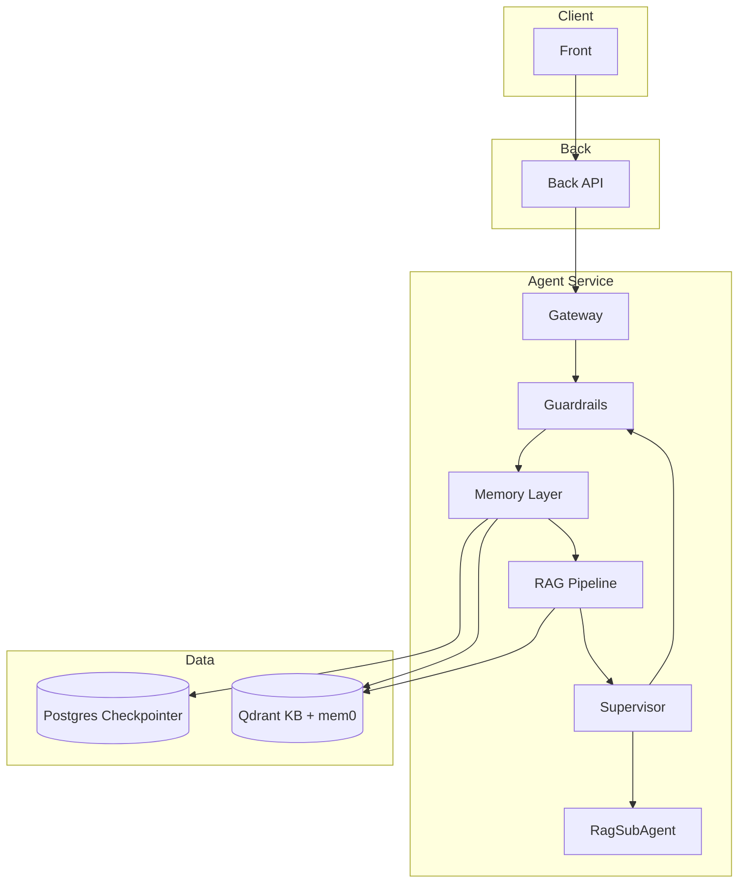
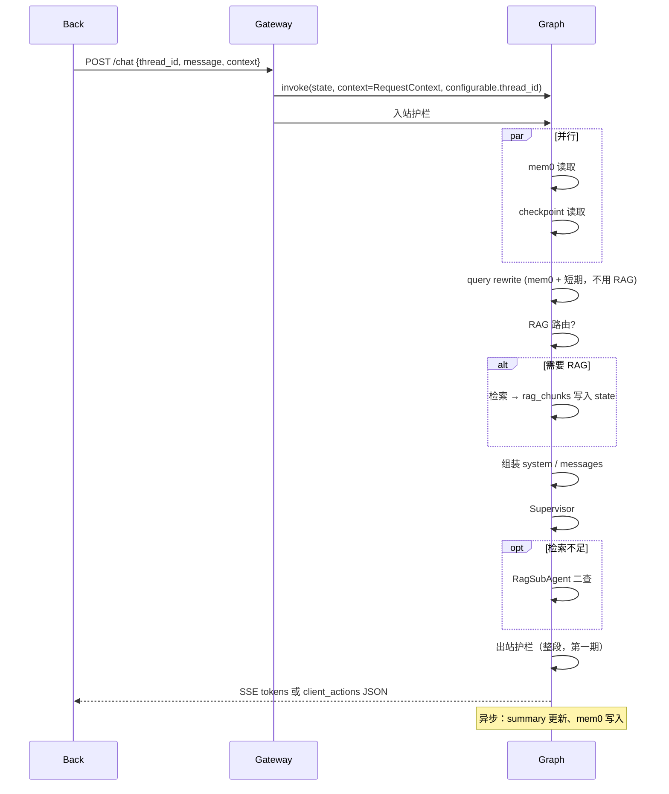

# 通用 Agent 总体架构

> 与 [prd1.md](./prd1.md) 对齐。实现时以本文 + 当前 [docs/prompts/](./prompts/) 任务卡为准。

## 1. 目标与边界

构建 **Front → Back → Agent** 三层通用智能体：有记忆、可 RAG、可产出客户端工具指令，第一期 **不** 做完整登录/审批 UI，但契约按生产形态预留。

| 层级 | 职责 | 第一期 |
|------|------|--------|
| **Front** | 对话 UI、`thread_id`（sessionStorage）、解析并执行 `client_actions`、审批弹窗 | 占位 + 最小演示 |
| **Back** | 登录/鉴权、`role_id` 计算、工具白名单过滤、转发 Agent | 占位 + 透传 context |
| **Agent** | 记忆组装、RAG、Supervisor/SubAgent、护栏、SSE | **核心实现** |

**硬约束**

- Agent **仅内网**，浏览器不直连。
- `user_id` / `role_id` / `tools[]` 每轮由 Back 放入 **request context**，不写死在 checkpoint state。
- 外部工具：Agent **只产出** `client_actions`，不执行、不等待、不 resume；Back **不** 把执行结果回灌 Agent。

## 2. 逻辑架构



## 3. 目录结构（目标态）

```
commonAgent/
├── front/                 # 前端占位
├── back/                  # 后端占位（鉴权、滤工具、转发）
├── agent/                 # LangGraph / deepagents 主服务
│   ├── src/
│   │   ├── gateway/       # HTTP：chat、history、ingest
│   │   ├── graph/         # Supervisor、节点、state、context_schema
│   │   ├── memory/        # checkpoint 读取、K+M+summary、mem0
│   │   ├── rag/           # 路由、rewrite、检索、ingest
│   │   ├── guardrails/
│   │   └── settings/      # config from .env
│   ├── tests/
│   └── pyproject.toml     # uv
├── docs/
│   ├── architecture.md    # 本文
│   ├── prd1.md
│   └── progress.md        # 任务进度（由 skill 维护）
├── docs/prompts/           # 可执行任务卡
└── .cursor/skills/        # Cursor 执行 skill
```

### 3.1 LangGraph：State 与 Runtime Context

主图编译使用 LangGraph 1.x 双 schema（任务 **13.5** 落地）：

| 机制 | 内容 | 持久化 | 来源 |
|------|------|--------|------|
| **`state_schema`（`AgentState`）** | `messages`（`add_messages`）；单轮字段（`rewritten_query`、`rag_chunks`、`mem0_*`、`system_prompt` 等）使用 **`EphemeralValue`** | 仅 `messages` 跨轮持久化；单轮字段在当次 `invoke` 内传递，**不**依赖 checkpoint 中的上一轮残留 | 图节点读写 |
| **`context_schema`（`GraphContext`）** | `user_id`、`role_id`、`tools[]`（与 `gateway.schemas.RequestContext` 同构） | **不**作为权限依据写入 checkpoint | 每轮 `graph.invoke(..., context=...)`，由 Back/Gateway 注入 |
| **`configurable.thread_id`** | 会话键 | checkpointer 主键 | 每轮 `config={"configurable": {"thread_id": ...}}` |

**禁止**：把 `user_id` / `role_id` / `tools[]` 仅依赖 checkpoint 内残留的 `state["context"]` 做鉴权或 RAG 过滤（resume 时必须以当轮 `context=` 为准）。

实现任务卡：[13.5_fix_state_2_context_schema.md](./prompts/13.5_fix_state_2_context_schema.md)。

## 4. 记忆分层

| 类型 | 存储 | 键 | 注入位置 |
|------|------|-----|----------|
| 完整对话 | Postgres Checkpointer | `thread_id` | 权威历史；分页 API 同源 |
| 模型上下文 | 运行时组装 | `thread_id` | system：指令+mem0+summary+RAG；messages：前 K + 近 M + 本轮 human |
| 用户偏好 | **本地** mem0（OSS `Memory`）+ **本地** Qdrant | `user_id` | system；写入=提取式事实（异步） |
| 知识库 | Qdrant | `role_id`（每轮 context） | system；RAG 片段带 doc/chunk 引用 |

**mem0 部署（第一期硬约束）**

- 只用 `mem0ai` 包的自托管 **`Memory`**，向量库指向本机/内网 **Qdrant**（`QDRANT_COLLECTION_MEM0`，与 KB collection 分离）。
- **禁止** mem0 托管云、`MemoryClient`、`MEM0_API_KEY`、`api.mem0.ai`。
- 开发/CI 无 Qdrant 时：`MEM0_MOCK=true` 跳过读取（返回空列表），不改为连云。

**滚动 summary**

- 只摘要「上次总结之后」的新消息，合并进旧 summary（增量，非全量重算）。
- 覆盖区间 `[K+1, N-M]`，与 prefix/recent **不重叠**。
- 默认 **K=4，M=20**。
- 更新在回复之后 **异步**，不挡首 token。

## 5. 单轮对话流水线



**性能原则**：mem0 与 checkpoint 并行；RAG 可跳过；summary/mem0 不阻塞首 token。

## 6. RAG 设计

1. **路由（混合）**：规则（闲聊、纯 client tool 意图等）→ 不确定时小模型分类 → 不需要则跳过整段 RAG。
2. **顺序**：`rewrite → RAG`；检索使用 `rewritten_query`。
3. **检索**：Qdrant `role_id` 过滤 + dense + sparse + rerank → system；回答须带 doc/chunk 标识。
4. **只查一次（主链路）**：结果写入当轮 state `rag_chunks`；**RagSubAgent** 仅在 Supervisor 认为不够时二查。
5. **Ingest**：`doc_id` + version；按 doc 名删旧再写；分块约 **512–1024 token**，overlap **10–15%**。

## 7. 外部工具（client_actions）

```json
{
  "client_actions": [
    {
      "tool": "jumpPage",
      "args": { "page": "pageA" },
      "requires_approval": false
    }
  ]
}
```

- Agent 产出后 **本轮回话结束**；无 ToolMessage、无 resume。
- Checkpoint 可存 assistant 消息 + `client_actions` 元数据供 UI 回放。
- Back：鉴权 + 工具是否在 role 白名单；Front：执行 + `requires_approval` 确认。
- deepagents **内置**工具仍走图内逻辑；**外部 tools 列表**语义均为客户端工具，ToolSubAgent **不**代执行 jumpPage 类。

## 8. API 契约（Agent Gateway）

### 8.1 Chat

```
POST /internal/chat
{
  "thread_id": "uuid",
  "message": "用户输入",
  "context": {
    "user_id": "...",
    "role_id": "...",
    "tools": [{ "name", "description", "parameters", "requires_approval" }]
  }
}
```

响应：`text/event-stream`（文本流）或 `application/json`（含 `client_actions`）。

### 8.2 历史分页

```
GET /internal/threads/{thread_id}/messages?cursor=&limit=
```

与 checkpoint **同源**，不另建 UI messages 表。

### 8.3 知识库 Ingest

```
POST /internal/kb/ingest
{ "role_id", "doc_id", "doc_name", "content" | "file_ref", "version" }
```

## 9. 模块职责

| 模块 | 职责 |
|------|------|
| **Guardrails** | 入站/出站文本；后期 tool 参数/返回 |
| **Query 重写** | mem0 + 短期 → `rewritten_query` |
| **Supervisor** | 主 Agent；可委派 RagSubAgent |
| **RagSubAgent** | 深检索 / 二查 |
| **Gateway** | 内网入口；chat / history / kb ingest |

**deepagents**：规划、filesystem 等能用内置则用；业务 RAG、`client_actions` 不重复造轮子。

## 10. 可观测与安全

- **LangSmith**：全链路 trace；节点耗时、LLM/RAG/rerank 成本标签。
- **鉴权**：第一期 Gateway 可信任内网 Back；后期 service token / mTLS。
- **环境变量**：修改 `agent/.env` 必须同步 `agent/.env.example`（值用掩码）；**key 名以任务 01 清单为准**。

### 10.1 环境变量（第一期）

| 分组 | 变量 | 用途 |
|------|------|------|
| LangSmith | `LANGSMITH_API_KEY`、`LANGCHAIN_TRACING_V2`、`LANGCHAIN_PROJECT`、`LANGCHAIN_ENDPOINT` | Trace 与项目名 |
| LLM | `OPENAI_API_KEY`、`OPENAI_BASE_URL`、`OPENAI_MODEL_NAME` | **SiliconFlow** OpenAI 兼容对话（如 DeepSeek-V3.2） |
| Embedding | `EMBEDDING_MODEL`、`EMBEDDING_MODEL_DIMS` | 向量模型（如 bge-large-zh，**dims=1024** 与 Qdrant 一致） |
| Rerank | `RERANK_MODEL`、`RERANK_TOP_K` | 交叉编码 rerank 与候选上限 |
| Qdrant | `QDRANT_HOST`、`QDRANT_PORT`、`QDRANT_COLLECTION_KB`、`QDRANT_COLLECTION_MEM0` | KB 与 mem0 **分 collection** |
| mem0 | `MEM0_MOCK`、`MEM0_READ_LIMIT` | 本地 OSS 读取；mock 时跳过 Qdrant |
| Postgres | `DATABASE_URL` | LangGraph Checkpointer |
| Gateway | `AGENT_HOST`、`AGENT_PORT` | 内网 HTTP 入口 |
| Guardrails | `GUARDRAILS_ENABLED` | 入站/出站文本护栏开关 |

本地 `.env` 不入库；SiliconFlow 与 LangSmith 密钥仅保存在开发者机器。

## 11. 后期 todo（不进第一期 prompt）

- Back：JWT、工具表、完整审批 UI
- Front：sessionStorage `thread_id`、client_actions 执行
- Agent 服务间鉴权；mem0 用户删记忆
- RAG：SubAgent 触发分数阈值；同 thread 检索缓存
- Admin：文档/工具管理 UI
- 服务端工具 + Agent 第二轮回（若产品需要）
- 护栏：tool 参数/返回；流式分段检测
- rerank 成本看板（饼图：rerank / 总 cost）

## 12. 任务拆分索引

实现按 [docs/prompts/](./prompts/) 序号顺序推进；依赖关系见各任务卡 **依赖** 节。总进度见 [progress.md](./progress.md)。
