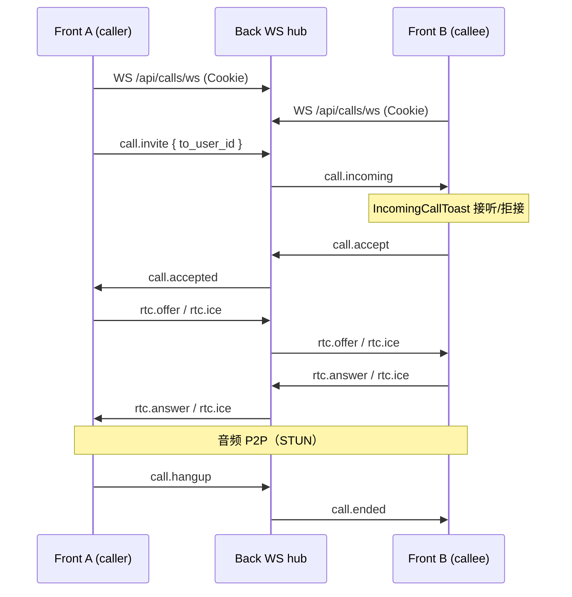
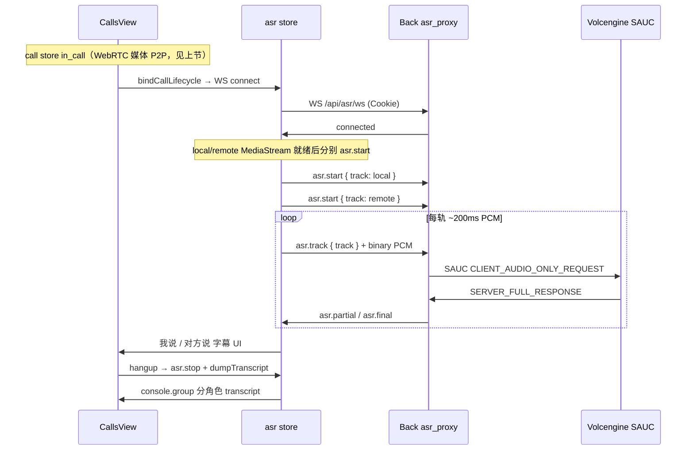
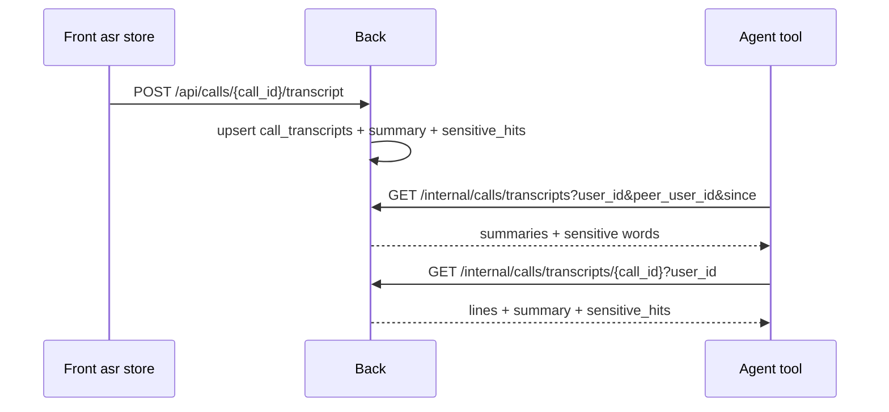
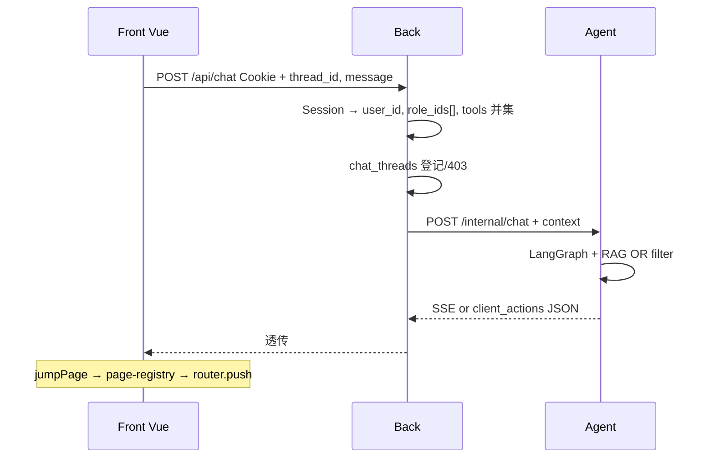

# Demo Platform（演示平台）

回答的问题：浏览器经 Back 登录后，学生/RAG/账号/对话各模块如何路由、鉴权并把 `role_ids[]` 注入 Agent。

## 边界

- Front（Vue 3 SPA，`5173`）只请求 Back（`8080`），`withCredentials` 携带 Cookie。
- Back 业务库 **`common_agent_back`**；Agent checkpoint/Store 库 **`common_agent`**；Qdrant 仅 KB。
- 浏览器 **不得** 直连 Agent Gateway。

## 认证与会话

- 登录：`POST /api/auth/login` → HttpOnly signed Cookie（`SessionMiddleware`）。
- 当前用户：`GET /api/me` → `user_id`、`role_ids[]`、`is_admin`。
- 登出：`POST /api/auth/logout`。
- 实现：[back/src/api/auth.py](/Users/chenkexin/commonAgent/back/src/api/auth.py)、[demo_auth 测试](/Users/chenkexin/commonAgent/back/tests/test_demo_auth.py:1)。

## Front 路由

定义在 [front/src/router/index.ts](/Users/chenkexin/commonAgent/front/src/router/index.ts:1)：

| 路径 | 页面 | 权限 |
|------|------|------|
| `/login` | 登录 | 游客 |
| `/app/home` | 欢迎页 | 登录 |
| `/app/students` | 学生 CRUD | 登录 |
| `/app/admin/roles` | 角色管理 | admin |
| `/app/admin/users` | 用户管理 | admin |
| `/app/admin/kb` | RAG 文档 | admin |
| `/app/calls` | 账号 WebRTC 音频通话 | 登录 |

全局 **ChatFab** + **ChatDrawer**（`AppLayout`）在所有 `/app/*` 页可用；**IncomingCallToast**（左下角来电）与信令 WS 亦在 `AppLayout` 挂载。

状态：Pinia `auth`（会话）、`chat`（抽屉、thread、SSE）、`call`（通话状态机 + WebRTC）、`asr`（ASR WS、双轨 PCM、字幕、控制台 transcript 与挂断上报）。

## Back 业务 API（摘要）

| 前缀 | 说明 |
|------|------|
| `/api/students` | 学生 CRUD + batch-delete |
| `/api/admin/roles` | 角色 CRUD |
| `/api/admin/users` | 用户 CRUD、多角色绑定 |
| `/api/admin/kb/documents` | KB ingest 代理 Agent + `kb_document_meta` 双写 |
| `/api/chat` | 对话 SSE/JSON 转发 Agent |
| `/api/threads/{id}/messages` | 历史分页（thread 归属 403） |
| `GET /api/calls/peers` | 可呼叫用户列表（排除当前 Session 用户） |
| `WS /api/calls/ws` | WebRTC 信令中继（Cookie Session；单进程内存 hub） |
| `WS /api/asr/ws` | 火山 SAUC 流式 ASR 代理（Cookie Session；与 call WS **分离**；单进程内存 session） |

## 通话信令（WebRTC 批次 111–114）

**Agent 不参与**。媒体为浏览器 `RTCPeerConnection` P2P；信令仅经 Back。



实现：[call_routes.py](/Users/chenkexin/commonAgent/back/src/api/call_routes.py)、[call_signaling.py](/Users/chenkexin/commonAgent/back/src/services/call_signaling.py)、[stores/call.ts](/Users/chenkexin/commonAgent/front/src/stores/call.ts)、[useCallSignaling.ts](/Users/chenkexin/commonAgent/front/src/composables/useCallSignaling.ts)。

## 通话字幕 ASR（火山 SAUC 批次 115–118 + 修复 119–123）

**Agent 不参与**。音频从 WebRTC `localStream` / `remoteStream` **旁路**采集；转写经 Back 代理火山 openspeech；与 call 信令 WS **并列**（`AppLayout` 可同时持有两条连接）。



实现：[asr_routes.py](/Users/chenkexin/commonAgent/back/src/api/asr_routes.py)、[asr_proxy.py](/Users/chenkexin/commonAgent/back/src/services/asr_proxy.py)、[volc_asr/](/Users/chenkexin/commonAgent/back/src/services/volc_asr/)、[stores/asr.ts](/Users/chenkexin/commonAgent/front/src/stores/asr.ts)、[useAsrCapture.ts](/Users/chenkexin/commonAgent/front/src/composables/useAsrCapture.ts)、[CallsView.vue](/Users/chenkexin/commonAgent/front/src/views/CallsView.vue)。

契约要点：

- 每用户每 `track`（`local` / `remote`）一路上游；新 `asr.start` 同 track 关闭旧会话。
- 二进制 PCM 前发送 JSON `asr.track` 指定路由 track；16 kHz、16 bit、单声道。
- 凭证 `VOLC_ASR_*` 仅 Back（`X-Api-Key` + 默认 ASR 2.0 `resource_id`）；Front **无** `VITE_VOLC_ASR_*`。
- 上游 pcm 首包 + audio-only `ser=0`（任务 **120**）；无 PCM 轨静默 stop、45000081 不抛 UI（**121**）。
- transcript 会在挂断后由 Front `POST /api/calls/{call_id}/transcript` 落入 Back `call_transcripts`；Back 生成摘要与敏感词命中；**不**自动 `POST /api/chat`，也不写入 langmem / Qdrant。

## 通话转写持久化与 Agent 查询



Agent 内置只读工具：`list_call_transcripts`、`get_call_transcript`。`user_id` 由 `GraphContextSchema` 注入，模型不能自报或越权查询。

## 对话数据流



`client_actions` 执行（任务 104）：Front [stores/chat.ts](/Users/chenkexin/commonAgent/front/src/stores/chat.ts:1) 解析 SSE/JSON；`jumpPage` 经 [page-registry.ts](/Users/chenkexin/commonAgent/front/src/client-actions/page-registry.ts:1) 映射 slug 并 `router.push`（未知 slug / 无 admin 权限 → toast，不静默跳首页）。跳转后 ChatDrawer 默认保持打开。

Context 组装：[back/src/services/context.py](/Users/chenkexin/commonAgent/back/src/services/context.py:1) `build_request_context_from_session()` → `role_ids[]` + `filter_tools_for_role_ids()`。

Agent 契约：[schemas.py](/Users/chenkexin/commonAgent/agent/src/gateway/schemas.py:1) `RequestContext.role_ids`；deprecated `role_id` 单字段 alias 仍接受。

## RAG 多角色（KB 批次 93–98）

```mermaid
flowchart LR
  Admin[Front KbDocumentsView]
  BackMeta[kb_document_meta]
  Junction[kb_document_roles]
  AgentIngest[POST /internal/kb/ingest]
  Qdrant[(Qdrant KB points)]

  Admin -->|role_ids[] JSON| BackAdmin[POST/PATCH /api/admin/kb/documents]
  BackAdmin --> AgentIngest
  BackAdmin --> BackMeta
  BackAdmin --> Junction
  AgentIngest -->|payload role_ids[]| Qdrant
  Chat[POST /api/chat] -->|Session role_ids[]| AgentRAG[roles_filter + payload 交集]
  AgentRAG --> Qdrant
```

- **Ingest**：Body `role_ids[]` → Agent ingest → Qdrant 每 point 相同 `role_ids[]`；Back upsert meta（`doc_id` PK）并替换 junction 行。
- **列表筛选**：`GET /api/admin/kb/documents?role_id=` 表示「文档绑定包含该角色」；Agent internal list 用可重复 query `role_id` 做 payload 交集筛选。
- **get/delete**：仅 `doc_id`，不要求 query `role_id`。
- **检索**：Session `role_ids[]` → Agent `roles_filter()` + [payload.py](/Users/chenkexin/commonAgent/agent/src/infrastructure/qdrant/payload.py:1) 后过滤；迁移期见 [kb-multi-role-rag.md](../prd/kb-multi-role-rag.md) M1/M3。
- **迁移 CLI**：`back/scripts/migrate_kb_multi_role.py`、`agent/scripts/migrate_kb_role_ids.py`（任务 97）。
- 地图细节：[rag-flow.md](./rag-flow.md)。

## 演示手册

逐步操作：[demo-walkthrough.md](../demo-walkthrough.md)（脚本 A/B；WebRTC 双账号见 **B5**；通话字幕见 **B6**）。

## 测试入口

```bash
cd back && uv run pytest tests/test_demo_auth.py tests/test_demo_students.py tests/test_demo_admin.py tests/test_demo_kb.py tests/test_demo_chat_context.py tests/test_demo_chat_history.py tests/test_call_signaling.py tests/test_asr_ws.py tests/test_volc_asr_protocol.py -v
cd front && npm run build
cd agent && uv run pytest tests/test_role_ids_filter.py tests/test_schemas.py -v
```
