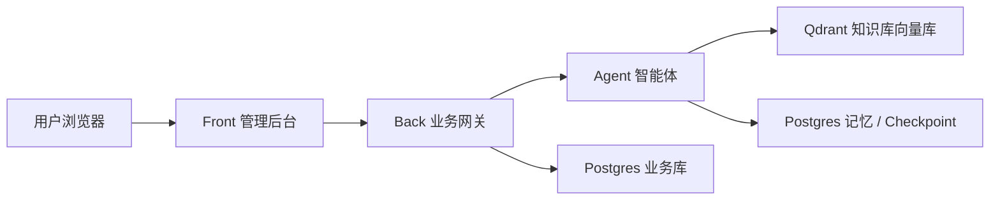
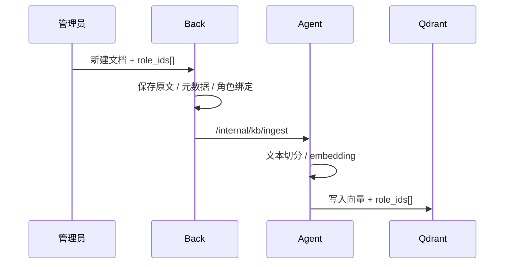
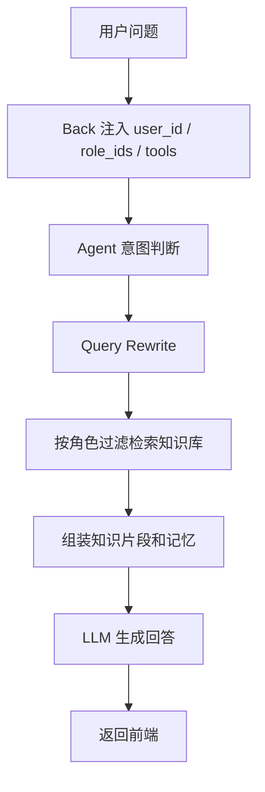
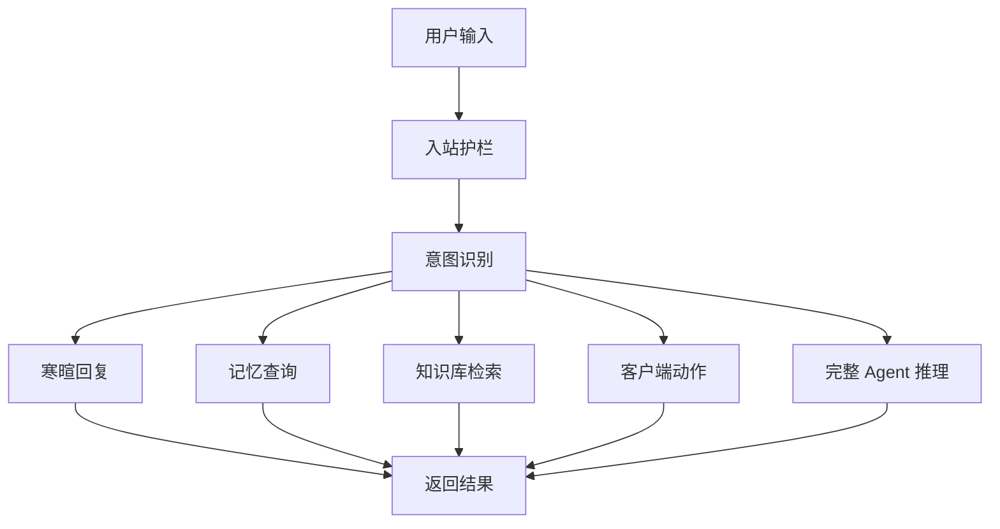

# PPT 说明稿：知识库与 Agent 能力介绍

本文适合整理成 PPT，用于向产品、技术或客户介绍 commonAgent 中 **知识库 RAG** 与 **智能 Agent** 的核心能力。每一节可作为 1 页或 2 页幻灯片。

## 1. 项目一句话介绍

**commonAgent 是一个带权限知识库、长期记忆和业务工具执行能力的通用智能体平台。**

PPT 要点：

- 前端提供管理后台和智能对话入口。
- 后端负责登录、权限、业务数据和 Agent 转发。
- Agent 负责理解问题、检索知识库、调用工具动作并生成回复。
- 知识库按角色隔离，保证不同用户只能访问自己有权限的内容。

讲解备注：

> 这个项目不是单纯聊天机器人，而是一个可接入业务系统的 Agent 平台。它既能回答知识库问题，也能根据用户意图触发页面跳转、学生创建、学生列表查询等业务动作。

## 2. 整体架构

**Front -> Back -> Agent 三层架构**

PPT 要点：

- Front：Vue 管理后台，负责页面、对话抽屉、客户端动作执行。
- Back：统一业务网关，负责认证、角色、权限、业务 API、Agent 转发。
- Agent：LangGraph 智能体，负责意图判断、记忆、RAG、回复和工具动作生成。
- Qdrant：知识库向量检索。
- Postgres：用户、角色、学生、知识库元数据、Agent 记忆和 checkpoint。

建议配图：



讲解备注：

> 浏览器不会直接访问 Agent，所有请求都经过 Back。这样可以由 Back 统一控制登录态、角色权限和工具白名单，避免 Agent 绕过业务权限。

## 3. 知识库解决的问题

**让 Agent 回答“企业内部资料”中的问题，并按角色控制可见范围。**

PPT 要点：

- 支持上传 Markdown / TXT 文档。
- 文档可绑定一个或多个角色。
- 文档内容切分后写入向量库。
- 对话时按用户角色过滤检索结果。
- 支持销售、客服、管理员等不同角色看到不同知识。

示例：

| 文档 | 绑定角色 | 可访问用户 |
|------|----------|------------|
| 产品价目表 | `role-sales` | 销售 |
| 退换货政策 | `role-support` | 客服 |
| 公司通用 FAQ | `role-sales`, `role-support` | 销售和客服 |

讲解备注：

> 传统知识库通常只解决“能不能搜到”。这个项目增加了角色维度，解决“谁能搜到”的问题。销售问价格，客服问售后，管理员可以管理全部文档。

## 4. 知识库管理流程

**管理员上传文档，系统自动完成元数据保存和向量入库。**

PPT 要点：

1. 管理员在 RAG 管理页创建文档。
2. 选择文档可见角色 `role_ids[]`。
3. Back 保存文档元数据和角色绑定。
4. Back 转发 Agent ingest 接口。
5. Agent 切分文本并写入 Qdrant。
6. 用户对话时按角色检索相关片段。

建议配图：



讲解备注：

> Back 保存原文和管理信息，Agent 负责向量化和检索。两者分工清晰：业务管理归 Back，智能检索归 Agent。

## 5. 多角色权限检索

**检索时不是全库搜索，而是先根据用户角色限制可访问范围。**

PPT 要点：

- 登录用户拥有 `role_ids[]`。
- 知识库文档也拥有 `role_ids[]`。
- 只有两者存在交集时，文档才可被检索。
- Agent 不从历史状态里信任权限，而是每轮使用 Back 注入的角色。

判断规则：

```text
用户 role_ids[] ∩ 文档 role_ids[] 非空 => 可检索
用户 role_ids[] ∩ 文档 role_ids[] 为空 => 不可检索
```

讲解备注：

> 权限是每一轮请求实时注入的，不依赖历史对话里残留的信息。这样用户切换、角色变更后，Agent 的可见范围也会跟着变化。

## 6. RAG 回答流程

**用户问题经过理解、改写、检索、上下文组装，再交给模型生成回答。**

PPT 要点：

1. 用户在对话框提问。
2. Back 注入用户身份、角色和工具权限。
3. Agent 判断问题类型。
4. 必要时进行 Query Rewrite。
5. 根据 `role_ids[]` 检索知识库。
6. 组装上下文。
7. 模型生成最终回答。

建议配图：



讲解备注：

> RAG 不是简单把问题扔给向量库。系统会先判断问题类型，再决定是否检索、如何改写查询、如何控制上下文预算，最后由模型基于检索片段回答。

## 7. Agent 核心能力

**Agent 是一个带状态、记忆、检索和工具动作能力的 LangGraph 工作流。**

PPT 要点：

- 意图识别：判断用户是在闲聊、问知识库、查记忆还是要执行业务动作。
- 长期记忆：记住用户的姓名、城市、偏好等稳定事实。
- RAG 检索：从角色授权的知识库中查找资料。
- 工具动作：生成 `client_actions`，由前端执行页面跳转或业务操作。
- 安全护栏：包含入站和出站校验。
- 可观测：记录路径、fallback、LLM 调用和检索行为。

讲解备注：

> Agent 的目标不是一次性回答所有问题，而是根据用户意图走不同路径。简单寒暄走轻量路径，知识问题走 RAG，业务动作走 client_actions，记忆问题走 memory_query。

## 8. Agent 工作流

**不同问题走不同处理路径，减少无效模型调用。**

PPT 要点：

- `chitchat`：普通寒暄，轻量回复。
- `memory_query`：查询用户长期记忆。
- `knowledge_query`：进入 RAG 检索。
- `client_action`：生成前端可执行动作。
- `ambiguous`：不确定问题走完整推理路径。

建议配图：



讲解备注：

> 通过意图分流，可以让系统更稳定、更快，也更容易排查问题。不是所有请求都需要走最重的 Agent 路径。

## 9. Client Actions：Agent 如何驱动业务系统

**Agent 不直接操作数据库，而是输出结构化动作，由 Front / Back 执行。**

PPT 要点：

- `jumpPage`：打开指定页面。
- `createStudent`：在对话中生成新建学生表单。
- `listStudents`：在对话中展示学生列表。
- Front 会校验动作参数和页面权限。
- Back 仍然负责最终业务 API 权限校验。

讲解备注：

> 这种设计避免让 Agent 直接写业务库。Agent 只表达“想做什么”，前端和后端负责“能不能做、怎么做”。这对安全和可控性更好。

## 10. 长期记忆能力

**Agent 可以记住用户稳定事实，并在后续对话中使用。**

PPT 要点：

- 结构化记忆：姓名、城市、职业、公司、偏好等。
- 自由文本记忆：通过 langmem 抽取。
- 记忆查询：例如“你记得我叫什么吗？”
- 记忆写入有策略门控，避免随意写入噪声。
- 使用 Postgres Store，不依赖第三方托管记忆服务。

讲解备注：

> 长期记忆让 Agent 从“一问一答”变成“认识用户”。但记忆写入必须谨慎，所以系统区分稳定事实和普通聊天内容。

## 11. 安全与权限设计

**权限由 Back 控制，Agent 只在授权范围内工作。**

PPT 要点：

- 浏览器不直连 Agent。
- Back 每轮注入当前用户和角色。
- Agent 不信任历史 checkpoint 中的权限字段。
- 知识库检索按角色过滤。
- 管理员页面由前端路由和后端 API 双重校验。
- 工具动作由 Front 执行前二次校验。

讲解备注：

> Agent 本身不作为权限系统。真正的权限边界在 Back，Agent 只是拿到本轮授权上下文后，在范围内生成回答或动作。

## 12. 可演示场景

**场景一：角色知识库隔离**

PPT 要点：

- admin 上传销售价目表，只绑定 `role-sales`。
- admin 上传售后政策，只绑定 `role-support`。
- alice 登录后能问价格。
- bob 登录后能问售后。
- 双方不能检索对方专属文档。

**场景二：对话驱动业务动作**

PPT 要点：

- 用户说“打开学生管理”。
- Agent 返回 `jumpPage` 动作。
- 前端展示确认卡片。
- 用户确认后跳转页面。

**场景三：对话中新建学生**

PPT 要点：

- 用户说“帮我新建一个学生，姓名张三，学号 2024999”。
- Agent 返回 `createStudent` 动作。
- 前端展示表单。
- 用户确认后 Back 创建学生。
- 对话内自动显示学生列表。

讲解备注：

> 这三个场景能同时展示知识库、权限、Agent 理解能力和业务闭环。

## 13. 项目当前价值

PPT 要点：

- 提供了企业智能体的基础架构。
- 已打通用户权限、知识库检索和对话工具。
- 支持多角色知识隔离，适合销售、客服、运营等场景。
- Agent 能从“回答问题”扩展到“驱动业务操作”。
- 架构边界清晰，后续可以继续接入更多业务工具。

讲解备注：

> 这个项目的价值在于，它不是一个孤立 AI 对话框，而是已经具备接入业务后台、知识库和权限系统的雏形。

## 14. 后续可扩展方向

PPT 要点：

- 更多业务工具：工单、订单、客户、合同、审批。
- 更丰富的知识库格式：PDF、Word、网页抓取。
- 更精细的权限：部门、组织、数据行级权限。
- 通话转写持久化，并让 Agent 查询历史通话记录。
- 更完整的审计日志和管理员可观测面板。
- 多租户和生产级部署。

讲解备注：

> 当前项目已经完成核心链路，后续扩展重点是更多业务工具、更强的文档处理能力和生产级权限审计。

## 15. PPT 页建议

如果需要控制在 10 页以内，可以按下面顺序整理：

| 页码 | 标题 | 内容 |
|------|------|------|
| 1 | 项目定位 | 一句话介绍 + 三层架构 |
| 2 | 整体架构 | Front / Back / Agent / Qdrant / Postgres |
| 3 | 知识库能力 | 文档上传、角色绑定、向量检索 |
| 4 | 多角色权限检索 | `role_ids[]` 交集规则 |
| 5 | RAG 回答流程 | 问题 -> 检索 -> 上下文 -> 回复 |
| 6 | Agent 核心能力 | 意图、记忆、RAG、工具、安全 |
| 7 | Agent 工作流 | 分流路径图 |
| 8 | Client Actions | 页面跳转、学生创建、列表查询 |
| 9 | 演示场景 | 角色知识库隔离 + 对话业务动作 |
| 10 | 当前价值与扩展 | 已完成能力 + 后续方向 |

