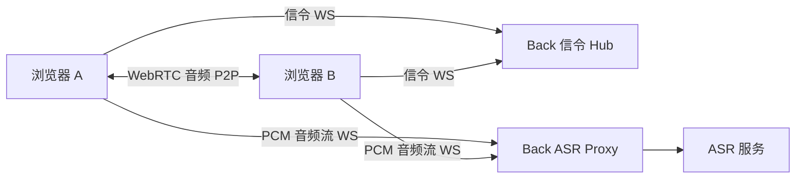
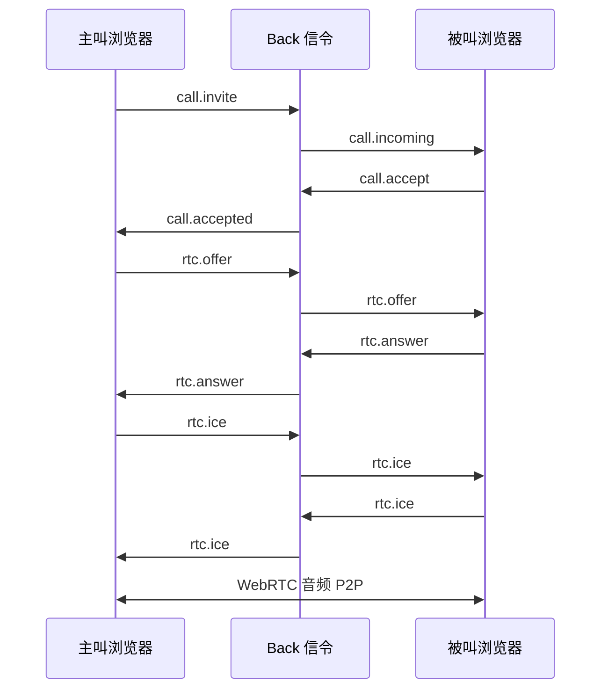
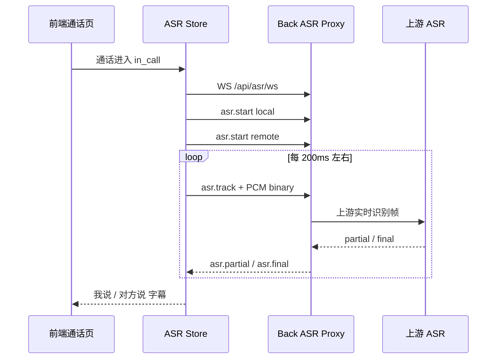

# PPT 说明稿：通话与实时字幕能力介绍

本文适合整理成 PPT，用于介绍 commonAgent 中 **账号语音通话** 与 **实时字幕 ASR** 能力。重点说明 WebRTC 通话链路、Back 信令、双轨字幕、Agent 边界和后续扩展方向。

## 1. 一句话介绍

**通话模块支持系统内账号之间发起语音通话，并在通话中实时生成双方字幕。**

PPT 要点：

- 登录用户之间可以进行 1 对 1 语音通话。
- 被叫用户在任意页面都能收到来电提醒。
- 通话音频通过浏览器 WebRTC 点对点传输。
- Back 负责通话信令和 ASR 代理。
- 通话字幕支持本地和远端双轨识别。
- Agent 当前不参与通话过程。

讲解备注：

> 这个模块展示了系统从“文本对话”扩展到“实时语音交互”的能力。它既能完成账号间通话，也能把通话内容实时转成文字。

## 2. 模块定位

**通话模块是业务协作能力，实时字幕是通话内容结构化的基础。**

PPT 要点：

- 通话：解决账号之间实时沟通。
- 来电提醒：让用户不在通话页也能接听。
- 实时字幕：把语音内容转成文本。
- 转写结果：当前用于页面展示和控制台 transcript。
- 后续可扩展：通话记录落库、Agent 查询通话历史、自动生成业务草稿。

讲解备注：

> 通话本身是协作功能，字幕则是后续智能化的入口。只有先把语音转成文本，后续才能做摘要、质检、信息提取和 Agent 查询。

## 3. 整体架构

**WebRTC 媒体点对点，Back 负责信令和 ASR 代理。**

建议配图：



PPT 要点：

- 音频媒体不经过 Back，直接通过 WebRTC 在浏览器之间传输。
- Back 只中继呼叫、接听、挂断、offer、answer、ice 等信令。
- 字幕音频由浏览器旁路采集后发送给 Back ASR Proxy。
- Back 再连接上游 ASR 服务。
- Agent 不在通话链路中。

讲解备注：

> 这里要区分两条链路：通话音频是浏览器点对点；字幕识别是浏览器把音频采样发给 Back，再由 Back 代理 ASR 服务。

## 4. WebRTC 通话流程

**从发起呼叫到接通，Back 只负责消息中继。**

建议配图：



PPT 要点：

- 主叫选择用户并发起呼叫。
- 被叫收到来电提醒。
- 被叫接听后双方交换 WebRTC SDP 和 ICE。
- 连接建立后音频点对点传输。
- 任一方挂断，Back 通知对方结束通话。

讲解备注：

> Back 不保存音频，也不转发音频，只负责双方建立连接所需的信令消息。

## 5. 来电提醒能力

**被叫用户不需要停留在通话页，也可以收到来电。**

PPT 要点：

- 登录后 `AppLayout` 会建立通话信令 WebSocket。
- 任意 `/app/*` 页面都能收到 `call.incoming`。
- 左下角展示来电条。
- 用户可选择接听或拒接。
- 接听后自动进入通话页。

讲解备注：

> 这保证了通话能力是全局可用的，而不是只能在某个页面里使用。用户在学生管理、首页或其他后台页面也能被呼叫。

## 6. 实时字幕流程

**通话接通后，前端采集本地和远端音频，分别送入 ASR。**

建议配图：



PPT 要点：

- 通话接通后才启动字幕。
- 前端分别采集 `localStream` 和 `remoteStream`。
- 音频转换为 16 kHz PCM。
- 每个轨道独立发送 `asr.start`。
- 二进制音频前通过 `asr.track` 标记当前轨道。
- 返回结果分为 partial 和 final。

讲解备注：

> 字幕是双轨的，也就是本地说话和对方说话分开识别、分开展示。这比混合成一条音频更利于后续区分角色和生成 transcript。

## 7. 双轨字幕设计

**local / remote 双轨让系统知道“谁在说话”。**

PPT 要点：

- `local`：当前用户自己的麦克风音频。
- `remote`：对方传来的 WebRTC 音频。
- 页面展示为“我说”和“对方说”。
- 挂断后 transcript 带角色前缀。
- 后续落库后可用于按角色生成摘要。

示例：

```text
[本地 · Alice] 你好，能听到吗？
[对方 · Bob] 可以听到，我这边也正常。
```

讲解备注：

> 双轨设计解决了通话记录里最重要的问题：不仅知道说了什么，还知道是谁说的。

## 8. ASR 服务接入

**ASR 凭证只在 Back，前端不暴露密钥。**

PPT 要点：

- Back 统一代理 ASR 上游。
- 前端只连接 `/api/asr/ws`。
- 上游密钥放在 `back/.env`。
- 不使用 `VITE_*` 暴露 ASR 密钥。
- 当前支持火山 SAUC 和科大讯飞 iat 实时识别。
- ASR 失败不会中断 WebRTC 通话。

讲解备注：

> 前端环境变量会被打包进浏览器，所以 ASR 密钥不能放前端。Back 代理既保护密钥，也方便统一做错误处理和供应商切换。

## 9. 通话与 Agent 的边界

**当前通话模块不经过 Agent，Agent 不参与实时音频链路。**

PPT 要点：

- WebRTC 信令由 Back 处理。
- 音频媒体由浏览器 P2P 传输。
- ASR 字幕由 Back 代理上游服务。
- Agent 当前不接收音频，也不自动处理 transcript。
- 通话转写持久化是后续扩展方向。

讲解备注：

> 这里的边界非常重要。实时通话强调低延迟和稳定性，不适合先经过 Agent。Agent 更适合在通话结束后处理结构化文本，例如摘要、查询和信息提取。

## 10. 当前已实现能力

PPT 要点：

- 用户列表和可呼叫对象。
- 发起呼叫。
- 来电提醒。
- 接听 / 拒接 / 取消 / 挂断。
- WebRTC 音频通话。
- 通话状态和计时。
- 本地 / 远端双轨 ASR。
- 实时 partial 字幕。
- final 字幕追加。
- 挂断后控制台 transcript。
- ASR 异常提示不影响通话。

讲解备注：

> 当前版本已经打通从呼叫、接听、语音传输到实时字幕的完整链路。

## 11. 安全与隐私设计

PPT 要点：

- 用户必须登录后才能使用通话。
- Back 根据 Cookie Session 识别当前用户。
- 只展示可呼叫用户列表，不包含当前用户。
- ASR 密钥只保存在 Back。
- Agent 不直接接触实时音频。
- 当前 transcript 不自动写入长期记忆。
- ASR 结果不自动进入 Chat 对话。

讲解备注：

> 通话和字幕涉及隐私，所以当前系统没有把转写自动写进 Agent 记忆，也没有自动发给 Chat。后续如果要做通话记录，需要明确授权和审计。

## 12. 可演示流程

**演示一：双账号语音通话**

PPT 要点：

1. 浏览器 A 登录 `alice`。
2. 浏览器 B 登录 `bob`。
3. Alice 进入通话页，呼叫 Bob。
4. Bob 在任意页面收到来电提醒。
5. Bob 接听后双方进入通话中。
6. 双方进行语音沟通。
7. 任一方挂断，双方回到空闲状态。

**演示二：实时字幕**

PPT 要点：

1. 双方保持通话。
2. Alice 说一句话。
3. Alice 端“我说”区域出现字幕。
4. Bob 回答一句话。
5. Alice 端“对方说”区域出现字幕。
6. 挂断后查看控制台 transcript。

讲解备注：

> 演示时建议准备两个浏览器或两个用户环境，并提前确认麦克风权限和 ASR 凭证。

## 13. 常见问题说明

PPT 要点：

- 没有声音：检查浏览器麦克风权限和 WebRTC 连接。
- 没有来电：检查双方是否登录、信令 WS 是否连接。
- 没有字幕：检查 ASR 凭证和 `/api/asr/ws`。
- 字幕延迟：实时 ASR 会受网络、音频质量和上游响应影响。
- ASR 报错但通话正常：这是预期隔离，字幕失败不影响通话。
- 多标签同账号：后连接可能替换前连接。

讲解备注：

> 排查时先区分是“通话问题”还是“字幕问题”。通话走 WebRTC，字幕走 ASR WebSocket，它们是两条不同链路。

## 14. 后续扩展方向

PPT 要点：

- 通话 transcript 落库。
- Agent 查询历史通话记录。
- 通话自动摘要。
- 从通话中提取学生报名信息。
- 根据通话内容生成待办或业务草稿。
- 通话质检和敏感词检测。
- 多人会议和坐席场景。
- 生产级 TURN 服务和多实例信令。

讲解备注：

> 实时字幕是后续智能化的基础。一旦 transcript 能稳定落库，Agent 就可以围绕通话内容做摘要、检索、质检和业务动作。

## 15. 项目价值

PPT 要点：

- 把后台系统从文本交互扩展到语音交互。
- 支持账号间即时沟通。
- 支持通话内容实时结构化。
- 为后续通话摘要、质检、线索提取打基础。
- 保持清晰边界：通话链路、ASR 链路、Agent 链路相互独立。

讲解备注：

> 这个模块的核心价值不是单独“能打电话”，而是把语音通话变成未来可被 Agent 理解和利用的数据来源。

## 16. PPT 页建议

如果控制在 8 页左右，可以按下面结构整理：

| 页码 | 标题 | 内容 |
|------|------|------|
| 1 | 模块定位 | 账号通话 + 实时字幕 |
| 2 | 整体架构 | WebRTC P2P + Back 信令 + ASR Proxy |
| 3 | 通话流程 | 呼叫、接听、SDP/ICE、挂断 |
| 4 | 来电提醒 | 任意页面接收来电 |
| 5 | 实时字幕流程 | local / remote 双轨采集和识别 |
| 6 | ASR 接入与安全 | Back 保存密钥，字幕失败不影响通话 |
| 7 | Agent 边界 | 当前不参与实时通话，后续处理 transcript |
| 8 | 演示与扩展 | 双账号演示、通话摘要、信息提取 |

