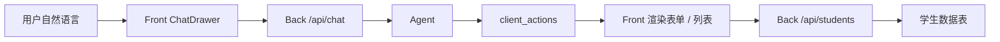
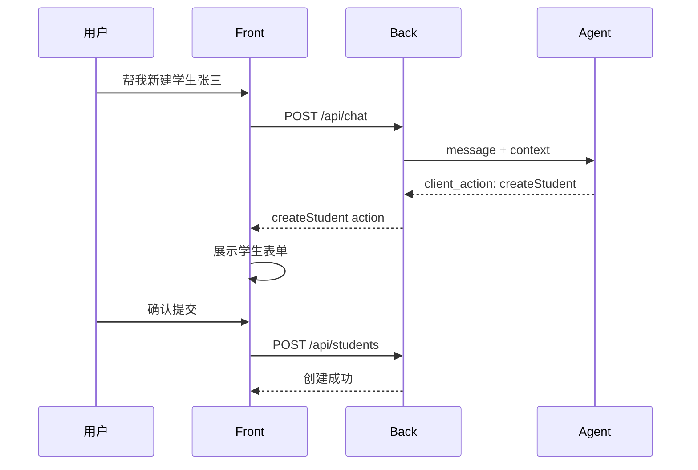

# PPT 说明稿：学生管理与 Agent 结合

本文适合整理成 PPT，用于介绍 commonAgent 中 **学生管理业务模块** 如何与 **智能 Agent** 结合。重点说明传统业务页面、对话式操作、客户端工具动作和安全边界。

## 1. 一句话介绍

**学生管理模块不仅支持传统表格 CRUD，也可以通过 Agent 对话完成学生创建、查询和页面跳转。**

PPT 要点：

- 学生管理是一个标准业务模块。
- 用户既可以在页面中手动操作，也可以通过智能对话触发操作。
- Agent 负责理解用户意图并生成结构化动作。
- Front 和 Back 负责真正执行业务操作和权限校验。

讲解备注：

> 这个模块展示了 Agent 如何从“聊天问答”进一步进入“业务操作”。用户不需要先找菜单、点按钮，也可以直接用自然语言完成学生管理相关任务。

## 2. 模块定位

**学生管理是 Agent 业务工具落地的典型示例。**

PPT 要点：

- 页面侧：提供完整学生 CRUD 能力。
- 对话侧：提供自然语言驱动的创建和查询能力。
- 后端侧：统一通过 `/api/students` 维护学生数据。
- Agent 侧：不直接写数据库，只返回 `client_actions`。

讲解备注：

> 学生管理本身是一个普通后台模块，但它被接入到 Agent 后，可以成为一个可对话、可自动填表、可联动查询的智能业务模块。

## 3. 传统学生管理能力

入口：`/app/students`

PPT 要点：

- 学生列表。
- 新建学生。
- 编辑学生。
- 删除学生。
- 批量删除。
- 搜索和分页。

适合场景：

- 批量浏览数据。
- 精确编辑字段。
- 管理员或业务人员进行常规后台操作。

讲解备注：

> 传统页面仍然保留，因为不是所有操作都适合对话完成。列表浏览、批量选择、精确编辑这类任务，表格页面更高效。

## 4. Agent 对话式学生管理

入口：任意登录页面右下角智能对话。

PPT 要点：

- 用户用自然语言提出需求。
- Agent 判断是否属于学生管理任务。
- Agent 返回结构化 `client_actions`。
- Front 在对话中展示表单或列表卡片。
- 用户确认后由 Back 执行业务 API。

示例话术：

- “帮我新建一个学生，姓名张三，学号 2024999。”
- “查一下学生列表。”
- “帮我查找李四的详细信息。”
- “打开学生管理页面。”

讲解备注：

> 对话式学生管理不是让大模型直接操作数据库，而是让大模型生成明确的动作，再由前端和后端按业务规则执行。

## 5. 整体链路

**自然语言 -> Agent 理解 -> client_actions -> Front 执行 -> Back 落库**

建议配图：

PPT 要点：

- Agent 负责理解和生成动作。
- Front 负责展示确认界面。
- Back 负责最终数据写入和读取。
- 数据库只由 Back 访问。

讲解备注：

> 这里的关键设计是“Agent 不越权”。Agent 只是提出动作建议，真正执行仍然由业务系统完成。

## 6. createStudent：对话中新建学生

**用户一句话提出新建需求，系统自动生成可确认表单。**

PPT 要点：

1. 用户说：“帮我新建一个学生，姓名张三，学号 2024999。”
2. Agent 识别为创建学生任务。
3. Agent 返回 `createStudent` 动作和已解析字段。
4. Front 在对话中渲染新建学生表单。
5. 用户检查并点击确认。
6. Front 调用 `/api/students` 创建学生。
7. 创建成功后，对话内自动追加学生列表。

建议配图：

讲解备注：

> 这个流程把自然语言变成了结构化表单。用户不用记住每个字段入口，也不用从零填写，Agent 可以先帮助预填。

## 7. listStudents：对话中查询学生

**用户用自然语言查询，系统在对话中展示学生列表卡片。**

PPT 要点：

1. 用户说：“查一下学生列表。”
2. Agent 返回 `listStudents` 动作。
3. Front 调用学生列表 API。
4. 对话中展示学生列表卡片。
5. 支持根据 Agent 提取的搜索条件展示结果。

示例：

- “查一下学生列表”
- “帮我查找李四”
- “搜索学号 2025 开头的学生”

讲解备注：

> 查询结果不是一段纯文本，而是结构化列表卡片。这样用户可以更清楚地看到学生数据，也方便后续扩展翻页、筛选和联动操作。

## 8. jumpPage：对话中打开学生管理

**Agent 可以帮助用户快速跳转到学生管理页面。**

PPT 要点：

1. 用户说：“打开学生管理页面。”
2. Agent 返回 `jumpPage` 动作。
3. Front 展示跳转确认卡片。
4. 用户确认后跳转 `/app/students`。

讲解备注：

> 页面跳转也作为一种工具动作处理。用户不需要熟悉菜单结构，可以直接告诉 Agent 想去哪里。

## 9. 为什么使用 client_actions

**client_actions 是 Agent 和业务系统之间的安全桥梁。**

PPT 要点：

- Agent 输出结构化动作，而不是直接执行代码。
- Front 可以展示确认界面，避免误操作。
- Front 可以校验动作参数。
- Back 可以再次校验登录态和权限。
- 业务逻辑仍然走原有 API。

对比：

| 方式 | 风险 | 当前方案 |
|------|------|----------|
| Agent 直接写数据库 | 权限和审计风险高 | 不采用 |
| Agent 调业务 API | 需要复杂服务间权限 | 暂不采用 |
| Agent 返回动作，Front / Back 执行 | 可控、可确认、可审计 | 当前采用 |

讲解备注：

> 这个设计让 Agent 成为“智能入口”，但不成为“绕过系统权限的执行者”。这更符合企业系统接入 AI 的安全要求。

## 10. 权限与安全边界

PPT 要点：

- 用户必须登录后才能使用学生管理和对话工具。
- Back 从 Cookie Session 获取真实用户身份。
- Agent 只接收 Back 注入的 `user_id`、`role_ids[]` 和工具白名单。
- Front 执行动作前做页面和参数校验。
- Back 的 `/api/students` 仍然是最终权限和数据校验入口。
- Agent 不直接访问学生数据库。

讲解备注：

> 即使 Agent 返回了一个动作，也不代表一定会执行。前端和后端都会根据当前用户状态进行校验。

## 11. 用户体验价值

PPT 要点：

- 降低操作门槛：用户用自然语言描述需求即可。
- 减少页面跳转：简单创建和查询可在对话中完成。
- 保留人工确认：创建学生前仍展示表单。
- 与传统页面互补：复杂管理仍回到表格页面。
- 形成业务闭环：对话不仅回答，还能完成实际操作。

讲解备注：

> 对话式操作不是替代所有后台页面，而是补充高频、简单、可结构化的业务流程。真正复杂的数据管理仍然保留传统页面。

## 12. 可演示流程

**演示一：对话跳转学生管理**

PPT 要点：

1. 登录系统。
2. 打开智能对话。
3. 输入“打开学生管理页面”。
4. 点击确认跳转。
5. 页面进入 `/app/students`。

**演示二：对话中新建学生**

PPT 要点：

1. 输入“帮我新建一个学生，姓名张三，学号 2024999”。
2. 对话内出现预填表单。
3. 检查字段并确认。
4. 创建成功。
5. 对话内自动出现学生列表。

**演示三：对话中查询学生**

PPT 要点：

1. 输入“帮我查找张三”。
2. 对话内出现学生列表卡片。
3. 展示查询条件和结果。
4. 可以进入传统学生管理页面继续处理。

讲解备注：

> 这三个演示能完整展示 Agent 从导航、创建到查询的业务闭环。

## 13. 技术实现要点

PPT 要点：

- 前端：`ChatDrawer` 渲染对话和动作卡片。
- 前端：`CreateStudentFormCard` 展示创建表单。
- 前端：`StudentListCard` 展示学生列表。
- 前端：`stores/chat.ts` 解析并执行 `client_actions`。
- 后端：`/api/chat` 负责转发 Agent 并注入用户上下文。
- 后端：`/api/students` 负责学生数据 CRUD。
- Agent：根据工具白名单生成 `createStudent` / `listStudents` / `jumpPage`。

讲解备注：

> 这套实现复用了原有业务 API，没有为 Agent 单独开危险的数据写入口。后续接入其他业务模块，也可以沿用同样模式。

## 14. 与普通 CRUD 的区别

| 维度 | 传统学生管理 | Agent 结合后 |
|------|--------------|--------------|
| 操作方式 | 点击菜单和表单 | 自然语言描述 |
| 数据展示 | 表格页面 | 表格页面 + 对话卡片 |
| 创建流程 | 手动填写全部字段 | Agent 预填，用户确认 |
| 查询流程 | 手动输入筛选条件 | Agent 解析查询意图 |
| 页面导航 | 用户找菜单 | Agent 生成跳转动作 |
| 安全控制 | 前后端权限 | 前后端权限 + 工具白名单 |

讲解备注：

> Agent 结合后，业务系统没有被推翻，而是多了一层自然语言入口。

## 15. 后续可扩展方向

PPT 要点：

- 支持更多学生字段的智能抽取。
- 支持对话中编辑学生信息。
- 支持对话中删除或批量处理，但需要更强确认机制。
- 支持学生详情卡片。
- 支持结合知识库回答学生相关政策问题。
- 支持把通话转写中的报名信息自动生成学生草稿。
- 支持审计日志，记录每个 Agent 动作的来源和执行结果。

讲解备注：

> 未来可以把学生管理扩展为完整的招生、教务或 CRM 场景。Agent 负责理解和草拟，业务系统负责确认、校验和落库。

## 16. PPT 页建议

如果控制在 8 页左右，可以按下面结构整理：

| 页码 | 标题 | 内容 |
|------|------|------|
| 1 | 模块定位 | 学生管理 + Agent 一句话介绍 |
| 2 | 传统学生管理 | CRUD、搜索、分页 |
| 3 | 对话式学生管理 | 自然语言触发业务动作 |
| 4 | 整体链路 | 用户输入 -> Agent -> client_actions -> API |
| 5 | 新建学生流程 | createStudent 动作和表单确认 |
| 6 | 查询学生流程 | listStudents 动作和列表卡片 |
| 7 | 安全边界 | Agent 不直接写库，Front / Back 执行 |
| 8 | 价值与扩展 | 降低门槛、业务闭环、后续能力 |

