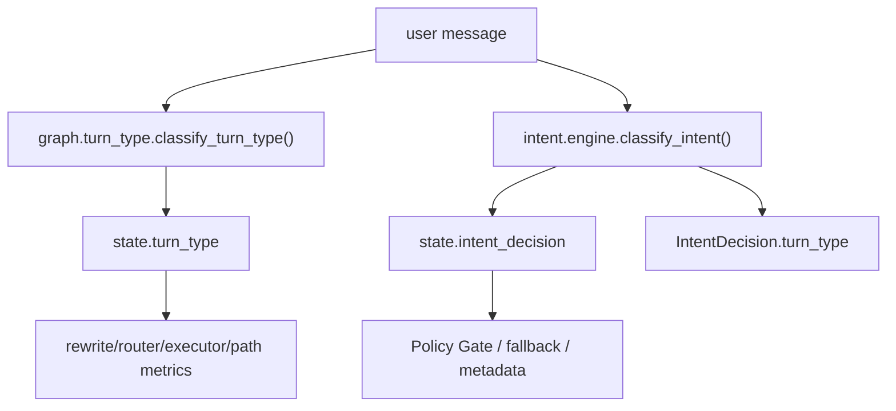
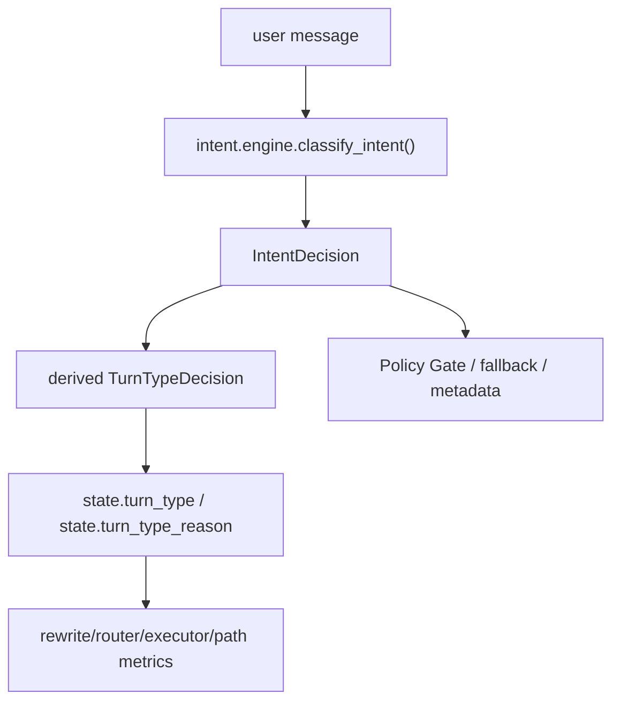

# Agent 意图权威来源收敛 PRD

## 文档定位

本文是任务 58-62 的设计依据，目标是解决当前 `turn_type` 兼容分类与 `IntentDecision` 控制面分类并存的问题。本文不替代 [README.md](../../README.md) 的当前运行契约；只有对应任务落地并同步 README 后，本文内容才进入当前事实。

## 背景

控制面任务 49-57 已经把 `IntentDecision`、Policy Gate、`memory_query`、Fallback Manager 和 feedback/eval 闭环落地。当前主图仍保留双轨分类：

- 旧兼容分类：`agent/src/graph/turn_type.py::classify_turn_type()`，直接基于 `rag.intent` 和 `rag.router` 的启发式规则产出 `TurnTypeDecision`。
- 新控制面分类：`agent/src/intent/engine.py::classify_intent()`，产出结构化 `IntentDecision`。
- 兼容映射：`IntentDecision.turn_type` 根据 `route` 派生旧 `TurnType`。

这种双轨设计是渐进迁移阶段的合理折中，但继续保留会带来长期风险：

- 同一用户输入可能被两套规则判成不同路径。
- `turn_type` 看起来仍像独立权威，弱化了控制面治理。
- rewrite/router/executor/path metrics 的真实来源不够清晰。
- 后续维护者可能继续改旧规则，绕过 `IntentDecision`、Policy Gate 和 intent eval。

## 核心判断

运行时应该只有一个意图权威来源：`IntentDecision`。

`turn_type` 仍可以存在，但只能是兼容字段，由 `IntentDecision.route` 派生，不能再拥有独立分类权。旧 `graph.turn_type.classify_turn_type()` 可以保留为 adapter，以保护旧导入和测试迁移，但其内部必须委托控制面。

## 目标

1. 冻结并记录当前双轨分歧，明确哪些分歧是目标行为、哪些是迁移风险。
2. 建立单一权威入口：控制面先产出 `IntentDecision`，再派生 `turn_type` / `turn_type_reason`。
3. 主图 `load_memory` 不再分别调用旧 `classify_turn_type()` 和新 `classify_intent()`。
4. rewrite/router/executor/path metrics 消费的 `turn_type` 均来自同一个 `IntentDecision`。
5. 旧 `graph.turn_type` 降级为兼容 adapter，不再直接依赖 `rag.intent` 的全局意图启发式。
6. 文档最终说明：`IntentDecision` 是唯一权威，`turn_type` 是兼容派生字段。

## 非目标

- 不移除 `TurnType` enum；它仍是兼容、trace、seed 和下游字段。
- 不删除 `IntentDecision.turn_type` property。
- 不把 hot path 改为默认调用 `INTENT_CLASSIFIER` LLM；当前仍以确定性规则为主。
- 不重写 RAG 检索、memory query 证据抽取、client_actions 执行边界。
- 不改变 Front -> Back -> Agent 三层边界。
- 不在规划阶段提前修改 README 的当前事实。

## 当前双轨行为

这个结构允许观测分歧，但不应该长期存在。

## 目标结构

迁移完成后：

- `load_memory` 只运行一次控制面分类。
- `state.intent_decision` 和 `state.turn_type` 必须同源。
- `intent_conflict` 不再表示“旧分类 vs 新分类”的常态分歧；如保留字段，只能用于兼容或异常观测。
- 旧 `graph.turn_type.classify_turn_type()` 只作为 adapter 调用控制面，不再直接调用 `is_user_fact_statement()` 等局部启发式。

## 设计原则

### 权威来源唯一

路径治理只能由控制面输出。所有粗粒度字段都从控制面派生，不能并行判断。

### 兼容字段保留

`turn_type` 仍服务于 rewrite/router/executor、path metrics、seed 和旧测试。收敛目标不是删除字段，而是删除独立分类权。

### 先冻结再切换

先用 characterization 测试记录当前双轨差异，再切换 graph 来源。否则很难区分预期行为变化和回归。

### 行为变化必须可评测

典型样例必须纳入 intent seed 或专门测试，尤其是：

- 「我是谁」「我叫什么」「我公司在哪」必须是 `memory_query`。
- 「我叫张三」「我公司在天翔街188号」仍允许高置信 `fact_update`。
- 「报销制度是什么」仍是 `knowledge_query`。
- 「打开 pageA」仍是 `client_action`。
- 「它需要什么材料」仍是 `ambiguous`。

## 风险与缓解

| 风险 | 说明 | 缓解 |
|------|------|------|
| 路径行为变化 | 旧 `turn_type` 与 `IntentDecision.route` 不一致时，切换来源会改变 rewrite/RAG/executor 路径 | 任务 58 先列出分歧矩阵，任务 60 只接受明确目标行为 |
| 测试大量变更 | 旧测试可能断言旧 reason code | 先引入派生 helper 和兼容 adapter，逐步迁移测试 |
| 观测字段含义变化 | `intent_conflict` 可能不再有旧含义 | 文档和 metadata 测试同步说明 |
| 局部规则被误删 | `rag.intent` 仍被 rewrite/router 局部复用 | 只移除 graph turn_type 对它的全局分类依赖，不删除局部能力 |

## 任务拆分

| ID | 任务 | 目的 |
|----|------|------|
| 58 | 行为冻结与双轨分歧审计 | 先证明当前两套分类哪里一致、哪里分歧，并把目标行为写进测试 |
| 59 | 单一权威派生契约 | 明确从 `IntentDecision` 派生 `TurnTypeDecision` 的 helper / adapter 契约 |
| 60 | Graph 切换到 IntentDecision 单源 | `load_memory` 只调用控制面分类，并派生 `turn_type` |
| 61 | 旧 turn_type 分类器降级与清理 | `graph.turn_type` 降级为兼容 adapter，清除旧全局分类权 |
| 62 | README、maps、PRD 与 progress 最终对齐 | 实现完成后统一更新所有该更新的文档 |

## 验收标准

- 主图每轮只运行一个权威意图分类入口。
- `state.turn_type` 与 `state.intent_decision.turn_type` 同源。
- 旧 `graph.turn_type.classify_turn_type()` 若保留，内部必须委托控制面。
- intent/path eval 覆盖关键路径，且第一人称疑问不会再被任何权威路径视为事实写入。
- README 和 maps 明确 `IntentDecision` 是唯一权威，`turn_type` 是兼容派生字段。
