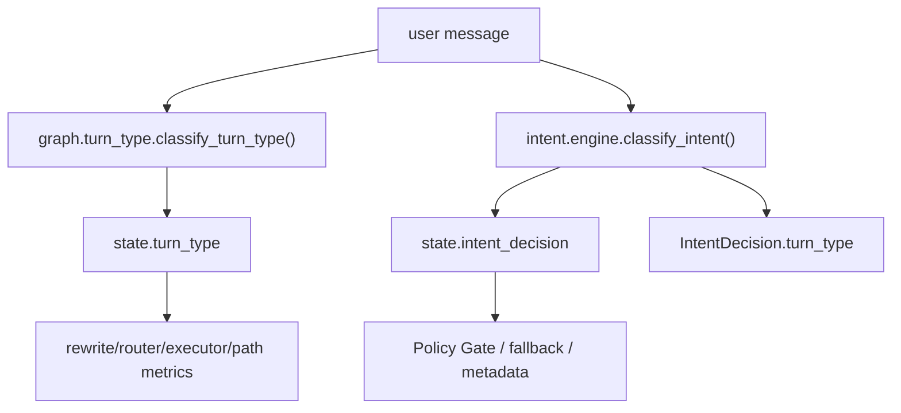
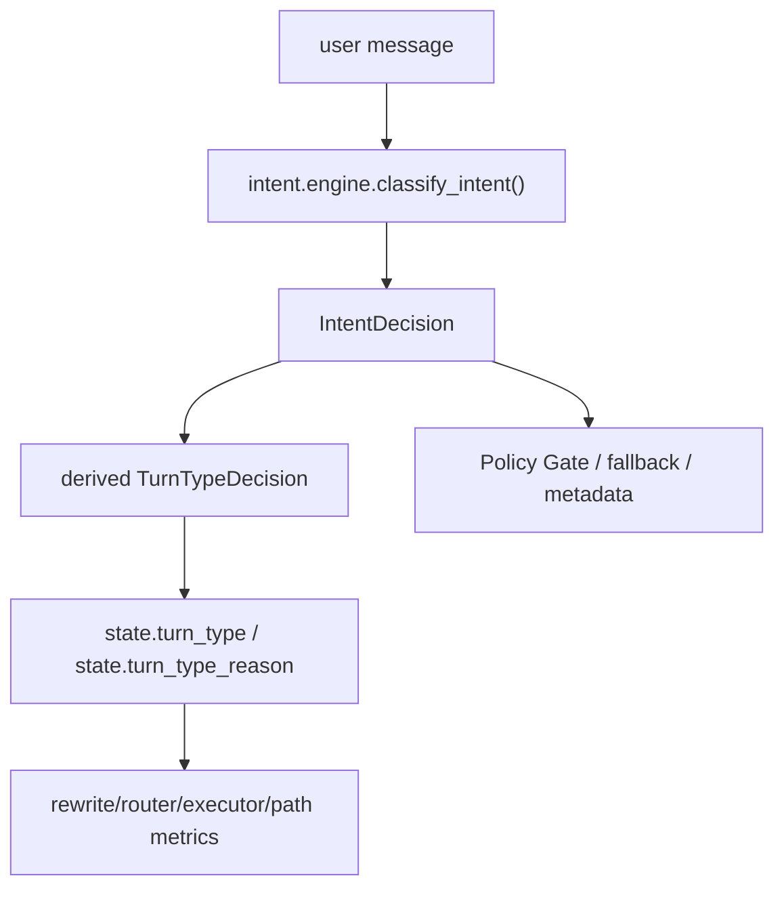

# Agent 意图权威来源收敛 PRD

## 文档定位

本文是任务 58-62 的设计依据，目标是解决当前 `turn_type` 兼容分类与 `IntentDecision` 控制面分类并存的问题。本文不替代 [README.md](../../README.md) 的当前运行契约；只有对应任务落地并同步 README 后，本文内容才进入当前事实。

## 背景

控制面任务 49-57 已经把 `IntentDecision`、Policy Gate、`memory_query`、Fallback Manager 和 feedback/eval 闭环落地。任务 58-62（2026-05-25 完成）已将运行时意图权威收敛为单源结构。

迁移前主图曾保留双轨分类（历史事实，见下方「历史双轨行为」）：

- 旧兼容分类：`graph.turn_type.classify_turn_type()` 直接基于 `rag.intent` 和 `rag.router` 启发式规则。
- 新控制面分类：`intent.engine.classify_intent()` 产出结构化 `IntentDecision`。

继续保留双轨会带来同一输入两套路径、观测字段语义混乱等长期风险，因此任务 58-61 已完成收敛。

## 落地状态（2026-05-25）

| 项 | 状态 | 说明 |
|----|------|------|
| 58 行为冻结 | ✅ | `test_intent_authority_characterization.py` 记录迁移前分歧矩阵；现已改为单源对齐测试 |
| 59 派生契约 | ✅ | `turn_type_decision_from_intent()` 在 [engine.py](/Users/chenkexin/commonAgent/agent/src/intent/engine.py:1) |
| 60 graph 切换 | ✅ | [memory_nodes.py](/Users/chenkexin/commonAgent/agent/src/graph/nodes/memory_nodes.py:1) 仅调用 `classify_intent()` 并派生 `turn_type` |
| 61 adapter 降级 | ✅ | [turn_type.py](/Users/chenkexin/commonAgent/agent/src/graph/turn_type.py:1) 委托 control plane，不再独立分类 |
| 62 文档对齐 | ✅ | README、docs/maps、progress 同步单源权威当前事实 |

### 与 README 的偏差说明

- **已落地**：`IntentDecision` 为唯一权威；`turn_type` 为兼容派生；`intent_conflict` 常态 `false`；`classify_intent()` 失败时保守回退 `general_chat`。
- **仍保留兼容**：`TurnType` enum、`graph.turn_type.classify_turn_type()` 导出、`intent_conflict` / `intent_shadow_error` state 字段、`INTENT_CONFLICT_DETECTED` 事件类型（当前 graph 不 emit）。
- **未接入 hot path**：`INTENT_CLASSIFIER` LLM 结构化分类器；`check_intent_conflicts()` 仍服务于 classifier 评测，不是 graph 常态观测。
- **局部保留**：`rag.intent` helper 仍供 rewrite/router/signals 局部使用，不是全局意图权威。

## 历史双轨行为（迁移前）

这个结构在任务 52-60 期间用于观测分歧，已于任务 60 移除。

## 当前结构（与 README 一致）

运行时只有一个意图权威来源：`IntentDecision`（见 [README.md](../../README.md) 当前契约）。

`turn_type` 仍可以存在，但只能是兼容字段，由 `IntentDecision.route` 派生。`graph.turn_type.classify_turn_type()` 保留为 adapter，内部委托控制面。

## 目标（已完成）

1. 冻结并记录双轨分歧，明确目标行为（任务 58）。
2. 建立单一权威入口：控制面先产出 `IntentDecision`，再派生 `turn_type` / `turn_type_reason`（任务 59-60）。
3. 主图 `load_memory` 不再并行调用两套分类（任务 60）。
4. rewrite/router/executor/path metrics 消费的 `turn_type` 均来自同一 `IntentDecision`（任务 60-61）。
5. 旧 `graph.turn_type` 降级为兼容 adapter（任务 61）。
6. README、maps、progress 说明单源权威当前事实（任务 62）。

## 非目标

- 不移除 `TurnType` enum；它仍是兼容、trace、seed 和下游字段。
- 不删除 `IntentDecision.turn_type` property。
- 不把 hot path 改为默认调用 `INTENT_CLASSIFIER` LLM；当前仍以确定性规则为主。
- 不重写 RAG 检索、memory query 证据抽取、client_actions 执行边界。
- 不改变 Front -> Back -> Agent 三层边界。

## 目标结构

当前事实：

- `load_memory` 只运行一次控制面分类。
- `state.intent_decision` 和 `state.turn_type` 必须同源。
- `intent_conflict` 不再表示“旧分类 vs 新分类”的常态分歧；如保留字段，只能用于兼容或异常观测。
- 旧 `graph.turn_type.classify_turn_type()` 只作为 adapter 调用控制面，不再直接调用 `is_user_fact_statement()` 等局部启发式。

## 设计原则

### 权威来源唯一

路径治理只能由控制面输出。所有粗粒度字段都从控制面派生，不能并行判断。

### 兼容字段保留

`turn_type` 仍服务于 rewrite/router/executor、path metrics、seed 和旧测试。收敛目标不是删除字段，而是删除独立分类权。

### 先冻结再切换

先用 characterization 测试记录当前双轨差异，再切换 graph 来源。否则很难区分预期行为变化和回归。

### 行为变化必须可评测

典型样例必须纳入 intent seed 或专门测试，尤其是：

- 「我是谁」「我叫什么」「我公司在哪」必须是 `memory_query`。
- 「我叫张三」「我公司在天翔街188号」仍允许高置信 `fact_update`。
- 「报销制度是什么」仍是 `knowledge_query`。
- 「打开 pageA」仍是 `client_action`。
- 「它需要什么材料」仍是 `ambiguous`。

## 风险与缓解

| 风险 | 说明 | 缓解 |
|------|------|------|
| 路径行为变化 | 旧 `turn_type` 与 `IntentDecision.route` 不一致时，切换来源会改变 rewrite/RAG/executor 路径 | 任务 58 先列出分歧矩阵，任务 60 只接受明确目标行为 |
| 测试大量变更 | 旧测试可能断言旧 reason code | 先引入派生 helper 和兼容 adapter，逐步迁移测试 |
| 观测字段含义变化 | `intent_conflict` 可能不再有旧含义 | 文档和 metadata 测试同步说明 |
| 局部规则被误删 | `rag.intent` 仍被 rewrite/router 局部复用 | 只移除 graph turn_type 对它的全局分类依赖，不删除局部能力 |

## 任务拆分

| ID | 任务 | 状态 |
|----|------|------|
| 58 | 行为冻结与双轨分歧审计 | ✅ 2026-05-25 |
| 59 | 单一权威派生契约 | ✅ 2026-05-25 |
| 60 | Graph 切换到 IntentDecision 单源 | ✅ 2026-05-25 |
| 61 | 旧 turn_type 分类器降级与清理 | ✅ 2026-05-25 |
| 62 | README、maps、PRD 与 progress 最终对齐 | ✅ 2026-05-25 |

## 验收标准（已满足）

- 主图每轮只运行一个权威意图分类入口。
- `state.turn_type` 与 `state.intent_decision.turn_type` 同源。
- 旧 `graph.turn_type.classify_turn_type()` 若保留，内部必须委托控制面。
- intent/path eval 覆盖关键路径，且第一人称疑问不会再被任何权威路径视为事实写入。
- README 和 maps 明确 `IntentDecision` 是唯一权威，`turn_type` 是兼容派生字段。
