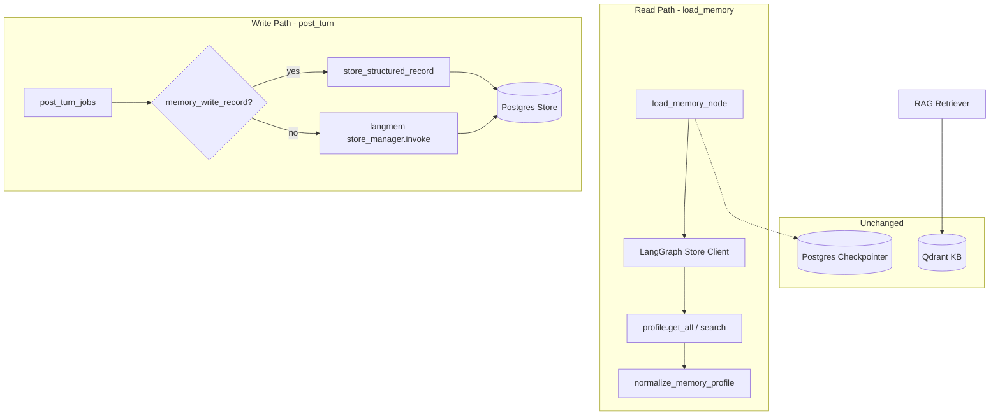

# Agent LangMem 迁移（替换 mem0）PRD

## 文档定位

本文是 **长期记忆存储层替换** 的设计草案，不替代当前 [README.md](../../README.md) 的运行契约。

当前系统已在控制面完成 **Single Extraction Point + 双轨写入**（任务 63-68）：Policy 通过的 `fact_update` 走确定性 slot fill + `infer=False` 落库；其他回合仍走 mem0 `infer=True` 慢路径。mem0 仍作为独立存储与抽取引擎，与 LangGraph/Postgres 栈并行，带来：

- 第二套向量存储（`QDRANT_COLLECTION_MEM0`）与运维面
- infer 抽取不可控（小模型 `stored_empty`、与 control plane 决策脱钩）
- 与 LangGraph 长期记忆 Store 能力重复，生态割裂

本文目标：用 **langmem + LangGraph BaseStore（Postgres）** 替换 mem0，**保留** 控制面 structured write 契约与读取侧 `memory_profile` 语义，**删除** mem0 依赖与相关 Qdrant 集合。

## 背景与动机

### 当前记忆分层（保持不变的部分）

| 类型 | 存储 | 维度 | 迁移后 |
|------|------|------|--------|
| 完整对话 | Postgres Checkpointer | `thread_id` | **不变** |
| 滚动 summary | Checkpointer metadata | `thread_id` | **不变** |
| 用户偏好 / 事实 | mem0 OSS + Qdrant | `user_id` | **→ LangGraph Store + langmem** |
| 知识库 RAG | Qdrant | `role_id` | **不变** |

### 为何要换

1. **栈统一**：项目已深度依赖 LangGraph、LangChain、Postgres checkpointer；langmem 原生对接 LangGraph Store，与 checkpoint 同库可运维。
2. **抽取可控**：langmem 的 `create_memory_manager` / `create_memory_store_manager` 暴露 instructions、schema、insert/update 策略；可对接现有 LLM Gateway 与 `ModelUseCase`，避免 mem0 黑盒 infer。
3. **Structured Write 更自然**：当前 fast path 已不依赖 mem0 infer，仅把 canonical text `Memory.add(infer=False)` 当作 KV/向量落库；LangGraph Store 的 `put(namespace, key, value)` 更贴合「按 attribute upsert」。
4. **减少基础设施**：用户记忆不再占用独立 Qdrant collection；可选在同一 Postgres 上启用 pgvector 做 semantic search（与 RAG Qdrant 职责分离）。
5. **issue 根因未完全消除**：structured 路径已缓解 `stored_empty`，但 inferred 慢路径仍完全依赖 mem0 内置 LLM（见 [issue/mem0事实抽取失败.md](../../issue/mem0事实抽取失败.md)）。

### 为何不继续深化 mem0

- mem0 与 LangGraph 图编排、Store namespace、trace/metadata 契约无一等集成。
- 团队已在 control plane 自建 slot fill + policy；mem0 的 value 主要在「托管式 infer + 向量 dedup」，与当前架构方向重复。
- AGENTS.md 已禁止 mem0 cloud；本地 OSS 仍引入 `mem0ai` 依赖与 Qdrant 侧车。

## 目标

1. **存储替换**：用户长期记忆读写走 LangGraph Store（推荐 `PostgresStore` / `AsyncPostgresStore`），不再调用 `mem0.Memory`。
2. **抽取替换**：inferred 慢路径用 langmem background manager（`create_memory_store_manager`）或受控 `create_memory_manager`，经 LLM Gateway 配置模型。
3. **契约保留**：`StructuredMemoryRecord`、`MemoryWriteMode`、Policy Gate、post_turn 双轨互斥、memory_query 只读路径行为不变。
4. **可观测对齐**：`memory_write.mode`、`mem0_write.*` trace 键迁移为中性命名（如 `memory_store.*`），eval seed 可继续回归 structured 路径。
5. **彻底清理**：移除 `mem0ai`、mem0 专用 env、mem0 Qdrant collection 配置、mem0 模块与测试；文档与 AGENTS 约束同步更新。

## 非目标

- 不改变 Front → Back → Agent 边界、`thread_id` / `user_id` 语义。
- 不改造 RAG Qdrant 管线与 KB ingest。
- 不在本阶段引入 agent hot-path 记忆工具（`create_manage_memory_tool` 给 deepagents 主动写记忆）；维持 **post_turn 后台写入** 模式。
- 不实现 Front pending/saved/failed 记忆 UI（structured write PRD Phase 2 仍可选）。
- **不做过渡期方案**：不要求双读、双写、灰度；只保证迁移完成后的最终态可用。
- **不保留 Qdrant mem0 数据**：旧 `QDRANT_COLLECTION_MEM0` 可丢弃，不提供迁移脚本。

## 方案对比

| 维度 | 当前 mem0 | 目标 langmem + Store |
|------|-----------|----------------------|
| 存储 | Qdrant collection + mem0 封装 | Postgres `BaseStore`（namespace + key + JSON value） |
| 读取 | `get_all(filters={user_id})` → `list[str]` | `search(namespace, query=...)` 和/或 profile key `get` |
| Structured write | `Memory.add(text, infer=False)` | `store.put(("users", user_id, "profile"), attribute, record_dict)` |
| Inferred write | `Memory.add(messages, infer=True)` + 内置 LLM | `create_memory_store_manager(...).invoke(...)` 后台 enrich/consolidate |
| 向量检索 | mem0/Qdrant 内置 | Store 可选 `index={dims, embed}`（pgvector） |
| Mock | `MEM0_MOCK` | `MEMORY_STORE_MOCK` 或 InMemoryStore |
| 依赖 | `mem0ai`, `qdrant-client`（记忆侧） | `langmem`, `langgraph-store-postgres`（或 langgraph 自带 store 包） |

### 推荐存储模型：Profile + Collection 混合

与现有 `memory/profile.py` 对齐：

| Store 区域 | namespace 示例 | key | value | 用途 |
|------------|------------------|-----|-------|------|
| **Profile（结构化）** | `("users", "{user_id}", "profile")` | `name`, `birth_year`, `city`, ... | `{value, raw_utterance, updated_at, source_turn_id}` | fast path deterministic upsert；读取 O(1) |
| **Collection（自由文本）** | `("users", "{user_id}", "facts")` | UUID / content hash | `{text, importance, ...}` | inferred 慢路径；semantic search |

读取侧继续产出 `list[str]`（兼容 `mem0_memories` state 字段名可在 Phase 5 重命名为 `user_memories`）：

1. 从 profile namespace 合成 canonical fact 字符串
2. 从 collection namespace `search` 取 top-k 自由事实
3. 合并后仍走 `normalize_memory_profile()` → `memory_profile` + residual

## 目标架构



### 与 LangGraph 编译的关系

当前 `compile_graph()` 仅挂载 `checkpointer`，**未**挂载 `store`：

```98:105:agent/src/graph/build.py
    if checkpointer is not None:
        saver = checkpointer
    elif use_pooled_postgres:
        saver = get_pooled_checkpointer(setup=False)
    else:
        saver = MemorySaver()

    return builder.compile(checkpointer=saver)
```

迁移后建议：

- 新增 `memory/store.py`：`get_pooled_store()` 工厂（与 checkpointer 共用 `DATABASE_URL`，独立 connection pool）。
- **Phase 1-4**：post_turn / load_memory 通过工厂直接访问 Store，**不必**强行 `graph.compile(store=store)`（减少 graph 编译面变更）。
- **可选 Phase 6+**：若未来 deepagents 需要 hot-path 工具，再 `compile(store=store)` 并注入 langmem tools。

### Inferred 慢路径：langmem 接入方式

推荐 **Background Store Manager**（对应现有 post_turn 异步线程池）：

```python
# 概念示例 — 非最终实现
from langmem import create_memory_store_manager

manager = create_memory_store_manager(
    model,  # 经 LlmGateway / ModelUseCase.MEMORY_EXTRACT
    namespace=("users", "{user_id}", "facts"),
    instructions="...",  # 可迁移 mem0_custom_instructions.txt 业务语义
    enable_inserts=True,
)

# post_turn 内
manager.invoke({"messages": turn_payload}, config={"configurable": {"user_id": uid}})
```

Structured fast path **不调用** manager 的 LLM 抽取，仅 `store.put` profile keys（与 today 的 `store_structured_record` 等价）。

### 读取语义

| 场景 | 行为 |
|------|------|
| `load_memory` | 拉 profile + collection；合成 fact list；写入 state |
| `memory_query` | 仍只读 profile + 可靠 thread 证据；不触发 write |
| `rewrite` | 继续用 fact list 格式化 query（today: `format_mem0_for_system` 内联） |
| `context_assembly` | `memory_profile` + residual free text 预算不变 |

**Profile 与 Collection 共存**（已确认）：同一用户可同时有结构化 profile 字段与 inferred 自由文本 facts。读取时 profile 走 `get`（按 key），collection 走 **pgvector semantic search**（按 query 相似度）。因此 **pgvector 为必开能力**，运维与库配置见独立任务 [75-postgres-pgvector-store-setup.md](../prompts/75-postgres-pgvector-store-setup.md)；profile 字段不走向量索引。

## 分阶段实施计划

建议拆分为 7 个 prompt 任务卡（69-75），依赖顺序如下：

```text
75 Postgres pgvector 运维配置（可与其他任务并行，但 70 读 collection 前须完成）
69 契约与行为冻结 → 70 Store 工厂与读路径（含 pgvector index）→ 71 Structured 写 → 72 Inferred 写
                                                              ↓
74 文档收口 ← 73 删除 mem0（无 Qdrant 数据迁移）
```

### Phase 0：契约与行为冻结（任务 [69](../prompts/69-langmem-migration-contract-spike.md)）

- 新增 `MemoryStoreFact` / 读取契约（或扩展 `contracts/memory_write.py`）。
- Characterization 测试冻结：`load_memory` 产出 fact 形状、post_turn structured/inferred 分支、memory_query 证据来源。
- Eval：`memory_write_seed.json` 基线 pass；注明 mem0 实现为 legacy baseline。
- **不改运行路径**。

### Phase 0b：Postgres pgvector 运维（任务 [75](../prompts/75-postgres-pgvector-store-setup.md)）

- **独立任务**：文档 + 本地验证步骤，说明如何在现有 `DATABASE_URL` 库上启用 `pgvector`、跑 Store `setup()`、核对 embedding 维度。
- 不实现 Agent 业务代码；产出 README 章节与任务卡内可复制命令。
- 任务 70 依赖本任务（或确认 pgvector 已就绪）。

### Phase 1：Store 工厂与读路径（任务 [70](../prompts/70-langmem-store-read-path.md)）

- 依赖：`langmem`、`langgraph-store-postgres`（或文档确认的包名）、**任务 75**。
- 实现 `memory/store.py`：`PostgresStore`/`AsyncPostgresStore` 池化、`setup()` 迁移、**pgvector index**（`EMBEDDING_MODEL_DIMS` + 现有 embedding 模型）、mock/`InMemoryStore`（mock 无向量）。
- 实现 `memory/read.py`：`fetch_user_memories(user_id)` — profile `get` + collection `search` — 返回 `list[str]`。
- Settings：`MEMORY_STORE_MOCK`、`MEMORY_READ_LIMIT`；迁移期可保留 `MEM0_*` deprecated alias，**任务 74 删除**。
- 测试：`test_memory_store_read.py`；integration 需 Postgres + pgvector。

### Phase 2：Structured Write 切 Store（任务 [71](../prompts/71-langmem-structured-write.md)）

- 重写 `store_structured_record()` → `store.put` profile namespace；删除对 `mem0.Memory.add(infer=False)` 的调用。
- `ExtractionMethod.MEM0_INFER` 重命名为 `LANGMEM_INFER` 或 `LLM_EXTRACT`（保留 enum 兼容 alias）。
- Path contract / trace：`mem0_write.*` 增加 `memory_store.*` 并行键；测试通过后 deprecate 旧键。
- Eval：structured seed 5/5 pass，`stored_empty` 对 fact_update 仍为 forbidden。

### Phase 3：Inferred Write 切 langmem（任务 [72](../prompts/72-langmem-inferred-write.md)）

- 用 `create_memory_store_manager` 替换 `extract_and_store()` 中的 mem0 infer。
- 模型经 `ModelUseCase.MEMORY_EXTRACT`（由原 `MEM0_WRITE` 改名）走 LLM Gateway。
- 迁移 `memory/prompts/mem0_custom_instructions.txt` → langmem instructions 或项目 prompt 文件。
- Characterization：inferred 路径允许 `stored_empty`，但需记录 manager 返回条数。

### Phase 4：mem0 删除（任务 [73](../prompts/73-langmem-remove-mem0.md)）

- 删除 mem0 模块、依赖、env、Qdrant mem0 collection 配置。
- **不提供** Qdrant → Store 数据迁移脚本（Qdrant mem0 数据可丢）。
- 全量测试绿；CI 不再安装 mem0ai。

### Phase 5：文档与命名收口（任务 [74](../prompts/74-langmem-docs-final.md)）

- 更新 README、AGENTS.md、docs/maps、progress、issue 引用。
- State 字段 `mem0_memories` → `user_memories`（**本迁移一并完成**，不保留长期 alias）。
- 移除 deprecated `MEM0_*` settings。

## 环境变量迁移

| 当前 (mem0) | 目标 | 说明 |
|-------------|------|------|
| `MEM0_MOCK` | `MEMORY_STORE_MOCK` | 跳过 Store 读写 |
| `MEM0_READ_LIMIT` | `MEMORY_READ_LIMIT` | 每用户最大事实条数 |
| `MEM0_LLM_MODEL_NAME` | `MEMORY_EXTRACT_MODEL_NAME` | inferred 抽取模型 |
| `MEM0_LLM_MAX_TOKENS` | `MEMORY_EXTRACT_MAX_TOKENS` | |
| `MEM0_LLM_TIMEOUT_SECONDS` | `MEMORY_EXTRACT_TIMEOUT_SECONDS` | |
| `MEM0_FREE_TEXT_MAX_FACTS` | `MEMORY_FREE_TEXT_MAX_FACTS` | 上下文预算 |
| `QDRANT_COLLECTION_MEM0` | **删除** | 用户记忆不再用 Qdrant |
| — | `MEMORY_STORE_SETUP` | 是否在启动时跑 Store migrations |
| — | （无单独开关） | pgvector **必开**；Store 工厂始终配置 semantic index |

**契约同步**：`config.py`、`.env.example`、`.env` 三者同改；跑 `test_settings.py::test_env_files_match_settings_contract`。

## 代码清理清单

### 删除（Phase 4）

| 路径 | 说明 |
|------|------|
| `agent/src/memory/mem0_client.py` | mem0 读客户端 |
| `agent/src/memory/mem0_write.py` | mem0 写封装 |
| `agent/src/memory/prompts/mem0_custom_instructions.txt` | 迁移后删除 |
| `agent/src/memory/prompts/mem0_extract.txt` | 已无引用，直接删 |
| `agent/pyproject.toml` 中 `mem0ai` | 依赖移除 |

### 重写 / 新增

| 路径 | 说明 |
|------|------|
| `agent/src/memory/store.py` | Store 工厂 + setup |
| `agent/src/memory/read.py` | 用户记忆读取 |
| `agent/src/memory/write.py` | structured + inferred 写入（替代 mem0_write） |
| `agent/src/memory/langmem_manager.py` | 可选：封装 `create_memory_store_manager` 单例 |

### 修改（引用面）

| 路径 | 变更要点 |
|------|----------|
| `memory/post_turn.py` | import 与 log 字段 |
| `memory/__init__.py` | 导出新 client，移除 mem0 |
| `graph/nodes/memory_nodes.py` | `fetch_user_memories` 来源 |
| `memory/assembly.py` | `format_mem0_for_system` → `format_user_memories_for_system` |
| `contracts/llm.py` | `MEM0_WRITE` → `MEMORY_EXTRACT` |
| `infrastructure/llm/policy.py` | 模型策略映射 |
| `observability/tracing.py` | metadata 键名 |
| `observability/path_contract.py` | path metrics |
| `settings/config.py` | 新 settings 字段 |
| `graph/state.py` | 字段重命名（可选分阶段） |
| `rag/rewrite.py` | 变量/注释 mem0 → user memories |

### 测试迁移

| 当前 | 目标 |
|------|------|
| `tests/test_mem0_read.py` | `tests/test_memory_store_read.py` |
| `tests/test_mem0_write.py` | `tests/test_memory_store_write.py` |
| `tests/test_structured_memory_characterization.py` | 更新 mock 点（mem0 add → store put） |
| `tests/test_graph_load_memory.py` | patch 路径更新 |
| `tests/test_memory_query_executor.py` | fixture 字段名 |
| `tests/test_context_assembly.py` | mem0 → user memories |
| `tests/test_llm_gateway.py` | ModelUseCase 重命名 |
| `tests/test_settings.py` | env 契约 |
| `scripts/run_memory_write_eval.py` | 后端无关 eval runner |

### 文档清理

| 路径 | 动作 |
|------|------|
| `README.md` | 记忆章节改为 Store + langmem（任务 74） |
| `AGENTS.md` | mem0 约束 → Store 约束；删除 mem0 cloud 禁止条款中 mem0 特指，改为「禁止第三方托管记忆 SaaS」 |
| `docs/maps/*.md` | chat-turn-pipeline、state-fields、llm-calls、failure-modes |
| `docs/progress.md` | 新任务 69-74 行 + changelog |
| `docs/prd/common-agent-architecture.md` | 历史层：标注 mem0 为已废弃设计 |
| `docs/prd/agent-structured-memory-write.md` | 增加「存储面由 mem0 迁 langmem」偏差说明 |
| `issue/mem0事实抽取失败.md` | 关闭或指向本 PRD |
| `agent/evals/README.md` | eval 说明 |
| 历史 prompt 卡 `07/17/24/34/65-*` | **不删**；可加页眉「已 superseded by langmem migration」 |

## 风险与缓解

| 风险 | 影响 | 缓解 |
|------|------|------|
| Postgres Store 与 Checkpointer 同库争用连接 | 连接池压力 | 独立 pool；监控连接数 |
| pgvector 未安装 | collection 语义检索不可用 | **任务 75 必做**；启动前检查 extension |
| langmem inferred 仍可能空写入 | 慢路径 recall 低 | instructions 调优；保留 trace；不用于 fact_update |
| 切换后旧 Qdrant mem0 为空 | 切换后用户需重新写入记忆 | 已接受；不做数据迁移 |
| `langmem` 版本 `<1.0` | API 变动 | pin 版本；wrapper 层隔离 |
| Async vs Sync Store | Gateway 同步 invoke 与 async store | post_turn 继续 `asyncio.to_thread` 或统一 async store 客户端 |

## 验收标准

1. **功能**：Policy 通过的 fact_update structured 写入后，同用户 `memory_query` 可读到对应 profile 字段。
2. **双轨**：同一 turn 有 `memory_write_record` 时不触发 inferred manager。
3. **隔离**：`memory_query` 路径不写入 Store。
4. **RAG 无回归**：KB 检索仍只走 Qdrant role collection。
5. **测试**：非 integration 全绿；Store integration 在本地 Postgres 可跑。
6. **Eval**：`memory_write_seed.json` structured 用例 5/5 pass。
7. **清理**：仓库内无 `mem0ai` import、无 `Memory.from_config`、无 `QDRANT_COLLECTION_MEM0` 运行时依赖。
8. **文档**：README 与 AGENTS 与实现一致。

## 已确认决策（2026-05-25）

| 项 | 决策 |
|----|------|
| 过渡期 | **不管**；只验收最终态 |
| Qdrant mem0 数据 | **可丢**；无迁移脚本 |
| Profile + Collection | **共存**；collection 读依赖 **pgvector**（任务 75） |
| state 字段 | **`mem0_memories` → `user_memories`**（任务 74 收口） |

## 剩余技术项（实现中验证，无需产品决策）

1. **Store 包版本矩阵**：`langgraph-store-postgres` 与 `langgraph-checkpoint-postgres>=3.1` 兼容性，任务 69 spike 验证。
2. **langmem 版本 pin**：建议 `langmem>=0.0.30`。

## 与现有 PRD 的关系

| 文档 | 关系 |
|------|------|
| [agent-structured-memory-write.md](./agent-structured-memory-write.md) | 控制面 Single Extraction Point **保留**；仅存储面从 mem0 API 换 Store API |
| [agent-control-plane-intent-fallback.md](./agent-control-plane-intent-fallback.md) | Policy Gate、memory_query **不变** |
| [common-agent-architecture.md](./common-agent-architecture.md) | 历史架构；迁移完成后更新「用户偏好」行 |

## 建议下一步

LangMem 迁移 **69-75 已全部完成**；后续按产品需求从 [docs/progress.md](../progress.md) 规划新任务。

## 落地状态（2026-05-25）

**任务 69-75 已全部完成。** 当前运行契约以 [README.md](../../README.md) 为准。

| 阶段 | 任务 | 状态 |
|------|------|------|
| 契约与 spike | 69 | ✅ |
| Store 读路径 + pgvector | 70、75 | ✅ |
| Structured Write | 71 | ✅ |
| Inferred Write (langmem) | 72 | ✅ |
| 删除 mem0 | 73 | ✅ |
| 文档与 `user_memories` 收口 | 74 | ✅ |

验收：非 integration 测试全绿；`memory_write_seed.json` 5/5；运行时无 `mem0ai` / `MEM0_*` / `mem0_memories`。

---

**状态**：LangMem 迁移 **69-75 已全部完成**（2026-05-25）；pgvector 运维见 [75-postgres-pgvector-store-setup.md](../prompts/75-postgres-pgvector-store-setup.md) 与 README；当前运行契约以 README 为准。
