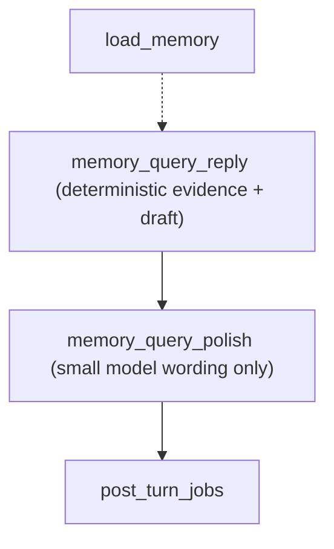
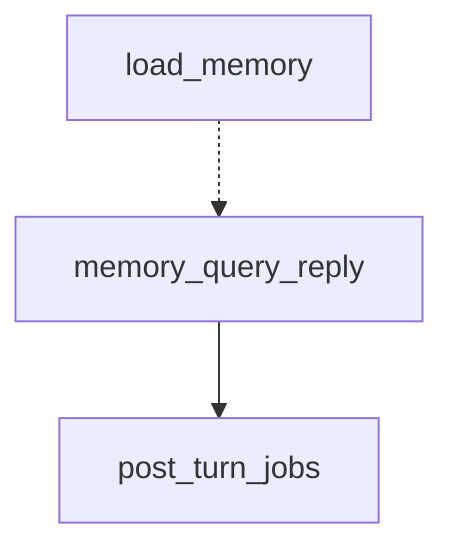
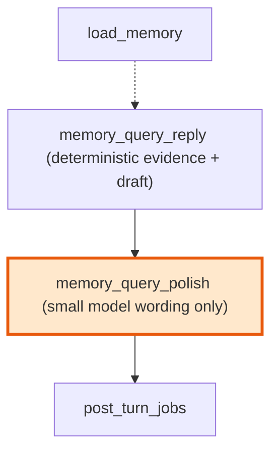

# Agent memory_query 小模型话术润色 PRD

> **落地状态（2026-05-26）**：任务 76-80 已全部完成并同步 [README.md](/Users/chenkexin/commonAgent/README.md) 与 [docs/maps/](/Users/chenkexin/commonAgent/docs/maps/)。当前运行路径为 `load_memory -> memory_query_reply -> memory_query_polish -> post_turn_jobs`；`MEMORY_QUERY_POLISH_USE_LLM` 默认 `true`（校验失败回退 deterministic draft）。

## 背景

`memory_query` 已是一等运行路径，用于回答「我是谁」「我叫什么」「我公司在哪」等用户长期记忆读取问题。**当前**主图形态为：

```text
load_memory -> memory_query_reply -> memory_query_polish -> post_turn_jobs
```

`memory_query_reply` 调用 `memory.query.answer_memory_query()`，返回 `MemoryQueryResult`；`memory_query_polish` 根据开关润色话术或 passthrough draft，并 append 唯一 assistant message。

| 字段 | 含义 |
|------|------|
| `reply` | 确定性模板草稿（polish 前） |
| `evidence` | 本轮回答使用的可靠记忆证据，如 `name=刘日兴` |
| `missing_reason` | 没有可靠证据时的缺失原因，用于 memory fallback |

这条路径的优点是事实安全：只基于 `memory_profile`、Store/langmem 用户记忆和当前 thread 中可靠用户自述回答，不走 RAG、不走 deepagents、不触发记忆写入。缺点是模板话术偏硬，例如「我记录到你叫刘日兴。」。用户希望在不牺牲事实边界的前提下，用小模型优化最后话术。

## 目标

新增一个可配置的 memory query 话术润色阶段：

```text
load_memory -> memory_query_reply -> memory_query_polish -> post_turn_jobs
```

核心原则：

- `memory_query_reply` 仍是事实权威，负责证据选择和确定性草稿。
- 小模型只负责「怎么说」，不负责「答什么」。
- 小模型输入只能包含用户问题、确定性草稿和结构化证据摘要。
- 小模型输出必须通过校验；失败时回退确定性草稿。
- 记忆缺失时不得编造，可默认跳过润色或只润色缺失回复。
- `memory_query` 仍不触发用户记忆写入。

## 非目标

- 不让小模型重新检索记忆。
- 不让小模型决定 `memory_query` 路由。
- 不改变 `MemoryQueryResult` 的事实语义。
- 不改变 Store/langmem 读写模型。
- 不将 `memory_query` 交给 Supervisor/deepagents。
- 不改变 RAG、client_actions 或外部工具边界。

## 当前链路（已落地）



## 历史设计稿（任务 76 前）



## 目标链路（与当前一致）



## 设计

### 1. 事实层保持确定性

`answer_memory_query()` 继续负责：

- 解析用户问的是姓名、生日、城市、职业、公司地址还是偏好。
- 从 `memory_profile`、自由文本记忆和 thread 历史中选择证据。
- 生成确定性 `reply`。
- 生成 `missing_reason`。

小模型不得直接读取 `user_memories` 原始列表，不得读取 checkpoint 全历史，不得访问 RAG。

### 2. 新增润色契约

建议新增 `MemoryQueryPolishResult` 或等价 typed contract：

| 字段 | 含义 |
|------|------|
| `reply` | 通过校验后的最终回复 |
| `used_llm` | 是否调用了小模型 |
| `fallback_reason` | 小模型跳过或失败原因 |
| `changed` | 最终回复是否不同于 deterministic draft |

输入结构建议：

```python
{
    "question": "我叫啥名字",
    "draft_reply": "我记录到你叫刘日兴。",
    "evidence": [{"field": "name", "value": "刘日兴", "source": "memory_profile"}],
    "missing_reason": "",
}
```

### 3. 小模型 prompt 约束

系统约束：

- 只润色表达，不增删事实。
- 必须保留所有 evidence value 的原文。
- 不输出解释、不输出 JSON 以外内容（若采用结构化输出）。
- 如果没有证据，不得猜测用户信息。
- 回复短句优先，中文自然、简洁。

示例：

| 输入 | deterministic draft | evidence | 允许输出 |
|------|----------------------|----------|----------|
| 我叫啥名字 | 我记录到你叫刘日兴。 | `name=刘日兴` | 我记得你的名字是刘日兴。 |
| 我公司在哪 | 我记录到你公司的地址是天翔街188号。 | `company_address=天翔街188号` | 你公司的地址我这边记录的是天翔街188号。 |
| 我叫啥 | 我目前没有可靠记录你的姓名。 | none | 我这边还没有可靠记录你的姓名。你可以告诉我，我之后会按你的授权记住。 |

### 4. 输出校验

小模型输出必须满足：

- 非空，长度在合理范围内。
- 对每个 evidence value，必须原样出现或通过明确允许的格式化保留。
- 不出现与 `missing_reason` 冲突的肯定事实。
- 不出现「可能」「大概」「我猜」等不确定事实表达。
- 如果校验失败，回退 `draft_reply`，并记录 fallback。

### 5. Graph 接入

推荐新增节点 `memory_query_polish`，而不是把小模型逻辑直接塞进 `memory_query_reply_node`：

- 图上可观测：能清楚看到 `memory_query_reply -> memory_query_polish -> post_turn_jobs`。
- 可开关：禁用时仍可经过节点并快速 passthrough，或由路由跳过。
- 责任清晰：确定性证据和小模型话术分层。

### 6. 配置

涉及环境契约，必须同步：

- `agent/src/settings/config.py`
- `agent/.env.example`
- `agent/.env`

建议字段：

```text
MEMORY_QUERY_POLISH_USE_LLM=false
MEMORY_QUERY_POLISH_MODEL_NAME=
MEMORY_QUERY_POLISH_MAX_TOKENS=80
MEMORY_QUERY_POLISH_TIMEOUT_SECONDS=5
```

若默认 `false`，上线风险低；任务实现可先在测试中显式打开。

### 7. Observability

新增 metadata：

- `memory_query.polish.called`
- `memory_query.polish.enabled`
- `memory_query.polish.model`
- `memory_query.polish.changed`
- `memory_query.polish.fallback_reason`
- `memory_query.polish.validation_failed`

路径契约：

- `memory_query` 仍为 fast path。
- 不调用 rewrite/RAG/Supervisor/deepagents。
- 小模型调用不应计入 supervisor 调用。
- 可单独记录 `memory_query_polish.called`，避免污染原有 `supervisor.called` 语义。

## 测试策略

1. Characterization：冻结当前 `memory_query` 确定性行为。
2. Contract tests：校验小模型输入/输出、证据保留和 fallback。
3. Graph tests：验证新增节点、开关、失败回退、post_turn skip memory write。
4. Path/trace tests：验证 metadata 和路径契约。
5. Eval seed：覆盖姓名、公司地址、偏好、缺失记忆、模型篡改事实等样例。

## 任务拆分

| ID | 任务 | 目标 |
|----|------|------|
| 76 | 行为冻结与评测种子 | 冻结当前 `MemoryQueryResult` 与 graph 路径，不改运行行为 |
| 77 | 润色契约、配置与小模型客户端 | 新增 polish contract、settings/env、LLM Gateway use case 和纯函数 |
| 78 | Graph 接入与 fallback | 新增 `memory_query_polish` 节点并接入主图 |
| 79 | 可观测、eval 与真实 trace 验证 | 补 metadata、eval runner/seed 和 trace 验收 |
| 80 | 文档最终对齐 | 更新 README、docs/maps、PRD 落地状态、progress |

## 风险与缓解

| 风险 | 缓解 |
|------|------|
| 小模型篡改姓名/地址 | 输出校验必须保留 evidence value，失败回退草稿 |
| 延迟上升 | 默认关闭；超时短；失败回退 |
| 路径契约混乱 | 单独记录 `memory_query_polish` metadata，不复用 supervisor |
| 缺失记忆被编造 | missing 场景强约束，默认可跳过润色 |
| README 提前描述未来状态 | 仅 PRD/任务卡描述目标；README 在任务 80 落地后同步 |

## 落地状态与偏差

| 项 | 状态 | 说明 |
|----|------|------|
| 任务 76 行为冻结与 seed | ✅ | `memory_query_polish_seed.json` 8 条；characterization 测试 |
| 任务 77 契约 / 配置 / 客户端 | ✅ | `contracts/memory_query_polish`、`query_polish.py`、`MEMORY_QUERY_POLISH_*` |
| 任务 78 graph 接入 | ✅ | `memory_query_reply -> memory_query_polish -> post_turn_jobs`；单条 assistant message |
| 任务 79 可观测与 eval | ✅ | `memory_query.polish.*` metadata、`run_memory_query_polish_eval.py` |
| 任务 80 文档对齐 | ✅ | README、docs/maps、本 PRD、progress |
| 默认线上开启润色 | ✅ | `MEMORY_QUERY_POLISH_USE_LLM=true`；`MEMORY_QUERY_POLISH_MODEL_NAME` 建议配置小模型 |
| LangSmith Dataset 同步 polish seed | ⏸ 非范围 | 本地 JSON runner 已覆盖；Dataset 同步为可选人工步骤 |
| 生产监控看板 | ⏸ 非范围 | 仅 trace/path metadata，无独立 dashboard |

## 验证入口

```bash
cd agent
uv run pytest tests/test_graph_compile.py tests/test_memory_query_polish.py tests/test_memory_query_executor.py tests/test_path_contract.py tests/test_tracing.py -v
uv run python scripts/run_memory_query_polish_eval.py --seed evals/memory_query_polish_seed.json --json
```
