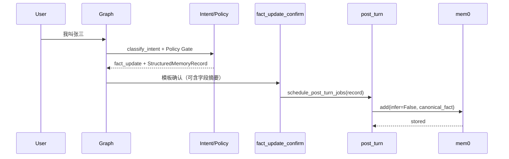

# Agent 结构化记忆写入（Single Extraction Point）PRD

## 文档定位

本文是 **记忆写入路径重构** 的设计草案，不替代当前 [README.md](../../README.md) 的运行契约。

当前系统已在控制面完成 Intent Authority 收敛：Policy Gate 只对高置信、显式属性+值的 `fact_update` 开放快速路径。但存储面仍对所有 post_turn 写入统一走 `mem0 Memory.add(..., infer=True)`，由 mem0 内置小模型 **再次** 判断「要不要存、存什么」。这造成 **Single Extraction Point** 原则被违反，并引发线上问题：

```text
用户：我叫张三
控制面：IntentDecision.route=fact_update，Policy Gate=allow
用户可见：已收到，我会把这个信息作为你的偏好/事实参考。
存储面：mem0 infer=True + Qwen2.5-7B → stored_empty
```

根因不是「小模型不够强」本身，而是 **控制面已决策 memory_write，存储面仍做概率性二次抽取**，且用户话术使用了 **Commit 语气**，与异步 durable write 结果脱钩。

本文目标：把高置信 `fact_update` 快路径改成 **结构化单次抽取 + deterministic 落库**；`infer=True` 保留给 **general_chat / 开放对话** 的「顺带挖记忆」慢路径。

## 落地状态与偏差说明

截至文档创建时（2026-05-25），本 PRD **尚未落地**。README 仍描述「post_turn 异步 mem0 infer 写入」为当前事实。实现进度见 [docs/progress.md](../progress.md) 任务 **63-68**。

## 背景与问题陈述

### 当前链路

```text
load_memory
  → classify_intent()
  → Policy Gate（要求 fact_attributes + explicit_value）
  → turn_type=fact_update
fact_update_confirm
  → 模板 Commit 确认
post_turn_jobs（异步）
  → extract_and_store(..., infer=True)
  → mem0 内部 LLM 再抽一次
  → 可能 stored_empty
```

### 已知失败模式

| 现象 | 用户影响 | 系统影响 |
|------|----------|----------|
| `stored_empty` | 以为已记住，下轮 `memory_query` 查不到 | trace 显示 fast path 成功，实际记忆缺失 |
| infer 与 intent 分歧 | 控制面写入 name，mem0 抽成 preference 或空 | memory_profile 归一化不稳定 |
| 异步 + Commit | 无法在同一 turn 修正话术 | 需补偿机制或 UI pending 状态 |

### 与现有能力的关系

已具备、应复用：

- `intent/signals.py`：`fact_attributes`、`explicit_values`、`has_explicit_value`
- `intent/policy.py`：Policy Gate 已要求显式属性与值
- `memory/profile.py`：读取侧已有 profile 字段归一化
- `memory/mem0_write.py`：`Mem0WriteResult` 结构化状态与 trace metadata
- `post_turn.py`：fire-and-forget 不阻塞主链路

不应推翻：

- Front → Back → Agent 边界
- mem0 本地 OSS + Qdrant，禁止 cloud
- Policy Gate 对 fact_update 的准入制度
- general_chat 等路径仍可 post_turn infer 挖记忆

## 核心判断

### Single Extraction Point

**记忆「写什么」应在控制面完成一次结构化决策；存储面只负责 durable upsert，不再重新理解语义。**

```text
控制面 Control Plane          存储面 Storage Plane
─────────────────────         ────────────────────
IntentSignals                 StructuredMemoryRecord
  fact_attributes      →        subject / attribute / value
  explicit_values               confidence / source_turn_id
Policy Gate allow
IntentDecision.memory_write
```

### 双轨写入策略

| 路径 | 触发条件 | 抽取方式 | mem0 调用 |
|------|----------|----------|-----------|
| **Structured Write（快路径）** | Policy 通过的 `fact_update` | 控制面 slot fill（确定性） | `infer=False`，写入 canonical fact 文本或 structured payload |
| **Inferred Write（慢路径）** | 其他会调度 post_turn 的回合 | mem0 infer | `infer=True`，从对话顺带发现记忆 |

两条路径 **互斥**：同一 turn 若已有 `StructuredMemoryRecord`，post_turn **不得** 再对该 turn 做 infer。

### Acknowledge vs Commit

工业上异步 durable write 不应默认使用 Commit 语气。本 PRD 分阶段处理：

1. **Phase 1（本批任务）**：structured write 成功后，确认话术可携带 **已解析字段摘要**（如「已记住：姓名=张三」）；structured write 失败时降级为 Acknowledge 或诚实说明。
2. **Phase 2（后续，不在 63-68）**：Front 记忆面板 pending/saved/failed 状态机。

任务 30 曾约定「模板确认不承诺 mem0 已持久化」；本 PRD 在 structured path 成功后 **允许有限 Commit**（仅当 deterministic write 成功或 speed-layer raw 已落库）。

## 目标

1. 新增 `StructuredMemoryRecord` 契约，作为控制面到存储面的唯一写入载荷（快路径）。
2. 在 Policy 通过的 `fact_update` 上，从 `IntentSignals` **确定性 slot fill**，不调用额外 LLM。
3. post_turn 对 structured record 走 `infer=False` deterministic store；其余路径保留 `infer=True`。
4. 消除「Policy 通过 + 用户 Commit + stored_empty」组合；对该组合建立 eval 回归。
5. 补全 trace / path contract / eval seed，使记忆写入成功率可度量。
6. 文档与 maps 同步新写入契约，不破坏 README 治理顺序。

## 非目标

- 不引入新数据库表或外部消息队列（本批用现有 post_turn + mem0；Outbox/DLQ 为后续 PRD）。
- 不改 mem0 cloud / MemoryClient。
- 不重构 memory_profile 读取侧（仅确保 structured write 与 profile 字段对齐）。
- 不在本批实现 Front 记忆 UI 或用户删改 API。
- 不用更大模型替代 slot fill；快路径 **禁止** 再调 LLM 抽取。
- 不改变 Policy Gate 准入规则本身（除非实现中发现契约无法对齐，需单独评审）。

## 设计原则

### 控制面决策，存储面执行

存储模块不做「这是不是事实」的二次判断；只校验 record 完整性、user_id、幂等键，然后 upsert。

### 确定性优先

快路径写入必须可单测：给定 utterance + signals → record → mem0 payload，不依赖网络 LLM。

### 失败可观测、可回归

`stored_empty` 在 structured path 上视为 **缺陷**；必须有 eval case 与 CI 断言。

### 读取写入 schema 对齐

structured record 的 `attribute` 枚举应与 `memory/profile.py` 首批字段及 `intent/signals.py` 的 `fact_attributes` 保持一致，避免写 A 读 B。

## StructuredMemoryRecord 契约

### 字段

```python
StructuredMemoryRecord(
    subject: MemorySubject,          # user | org
    attribute: str,                  # name | birthday | city | job | company.address | preference | ...
    value: str,                      # 规范化后的显式值
    raw_utterance: str,              # 用户原文（审计 / speed-layer fallback）
    confidence: float,               # 来自 IntentDecision.confidence 或 slot fill 固定值
    source_turn_id: str,             # thread_id + turn 序号或 hash
    extraction_method: str,          # slot_fill_v1
)
```

### subject 映射

| IntentSignals | subject |
|---------------|---------|
| `is_org_self_reference=True` | `org` |
| 否则 | `user` |

### attribute 映射（第一批）

与 `_FACT_ATTRIBUTE_PATTERNS` 对齐，并映射到 profile 字段：

| signals attribute | record attribute | profile 字段 |
|-------------------|------------------|--------------|
| `name` | `name` | `profile.name` |
| `birthday` | `birthday` | `profile.birth_year`（抽取年份） |
| `city` | `city` | `profile.city` |
| `job` | `job` | `profile.job` |
| `address` + org | `company.address` | `company.address` |
| `preference` | `preference.answer_style` 或自由 preference | `preference.answer_style` |

同一 utterance 多属性时，**第一批只写主属性一条 record**（与 Policy 当前单路径一致）；多 fact 拆分留后续任务。

### canonical fact 文本

mem0 仍存文本向量，structured path 需生成稳定 canonical 句子供 infer=False 写入与 profile 归一化复用，例如：

```text
用户的名字是张三
用户出生于1997年
公司地址是天翔街188号
```

生成规则应集中在一处（如 `memory/structured_record.py`），测试覆盖中文模板。

## 运行时数据流（目标态）



### State 承载

新增 **单轮 ephemeral** 字段（命名以实现为准，如 `memory_write_record`）：

- 在 `load_memory_node` 或专用节点写入
- `post_turn_jobs_node` 读取并传给 `extract_and_store` / `store_structured_record`
- 使用 `EphemeralValue`，不跨 invoke 依赖

### post_turn 路由伪代码

```python
if memory_write_record is not None:
    return store_structured_record(user_id, record)  # infer=False
return extract_and_store(user_id, turn_messages)       # infer=True，慢路径
```

## 与 mem0 API 的集成

优先方案：

```python
memory.add(
    canonical_fact,           # str 或 [{"role":"user","content": canonical_fact}]
    user_id=user_id,
    infer=False,
    metadata={"attribute": record.attribute, "source_turn_id": record.source_turn_id},
)
```

约束：

- 仍走本地 `get_local_memory()`，禁止 cloud client
- `Mem0WriteResult.status` 扩展：`stored_structured` / `stored_structured_empty`（若需区分）
- mock 测试注入点保留 `set_mem0_add_fn`

若 mem0 对 `infer=False` + metadata 行为与预期不符，允许在任务 65 中记录偏差并采用 **canonical 文本 + infer=False** 的最小可行方案，不引入第二套向量库。

## 用户可见话术

### 结构化路径（Policy 通过 + slot fill 成功）

推荐模板（可配置常量）：

```text
已记住：{attribute_label}={value}。后续我会据此为你提供个性化回答。
```

若 post_turn 异步尚未完成，主图仍可在同轮给出 **基于 record 的 Commit**（因为写入内容是 deterministic，不依赖 infer LLM）。可选：仅在 `store_structured_record` 同步探测成功时 Commit——本批默认 **异步 write + 基于 record 的 Commit**，并在 trace 标记 `mem0_write.pending=true`。

### slot fill 失败（Policy 通过但 record 为空）

- **不得** 使用 fact_update 快路径 Commit
- 降级：走 conservative general_chat 或 Acknowledge + infer 慢路径（带 trace reason `structured_fill_failed`）

### infer 慢路径

保持现有行为；话术不要求 Commit。

## 可观测性

新增 / 扩展 metadata 与 events：

| 键 | 含义 |
|----|------|
| `memory_write.mode` | `structured` \| `inferred` |
| `memory_write.record.attribute` | 结构化属性 |
| `memory_write.record.value_hash` | 值哈希（避免 log 泄露） |
| `memory_write.extraction_method` | `slot_fill_v1` |
| `mem0_write.status` | 沿用；structured 成功应为 `stored` 且 `stored_count>=1` |

Path contract：`fact_update` fast path 的 mem0 模式应为 `structured`，且 **不应** 出现 mem0 infer LLM span。

## 评测与回归

新增 `agent/evals/memory_write_seed.json`（或扩展现有 seed），至少覆盖：

| 类别 | 样例 | 断言 |
|------|------|------|
| name | 我叫张三 | record.attribute=name, infer=False, stored |
| birthday | 我出生于1997年 | birth_year 归一 |
| org address | 我公司在天翔街188号 | subject=org, company.address |
| negative infer-only | general_chat 顺带偏好 | 仍走 infer=True |
| regression | Policy 通过 fact_update | 不得 stored_empty |

本地 runner 可仿 `run_intent_eval.py`；CI 以 mock mem0 为主。

## 风险与缓解

| 风险 | 缓解 |
|------|------|
| slot fill 漏抽边缘句式 | eval seed 扩样；失败降级慢路径，不 Commit |
| mem0 infer=False 语义与 infer=True 不一致 | canonical 文本规范 + 读取侧 profile 规则复测 |
| 多属性单句 | 第一批只写主属性；README 说明限制 |
| 异步 write 失败用户已 Commit | trace 告警 + 后续 Outbox PRD；可选下轮补偿话术 |

## 任务拆分

| ID | 任务 | 说明 |
|----|------|------|
| 63 | 契约与评测种子 | `StructuredMemoryRecord`、memory_write seed、行为冻结 |
| 64 | Slot fill 抽取器 | 从 signals/decision 生成 record，纯单测 |
| 65 | Deterministic store | `store_structured_record`，infer=False |
| 66 | Graph 接入 | state 承载 + post_turn 双轨路由 |
| 67 | 话术与可观测 + eval runner | 确认模板、trace、path contract、本地 eval |
| 68 | 文档收口 | README、maps、PRD 落地状态、progress |

依赖顺序：63 → 64 → 65 → 66 → 67 → 68。

## 验收标准（整体）

- [ ] Policy 通过的 `fact_update` 不再对同 turn 调用 mem0 infer。
- [ ] intent_seed 中 fact_update 正例在 mock mem0 下 `stored_count >= 1`。
- [ ] 「我叫张三」类 case 不再出现 `stored_empty` + Commit 组合。
- [ ] general_chat post_turn 仍走 infer=True，行为无回归。
- [ ] README 与 maps 描述双轨写入当前事实。
- [ ] Path contract / trace 可区分 `structured` vs `inferred`。

## 参考

- 问题记录：[issue/mem0事实抽取失败.md](../../issue/mem0事实抽取失败.md)
- 控制面 PRD：[agent-control-plane-intent-fallback.md](./agent-control-plane-intent-fallback.md)
- 现有 fact_update 快路径：任务 30、53
- mem0 infer 写入：任务 24、34
