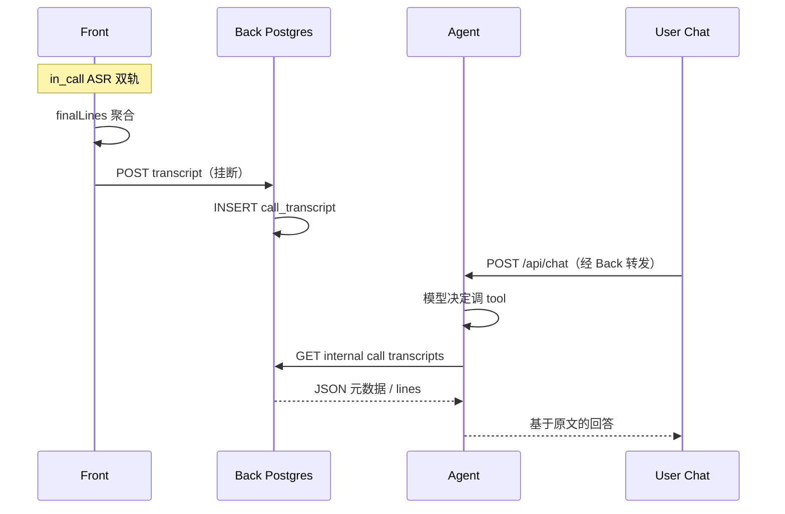

# 通话转写持久化与 Agent 按需查询（PRD）

## 文档定位

- 本文定义 **通话 ASR 逐句稿** 的落库、查询与 Agent 消费方式。
- **前置能力**：[火山 SAUC 通话字幕](./volcengine-streaming-asr.md)（双轨 PCM、`finalLines`、挂断 `console.group` transcript）；[账号 WebRTC 通话](./webrtc-account-call.md)（`call_id`、信令）。
- 不替代 [README.md](../../README.md) 的三层边界；**实现完成后**需同步 README、`docs/progress.md`、demo-walkthrough（可选 B7）、任务卡。
- **Agent 不存 transcript**；**Front 不直连 Agent** 上报；**浏览器无向量库**。

### 与 SAUC PRD 的关系

| 项 | SAUC PRD（一期，已落地） | 本文（二期） |
|----|-------------------------|--------------|
| 实时字幕 | ✅ CallsView | 不变 |
| 挂断输出 | 仅浏览器控制台 | **+ Back 持久化** |
| Agent / Chat | 不消费 | **tool 按需查** |
| 存储 | 不落库 | **Postgres 结构化原文** |

---

## 背景与动机

当前 `front/src/stores/asr.ts` 在挂断时已将 `finalLines` 排序、分角色打印到控制台（`dumpTranscriptToConsole`）。产品下一步需要：

1. **可复查**：用户事后在对话里问「刚才电话里说了什么」。
2. **可证据**：保留 ASR 原文，避免只存摘要导致无法核对原话。
3. **省 token**：不在每轮 Chat 自动注入全文；由模型 **需要时再调 tool** 拉取。

---

## 执行摘要

| 能力 | 说明 |
|------|------|
| **存什么** | 一通电话一条记录：元数据 + **分角色逐句原文**（`lines[]`），与 console dump 同源 |
| **存哪里** | **Back Postgres**（`common_agent_back`），普通表 + JSONB；**不向量化** |
| **怎么存** | 挂断后 Front **一次 HTTP POST** 整段 payload |
| **谁存** | **Front 写请求，Back 校验并落库** |
| **怎么取** | Agent **内置只读 tool** → Back **internal HTTP** → SQL 按 `user_id` / 时间 / 对方 / `call_id` 查询 |
| **不做什么** | 不进 Qdrant；不把整通稿写入 langmem；不自动 `POST /api/chat` |

---

## 目标

1. **挂断必上报（有内容时）**：`finalLines.length > 0` 时 Front 在 `stopAll` 后 POST transcript；失败可重试（实现时至少打日志 + 可选一次重试）。
2. **按用户隔离**：每条记录绑定 **当前登录用户** 的视角（本机双轨采到的 local/remote 文本）；仅本人与 Agent（经 Back）可读。
3. **原文为主数据**：库内保存 ASR **final 聚合结果**，不依赖大模型先摘要再存。
4. **Agent 按需查询**：提供 `list_call_transcripts` / `get_call_transcript`（命名实现时可微调）类 tool；由 Supervisor/DeepAgents 路径在需要时调用。
5. **可测**：Back 单测（鉴权、插入、列表/详情查询）；Front 单测（payload 构建）；Agent 单测（tool → mock Back）。

## 非目标（本期不做）

- 通话 **录音** 文件、合规存证、后台管理页浏览历史。
- **向量 / 全文语义检索**（如「所有电话里哪次提到过学费」跨多通模糊搜）；二期另议。
- 双方 transcript **合并为一条 canonical 稿**（一期各存各的浏览器视角）。
- 挂断后 **自动** 发 Chat、自动摘要写入 langmem（若要做「记住结论」，另开小任务）。
- ChatDrawer / CallsView **历史列表 UI**（可三期；本期 API 可先就绪）。
- 替代或修改 WebRTC / ASR 实时路径。

---

## 用户故事

1. **alice** 与 **bob** 通话并挂断 → alice 浏览器自动将 transcript POST 到 Back；bob 浏览器同样 POST 各自视角（两条记录，可接受文本略有差异）。
2. 通话结束后 **alice** 打开 Chat，问：「刚才和 Bob 电话里说的作业 deadline 是哪天？」→ Agent 调 tool 查最近与 bob 的 transcript → 基于原文回答。
3. **alice** 问：「我上周给 Bob 打过几次电话？」→ tool `list` 按 `peer_id` + 时间范围返回元数据列表，不必拉全文。
4. POST 失败（断网）→ 通话仍正常结束；字幕 console dump 仍可用；持久化失败不阻断 WebRTC/ASR。

---

## 架构与边界



| 层 | 职责 |
|----|------|
| **Front** | 挂断时 `buildTranscriptPayload()`（与 `dumpTranscriptToConsole` 同源排序与角色标签）→ `POST /api/calls/.../transcript` |
| **Back** | 表结构、鉴权、写入、对外列表/详情（可选）、**internal** 只读 API 供 Agent |
| **Agent** | 注册 **服务端执行** 的只读 tool；tool 内 HTTP 调 Back internal，带 `user_id`（来自 `GraphContextSchema`，不信任模型自报） |
| **langmem / Qdrant** | **不存** 整通 transcript |

---

## 数据模型（建议）

表名实现时可定为 `call_transcripts`（单数实体 `CallTranscript`）。

| 字段 | 类型 | 说明 |
|------|------|------|
| `id` | UUID PK | 行 id（可与 `call_id` 分开，便于幂等） |
| `call_id` | string, indexed | 信令 `call_id` |
| `user_id` | string, indexed | 记录所属用户（POST 方 Session） |
| `peer_user_id` | string, indexed | 对方账号 id |
| `peer_display_name` | string | 挂断时展示名快照 |
| `started_at` | timestamptz | 通话开始（Front 或 call store） |
| `ended_at` | timestamptz | 挂断时间 |
| `duration_ms` | int | 可选，与 console 一致 |
| `summary` | text | Back 入库时基于 final 文本生成的确定性摘要 |
| `sensitive_hits` | JSONB | Back 入库时基于 `CALL_TRANSCRIPT_SENSITIVE_WORDS` 的关键词命中 |
| `lines` | JSONB | 见下文 |
| `created_at` | timestamptz | 入库时间 |

**唯一约束（建议）**：`(user_id, call_id)` — 同一用户对同一通话只保留一条；重复 POST **upsert** 或 409 后忽略（实现时二选一，PRD 倾向 **upsert** 便于弱网重试）。

### `lines[]` 元素

与 [front/src/types/asr.ts](../../front/src/types/asr.ts) 对齐，并增加展示用角色名：

```json
{
  "track": "local",
  "role_label": "本地 · Alice",
  "text": "你好，能听到吗？",
  "start_time": 1200,
  "end_time": 3400,
  "seq": 1
}
```

- `track`：`local` | `remote`
- `role_label`：与 console 一致（`trackRoleLabel` 输出）
- `text`：ASR final 文本
- `start_time` / `end_time`：可选，毫秒
- `seq`：Front 侧序号，用于无时间戳时排序

**不存**：partial 中间态、原始 PCM、火山 request id（除非排障字段二期再加）。

---

## 存储策略：为何不用向量

| 方式 | 本期 | 说明 |
|------|------|------|
| **Postgres + JSONB** | ✅ | 结构化原文；按 `user_id`、`peer_user_id`、`ended_at`、`call_id` 查询 |
| **pgvector / Qdrant** | ❌ | 一期无「跨多通语义搜一句话」需求；避免与 KB RAG 混库 |
| **langmem facts** | ❌ 整通稿 | 与「我叫张三」类画像 fact 混淆；全文过长 |

**取数逻辑（tool → Back）** 示例：

- 最近一通：`WHERE user_id = ? ORDER BY ended_at DESC LIMIT 1`
- 与某人最近一通：`AND peer_user_id = ? LIMIT 1`
- 时间窗列表：`ended_at >= ? AND ended_at < ? LIMIT N`
- 全文：`WHERE user_id = ? AND call_id = ?`

模型在 tool 参数里传 `peer_user_id` / `since` / `limit` / `call_id`；**不是** embedding 相似度搜索。

若未来需要「在所有通话里搜关键词/语义」，再增：Postgres `tsvector` 或独立向量索引 PRD。

---

## API 契约（草案）

### Front → Back（Session Cookie）

**`POST /api/calls/{call_id}/transcript`**

- 鉴权：已登录；`user_id` 来自 Session。
- Body（示例）：

```json
{
  "peer_user_id": "bob",
  "peer_display_name": "Bob",
  "started_at": "2026-05-27T10:00:00Z",
  "ended_at": "2026-05-27T10:05:30Z",
  "duration_ms": 330000,
  "lines": [ { "track": "local", "role_label": "本地 · Alice", "text": "...", "seq": 1 } ]
}
```

- 响应：`201` + `{ "id": "...", "call_id": "..." }`；幂等 upsert 时 `200`。
- 校验：`call_id` 非空；`lines` 非空数组；`peer_user_id` 存在且 ≠ 当前用户（一期可宽松：仅校验非空，**不强依赖** 内存信令 hub，因 hub 挂断后已销毁）。

> **信令 hub 已销毁时的校验**：一期以 Session `user_id` + 合理 `peer_user_id` 为主；若需防伪造 `call_id`，可在信令 `accept` 时写 `calls` 元数据表（二期加固）。

**可选（UI 三期）**

- `GET /api/calls/transcripts?peer_user_id=&since=&limit=`
- `GET /api/calls/transcripts/{call_id}`

### Agent → Back（internal，仅内网）

与现有 `POST /internal/kb/ingest` 模式一致，例如：

- `GET /internal/calls/transcripts?user_id=&peer_user_id=&since=&limit=`
- `GET /internal/calls/transcripts/{call_id}?user_id=`

Header：Back 与 Agent 间共享密钥或 mTLS（与现有 Agent 转发约定对齐）。

**禁止**：Agent 直连 Postgres；浏览器调 internal。

---

## Agent Tool（草案）

**类型**：LangChain / DeepAgents **服务端 tool**（非 `client_actions`）。

| Tool | 用途 | 主要参数 |
|------|------|----------|
| `list_call_transcripts` | 元数据列表（时间、对方、时长、行数） | `peer_user_id?`, `since?`, `until?`, `limit`（默认 5，上限 20） |
| `get_call_transcript` | 单通全文 | `call_id`（必填） |

**返回**：JSON 字符串；`list` 含 `summary`、`sensitive_hit_count`、`sensitive_words`；`get` 含完整 `summary`、`sensitive_hits`、`lines`；过长时 Back 截断并返回 `truncated: true` + `total_lines`。

**挂载**：挂在会走 **DeepAgents / Supervisor** 的执行路径；`build_supervisor_agent` 当前 `tools=[]`，实现时显式注册上述 tool。

**与记忆分工**：

| 数据 | 存储 | 消费 |
|------|------|------|
| 通话逐句原文 | Back Postgres | **tool** |
| 用户画像 / 长期 fact | langmem Store | `load_memory` / `memory_query` |
| 通话结论（可选未来） | langmem 短摘要 | 另任务；**不替代** 原文表 |

---

## Front 改动要点

1. 从 `dumpTranscriptToConsole` 抽出 `buildTranscriptPayload()`。
2. `stopAll({ dump: true })` 在 dump 之后（或并行）调用 `persistCallTranscript(payload)`。
3. 数据来源：`sessionCallId`、`sessionLocalLabel` / `sessionRemoteLabel`、`callStore` 的 peer id/name、`finalLines` 排序逻辑不变。
4. 无 `finalLines` 则跳过 POST（未说话或 ASR 全失败）。

---

## 安全与隐私

- 仅 **记录所属用户** 可读写自己的 transcript（Back 强制 `user_id`）。
- Agent tool 查询必须带 **请求 context 的 `user_id`**，Back internal 接口忽略模型传入的其它 user。
- 不向对端用户暴露「对方机器上存的 transcript 原文」（各存各的；若未来要做共享视图另议）。
- 日志中不打印完整 `lines`（可打 `call_id` + line count）。

---

## 可观测性

建议 `path_metrics` / 日志字段：

- `call_transcript.persist.ok` / `failed`
- `call_transcript.tool.list` / `get`
- `call_transcript.lines_count`

---

## 测试计划（实现阶段）

| 层 | 内容 |
|----|------|
| Back | POST 鉴权；upsert；list/get SQL；internal API user 隔离 |
| Front | payload 与 asr store 排序/标签一致；空 lines 不 POST |
| Agent | tool 调 mock Back；返回注入后模型可读（可选集成测） |
| 手工 | 双浏览器通话 → 挂断 → DB 有记录 → Chat 问「刚才电话说了啥」 |

---

## 开放问题（实现前可决议）

| # | 问题 | 建议默认 |
|---|------|----------|
| 1 | 信令 hub 无记录时是否仍接受 POST？ | **接受**（仅校验 Session + peer 合理） |
| 2 | `get` 全文超 token 上限？ | Back 返回最近 N 行 + `truncated`；或 tool 文档要求先 `list` 再 `get` |
| 3 | tool 是否挂到所有 executor？ | 仅 **DEEPAGENTS** 路径，避免小 chat 误调 |
| 4 | bob 与 alice 各存一条是否 OK？ | **OK**（一期） |

---

## 任务卡（124–127）

| ID | 任务卡 | 范围 |
|----|--------|------|
| **124** | [124-call-transcript-back-persist.md](../prompts/124-call-transcript-back-persist.md) | Alembic + `POST /api/calls/{call_id}/transcript` |
| **125** | [125-call-transcript-front-upload.md](../prompts/125-call-transcript-front-upload.md) | Front 挂断上报 |
| **126** | [126-call-transcript-agent-tools.md](../prompts/126-call-transcript-agent-tools.md) | Back internal GET + Agent 只读 tool |
| **127** | [127-call-transcript-docs-final.md](../prompts/127-call-transcript-docs-final.md) | README / PRD 落地 / demo B7 |

进度见 [progress.md](../progress.md)。

## 落地状态

| 项 | 状态 |
|----|------|
| Postgres `call_transcripts` + POST | ✅ 任务 **124**；含 `summary` 与 `sensitive_hits` |
| Front 挂断 POST | ✅ 任务 **125** |
| Back internal + Agent tool | ✅ 任务 **126**；支持按 `peer_user_id` / `since` / `until` 查询 |
| README / 演示收口 | ✅ 任务 **127** |

---

## 修订记录

| 日期 | 说明 |
|------|------|
| 2026-06-01 | 落地 124–127：Back 持久化、摘要与敏感词命中；Front 挂断上报；Agent `list_call_transcripts` / `get_call_transcript` 只读查询；README / maps / progress 收口 |
| 2026-05-27 | 拆分任务卡 **124–127**；链接 progress |
| 2026-05-27 | 初稿：对齐讨论结论（Back 结构化原文、不向量、Agent tool 按需查） |
