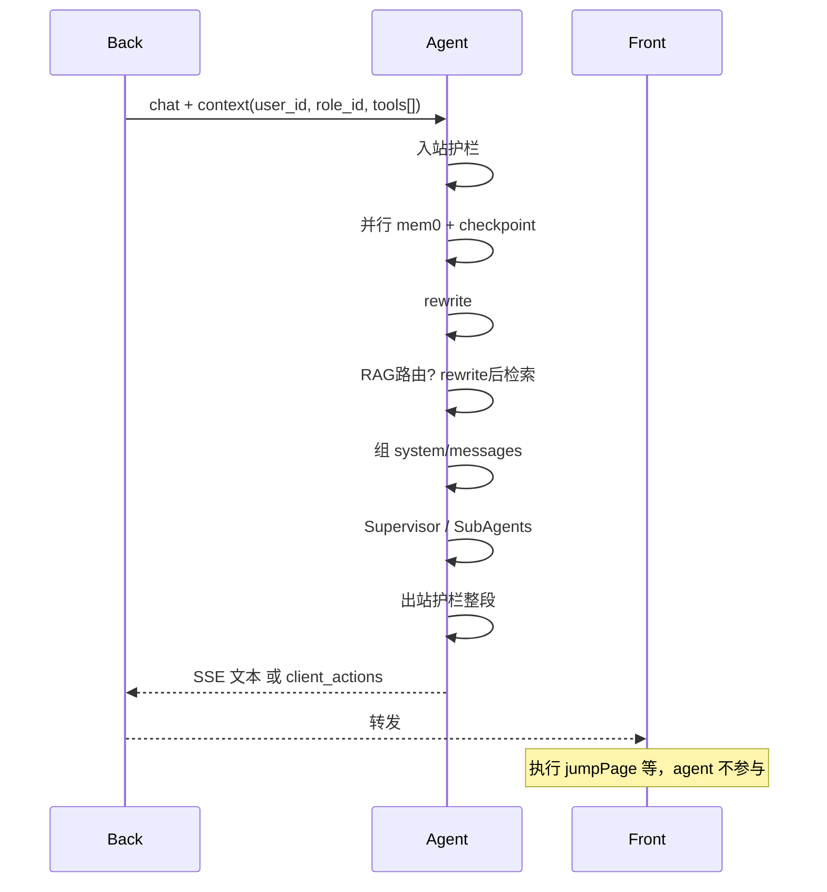

# 通用 Agent 架构（需求）

**第一期**：agent + 最小网关（front/back 占位）。**鉴权与工具过滤在 back**；agent 仅内网，不接浏览器直连。

---

## 记忆分层

| 类型 | 存储 | 维度 | 用途 |
|------|------|------|------|
| 完整对话 | Postgres Checkpointer | `thread_id` | 权威历史、分页展示 |
| 模型上下文 | 运行时组装 | `thread_id` | K + M + 滚动 summary |
| 用户偏好 | mem0 + Qdrant | `user_id` | 跨 thread；写入=mem0 `infer=True`（抽取+hash 去重，见任务 24） |
| 知识库 | Qdrant | `role_id`（每轮 context） | RAG |

**身份/权限**：`user_id`、`role_id`、`tools[]` 放在**每轮请求 context**，不写死在 checkpoint state。同 `thread_id` 可继续聊；权限变更后 back 传最新 `role_id` 即可。

---

## 上下文注入（已定：拆开放）

| 内容 | 位置 |
|------|------|
| 指令、mem0、滚动 summary、RAG 片段 | **system** |
| 前 K 轮 + 近 M 轮 + 本轮 human（rewrite 后） | **messages** |

**滚动 summary**：只摘要「上次总结之后」的新消息并合并进旧 summary，不全量重算。summary 覆盖区间 `[K+1, N-M]`，与 prefix/recent 不重叠。默认 K=4，M=20。

---

## RAG

1. **路由（混合）**：规则先判（闲聊/纯跳转类 client tool 等）→ 不确定时小模型分类 → 不需要则跳过整段 RAG。
2. **顺序（已定）**：`rewrite → RAG`（rewrite 只用 mem0 + 短期记忆，不用 RAG 结果；检索用 `rewritten_query`）。
3. **检索**：Qdrant `role_id` 过滤 + dense + sparse + rerank → 进 system；引用须带 doc/chunk 标识。
4. **只查一次**：主链路检索结果写入当轮 state（`rag_chunks`）。**RagSubAgent** 仅 Supervisor 认为不够时二查；分数阈值规则放后期 todo。
5. **Ingest**：`doc_id` + version；按 doc 名删旧再写；分块约 512–1024 token，overlap 10–15%。

---

## 端到端对话流



1. 入站护栏 → 并行读 mem0、checkpoint → **rewrite** → **RAG 路由+检索** → 拆开放组装 → Supervisor（+ 可选 RagSubAgent 二查）。
2. 出站：**整段**生成后再护栏（第一期）。
3. 事后异步：滚动 summary 更新、mem0 `add(infer=true)` 写入（去重由 mem0 负责）。
4. 性能：能并行则并行；RAG 可跳过；summary/mem0 不挡首 token。

---

## 外部工具（已定 #13）：客户端执行，agent 到此为止

**模式**：agent 只**产出**结构化 `client_actions`（即 tool name + args），**不执行、不等待结果、不 resume**。

示例：

```
human: 我要跳转 pageA
ai:   { "client_actions": [{ "tool": "jumpPage", "args": { "page": "pageA" }, "requires_approval": false }] }
→ 本轮回话结束
```

- **Front**：解析 `client_actions`；`requires_approval=true` 时先弹确认再执行（如 `router.push`）。
- **Back**：鉴权、工具是否在 role 白名单内；**不**把执行结果再喂给 agent（除非用户下一条主动描述结果）。
- **Checkpoint**：可存 assistant 消息 + `client_actions` 元数据供 UI 回放；**无需** ToolMessage。
- 与 deepagents 内置工具：内置仍走 agent 图内逻辑；**外部 tools 列表**均为客户端工具语义，ToolSubAgent **不负责代执行** jumpPage 类动作。

**后期 todo**：若需「调 API 且要把结果写进回复」类 **服务端工具**，再单独设计第二条链路（back 执行 + 可选第二轮回 agent）。

---

## 模块职责

| 模块 | 职责 |
|------|------|
| Guardrails | 入站/出站文本；后期 tool 参数/返回 |
| Query 重写 | mem0 + 短期 → rewritten_query |
| Supervisor | 主 Agent；委派 RagSubAgent |
| RagSubAgent | 深检索/二查 |
| Gateway | 内网入口；chat / 历史分页（同源 checkpoint）/ kb ingest |

**deepagents**：规划、filesystem 等能用内置则用内置；业务 RAG、client_actions 不重复造轮子。

---

## 分层契约

```
Front → Back（登录、role、滤 tools、审批 UI）→ Agent（仅内网）
```

- 历史分页与 checkpoint **同源**，不另建 messages 表给 UI。
- LangSmith：全链路 trace；后期看板含 rerank cost 占比、节点 P95。

---

## 后期 todo

- Back：JWT、工具表、`requires_approval`、完整审批 UI
- Front：sessionStorage thread_id、client_actions 执行与确认
- Agent 服务间鉴权；mem0 用户删记忆；任务 24 上线前 Qdrant mem0 collection 迁移/清库
- RAG：SubAgent 触发分数阈值；同 thread 检索缓存
- Admin：文档/工具管理 UI
- 服务端工具 + agent 第二轮回（若产品需要）
