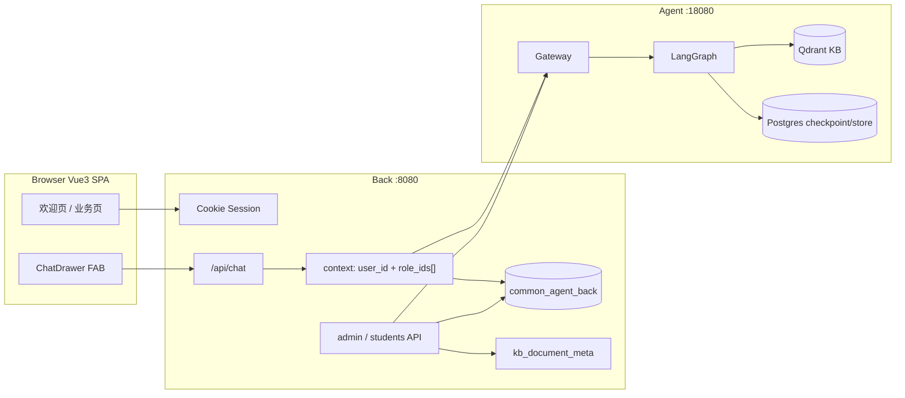

# 演示平台 — 管理后台与 RAG 控制台（PRD）

## 文档定位

本文是 **演示用前后端** 的产品设计草案，用于向团队或访客展示 commonAgent 的完整链路：**账号与多角色 → 业务 CRUD（学生）→ RAG 知识库 → 按 role_ids 检索的对话**。

- 不替代当前 [README.md](../../README.md) 的运行契约；**落地本 PRD 时需同步扩展 README**（`role_id` → `role_ids[]`、Back 数据库、演示 Front 形态）。
- 不改变 Front → Back → Agent 三层边界；浏览器仍 **不得** 直连 Agent。
- 实现时以本文 + 任务卡拆分；Agent 控制面与 graph 拓扑 **不重构**，但 RequestContext 与 RAG 过滤需 **薄扩展** 以支持多角色。

---

## 执行摘要

用 **Vue 3 SPA** 重写 [front/](../../front/)，在 Back 上扩展鉴权与业务 CRUD，Agent 补 KB 管理 API 与 **多 role_id OR 检索**：

| 模块 | 面向用户 | 核心价值 |
|------|----------|----------|
| **登录** | 所有用户 | Back Cookie Session；`/api/me` 返回身份与 `role_ids[]` |
| **欢迎页** | 所有用户 | 登录后首页：问候 + 用户名/角色；模块入口 |
| **账号管理** | admin | 角色 / 用户 CRUD；用户可绑定 **多个** `role_id` |
| **学生管理** | 所有登录用户 | 标准表格 CRUD；演示 Back 常规业务 API |
| **RAG 管理** | admin | 按角色维护文档；原文存 Back `kb_document_meta` |
| **智能对话** | 所有登录用户 | **右下角 FAB → 右侧抽屉（~420px）**；SSE + `client_actions` |

内置演示账号：

| 账号 | 密码 | 绑定角色 | 说明 |
|------|------|----------|------|
| `admin` | `123456` | `role-admin` | `is_admin=true`；全部模块；**不可删除** |
| `alice`（种子可选） | `demo123` | `role-sales` | 学生 CRUD + 对话 |
| `bob`（种子可选） | `demo123` | `role-support` | 学生 CRUD + 对话 |

**`role_id` 命名**：全局统一 **`role-` + slug**（如 `role-sales`、`role-support`、`role-admin`），与 Agent context、Qdrant payload、Back 角色表 **同一字符串**。

---

## 目标

1. **可演示**：脚本 A（~5 min）学生 CRUD；脚本 B（~10 min）RAG 多角色隔离 + 换账号对话。
2. **契约扩展**：Back 每轮向 Agent 注入 `user_id`、`role_ids[]`、`tools[]`；**禁止** Front 自报身份；权限不从 checkpoint 读取。
3. **多角色可见**：用户绑定多个角色时，RAG 对 **绑定集合做 OR 过滤**；单角色用户仍只见该角色文档。
4. **Back 即业务网关**：学生 / 账号 / RAG 元数据在 Back；Agent 管向量与对话图。
5. **技术栈统一**：Vue 3 + TypeScript + Pinia + Naive UI + Vite；鉴权 **HttpOnly Cookie Session**。

## 非目标

- OAuth / SSO / 多租户 / 按钮级 RBAC。
- 文档协同编辑、向量可视化、PDF/Word 上传（二期）。
- 在 Agent 内存用户表；学生 / 账号 / KB 原文 meta 在 **Back Postgres**。
- RAG 管理 UI 直连 Qdrant。
- 学生表行级隔离（一期全员共享；见开放问题）。
- 对话内自然语言查学生（不注册 Agent 工具）。

---

## 用户与场景

### 管理员（admin）

1. 登录 → **欢迎页**（`/app/home`）→ 侧边栏进入账号 / 学生 / RAG 管理。
2. 种子已含 `role-admin`、`role-sales`、`role-support`；admin 绑定 **`role-admin`**（独立 RAG / 工具配置）。
3. 为 `role-sales`、`role-support` 各上传知识库文档。
4. 创建 `alice`（`role-sales`）、`bob`（`role-support`）；可演示为用户绑定 **多角色**。
5. 右下角打开 **对话抽屉**，用 admin 账号验证 `role-admin` 工具与知识库。

### 业务用户

1. 登录 → **欢迎页**；侧边栏可见 **学生管理**；无账号 / RAG 菜单。
2. 学生管理 **全员 CRUD**（共享一张表）。
3. 任意页面可通过 **右下角 FAB** 打开对话抽屉。
4. Back 将该用户绑定的 **全部** `role_id` 作为 `role_ids[]` 注入 Agent。

### 演示脚本

**脚本 A — 业务 CRUD（~5 min）**

```text
1. alice 登录 → 欢迎页 → 学生管理 → 新建一条学生
2. 刷新列表可见；admin 登录 → 同一列表可编辑/删除（全员共享）
```

**脚本 B — Agent / RAG（~10 min）**

```text
1. admin → RAG 管理 → role-sales 上传《产品价目表》；role-support 上传《退换货政策》
2. alice 登录 → 对话抽屉 →「标准版一年多少钱？」→ 引用 sales 文档
3. bob 登录 →「几天可以退货？」→ 引用 support 文档
4. admin → 对话抽屉 →「请跳转到 pageA」→ Console 出现 client_actions（role-admin 工具白名单）
```

---

## 技术栈

### 前端（`front/` → Vue 3 SPA）

| 类别 | 选型 | 说明 |
|------|------|------|
| 框架 | Vue 3 + `<script setup>` | 单 SPA；路由守卫 |
| 语言 | TypeScript strict | API / Pinia / 表单 typed |
| 构建 | Vite | dev `proxy → Back :8080`；默认 dev 端口 **5173**（Back CORS 需放行） |
| 状态 | Pinia | `auth`、`chat`（抽屉开闭、thread、SSE） |
| 路由 | Vue Router 4 | `requiresAuth` / `requiresAdmin` |
| UI | **Naive UI** | 不引入第二套组件库 |
| HTTP | axios | `withCredentials: true`；401 → `/login` |
| 布局 | `n-layout` | 侧边栏 + 顶栏；**全局** `ChatFab` + `ChatDrawer` |

**目录建议**：

```text
front/src/
├── api/              # auth, students, admin, chat
├── stores/           # auth.ts, chat.ts
├── views/            # Login, Home, Students, admin/*
├── components/
│   ├── layout/       # AppLayout, AppSidebar
│   └── chat/         # ChatFab.vue, ChatDrawer.vue
├── router/
├── types/
└── main.ts
```

旧 `front/index.html` + `app.js` 在 Phase 0 完成后标记 **deprecated**，Phase 4 删除。

### 后端（`back/` 扩展）

| 类别 | 选型 |
|------|------|
| 框架 | FastAPI |
| ORM | SQLAlchemy 2.x + Alembic |
| 数据库 | Postgres 库 **`common_agent_back`**（与 Agent **同实例、不同库**） |
| 鉴权 | **HttpOnly Cookie Session**（`SameSite=Lax`） |
| 密码 | bcrypt |
| Session 存储 |  signed cookie + server-side session 或 DB session 表（实现任选） |

Agent **不参与** 学生 / 账号表；KB **向量**在 Qdrant，**原文**在 Back `kb_document_meta`。

---

## 环境与本地运行

| 变量（Back） | 说明 |
|--------------|------|
| `DATABASE_URL` | `postgresql://…/common_agent_back` |
| `SESSION_SECRET` | Cookie 签名 |
| `ADMIN_SEED_PASSWORD` | 默认 `123456` |
| `AGENT_URL` | 内网 Agent Gateway |
| `CORS_ORIGINS` | `http://127.0.0.1:5173,http://localhost:5173`（含原 3000 可保留） |

启动顺序不变：Agent → Back → `cd front && npm run dev`。

生产（演示）：Back 可挂载 `front/dist` 静态资源，或 nginx 反代；浏览器仍只请求 Back。

---

## 参考架构



| 层 | 职责 |
|----|------|
| **Front** | 欢迎页、CRUD 页、全局对话抽屉、Cookie 请求 |
| **Back** | 鉴权、业务 CRUD、KB meta 双写、thread 归属校验、`role_ids[]` + tools 注入 |
| **Agent** | chat/history；KB ingest/list/delete；RAG **`role_ids[]` OR 过滤** |

---

## Context 契约扩展（相对 README）

本 PRD **扩展** 当前单 `role_id` 为 **`role_ids[]`**。落地时须同步 Agent `RequestContext`、graph context、RAG retriever、README API 示例。

| 字段 | 类型 | 来源 | 说明 |
|------|------|------|------|
| `user_id` | string | Back session | 长期记忆 scope |
| `role_ids` | string[] | Back `user_roles` 全量绑定 | **至少 1 个**；去重、保序 |
| `tools` | object[] | Back 按 **role_ids 并集** 过滤白名单 | 同现有 client_actions 契约 |

**RAG 行为**：检索时对 `role_ids` 中每个 id 做 filter，结果 **OR 合并** 后再 merge/rerank（Agent 实现细节见任务卡；语义为「用户可见任一绑定角色的知识库」）。

**兼容**：Agent 内部可保留 `role_id` 作为 `role_ids[0]` 的 deprecated alias 一版，测试通过后移除。

---

## 模块一：登录、欢迎页与全局导航

### 1.1 登录

- 表单：用户名 + 密码；失败统一「用户名或密码错误」。
- 成功：`Set-Cookie` → 跳转 **`/app/home`**。
- 未登录访问 `/app/*` → 重定向 `/login`。

### 1.2 欢迎页（`/app/home`）

- **所有登录用户** 默认 landing。
- 内容：**问候语** + 当前 **用户名** + 已绑定 **角色标签**（`role_ids` 展示名）。
- **不放** 演示脚本长文；模块通过侧边栏或简洁入口卡片进入（卡片可选，一期仅侧边栏亦可）。
- 第一屏是可用的应用首页，不是营销页。

### 1.3 布局与菜单

**侧边栏（按权限）**

| 菜单 | 路由 | 可见 |
|------|------|------|
| 首页 | `/app/home` | 所有人 |
| 学生管理 | `/app/students` | 所有人 |
| 角色管理 | `/app/admin/roles` | admin |
| 用户管理 | `/app/admin/users` | admin |
| RAG 管理 | `/app/admin/kb` | admin |

**无** 独立「对话」菜单项；对话见 1.4。

顶栏：用户名、退出登录；**不在顶栏常驻 thread_id**（放在对话抽屉内）。

### 1.4 全局对话抽屉

- **右下角 FAB**（固定定位），任意 `/app/*` 页面可见。
- 点击 → **右侧 `n-drawer`**，宽约 **420px**，可收起；遮罩不阻断左侧页面太久（`mask-closable` 可 true）。
- 抽屉内：消息列表、输入框、**新开 thread**、当前 `thread_id`（可复制）、当前 `role_ids` 只读展示。
- SSE / `client_actions` 逻辑在 `ChatDrawer.vue` + `stores/chat.ts`。
- 关闭抽屉 **不** 中断已连接 SSE（可选 abort 或保持，实现取简单：关闭即 abort 当前流）。

### 1.5 鉴权

| 项 | 约定 |
|----|------|
| 协议 | **HttpOnly Cookie Session** |
| Session | `user_id`, `username`, `is_admin`, `role_ids[]` |
| Agent 转发 | Back 从 session 组装 context；Front chat **只传** `thread_id` + `message` |
| CSRF | SameSite=Lax；写操作校验 Origin |

### 1.6 admin 种子约束

- 用户 `admin` / 密码 `123456`（`ADMIN_SEED_PASSWORD` 可覆盖）。
- 绑定 **`role-admin`**；`is_admin=true`。
- 不可删除 admin 或取消其管理员标记；可改密码。

---

## 模块二：账号管理（admin）

### 2.1 角色管理

**`role_id` 规则**：必填，格式 **`role-[a-z0-9-]+`**，创建后不可改；全局唯一。

**列表列**：role_id、名称、描述、用户数、文档数（Back 聚合 Agent list + meta）、操作。

**删除**：仍有用户绑定或 KB 文档 → **409**；需先解绑或删文档。

**种子角色**

| role_id | 名称 | 用途 |
|---------|------|------|
| `role-admin` | 管理员 | admin 绑定；独立工具 / RAG |
| `role-sales` | 销售 | alice；价目表 |
| `role-support` | 客服 | bob；退换货政策 |

### 2.2 用户管理

**用户 ↔ 角色**：多对多；创建/编辑时 **至少选一个角色**。

- UI：`n-select` multiple 选择角色；**不设主角色** — 绑定集合 **整体** 写入 `user_roles`，原样作为 `role_ids[]` 下发 Agent。
- 变更绑定后 **不需** 清 checkpoint；下一轮 chat Back 即传新数组。

**admin 用户**：始终绑定 `role-admin`（种子保证）；可额外绑其他角色做实验，演示脚本默认仅 `role-admin`。

### 2.3 权限

| 能力 | admin | 普通用户 |
|------|-------|----------|
| 角色 / 用户 CRUD | ✅ | ❌ |
| RAG CRUD | ✅ | ❌ |
| 学生 CRUD | ✅ | ✅ |
| 对话抽屉 | ✅ | ✅ |
| 读他人 thread 历史 | ❌ | ❌ |

---

## 模块三：RAG 管理（admin）

### 3.1 存储分工

| 内容 | 存储 | 说明 |
|------|------|------|
| 向量 + chunk | Qdrant | Agent ingest；payload 含 `role_id`（单 doc 归属一角色） |
| 原文 + 列表 meta | Back **`kb_document_meta`** | ingest **成功后双写**；详情/编辑 **只读 Back** |

**禁止** 仅靠 Qdrant scroll 拼原文（chunk 顺序/格式不可靠）。

### 3.2 列表

筛选：角色下拉、关键词（doc_name / doc_id）。列：doc_name、doc_id、version、role_id、chunks、tokens_estimated、updated_at（**来自 meta**）、操作。

### 3.3 新建

1. Front → `POST /api/admin/kb/documents`（含 content 或文件）
2. Back 校验 admin + role 存在
3. Back → Agent `POST /internal/kb/ingest`
4. 成功 → Back **upsert `kb_document_meta`**（含 `raw_content`、`created_by`、`updated_at`）

### 3.4 详情 / 编辑

- **详情**：meta + chunk 概览（Agent `GET .../documents/{id}?role_id=` 仅用于 chunk 列表；**正文读 meta.raw_content**）。
- **编辑**：表单预填 `raw_content`；保存 = 新 `version` + 再次 ingest + 更新 meta。

### 3.5 删除

删 Qdrant points（Agent API）+ 删 meta 行（Back）；二次确认含 doc_name + role_id。

---

## 模块四：学生管理（所有登录用户）

演示 **Back 常规 CRUD**；与 Agent 无调用关系。

- **数据权限**：**全员共享** `students` 表；任意登录用户可增删改查全部记录。
- `created_by` 仅审计，列表默认不展示，**不做**过滤。

UI：`n-data-table` + 搜索（姓名/学号/班级）+ 状态/班级筛选 + 抽屉表单 + Popconfirm 删除。字段与校验见原表（student_no 唯一等）。

价值主张：证明 Back 是真实业务网关，而非纯 chat 代理。

---

## 模块五：智能对话（全局抽屉）

### 5.1 thread 归属

- 每个 `thread_id` 在 Back **`chat_threads`** 表绑定 **`user_id`**（首次 chat 时创建）。
- `GET/POST` chat 与 `GET .../messages` 均校验：**session.user_id 必须等于 thread 属主**，否则 **403**。
- Front：`thread_id` 存 **sessionStorage**（按浏览器 tab）；「新开 thread」生成新 UUID 并在 Back 登记。

### 5.2 请求 / 响应

Front → Back：

```json
{
  "thread_id": "uuid",
  "message": "用户输入"
}
```

Back → Agent（注入后）：

```json
{
  "thread_id": "uuid",
  "message": "用户输入",
  "context": {
    "user_id": "u-alice",
    "role_ids": ["role-sales"],
    "tools": []
  }
}
```

多角色示例：`"role_ids": ["role-sales", "role-support"]` → RAG OR 检索两库。

### 5.3 其他

- 历史：Back 代理 `GET /api/threads/{thread_id}/messages`（Phase 4；带归属校验）。
- `client_actions`：Console 日志 + `requires_approval` 时 `confirm()`。
- 抽屉内展示当前 `role_ids` 与 `user_id`（来自 `/api/me`）。

---

## 数据模型（Back · `common_agent_back`）

### roles / users / user_roles

同前；`user_roles` **去掉 `is_primary`**（多角色全部下发，无需主角色）。

### students

同前；`created_by` 审计 optional。

### kb_document_meta（**必需**）

| 字段 | 类型 | 说明 |
|------|------|------|
| doc_id + role_id | PK 联合 | |
| doc_name | varchar | |
| version | varchar | |
| raw_content | text | 原文；编辑回填来源 |
| chunks_written | int | 最近一次 ingest |
| tokens_estimated | int | |
| created_by | FK user | |
| created_at / updated_at | timestamptz | |

### chat_threads

| 字段 | 说明 |
|------|------|
| thread_id | PK |
| user_id | FK；属主 |
| created_at | |

---

## API 设计

### 统一错误体

```json
{
  "code": "CONFLICT",
  "message": "学号已存在",
  "field_errors": { "student_no": "已占用" }
}
```

### `GET /api/me`（示例）

```json
{
  "user_id": "u-alice",
  "username": "alice",
  "display_name": "Alice",
  "is_admin": false,
  "role_ids": ["role-sales"],
  "roles": [{ "role_id": "role-sales", "name": "销售" }]
}
```

### `GET /api/students`（示例）

```json
{
  "items": [{ "student_id": "…", "student_no": "2024001", "name": "张三", "…": "…" }],
  "total": 42,
  "offset": 0,
  "limit": 20
}
```

### Back 路由汇总

**认证**：`POST /api/auth/login` · `POST /api/auth/logout` · `GET /api/me`

**学生**（登录）：`/api/students` CRUD + 可选 `POST .../batch-delete`

**admin**：`/api/admin/roles` · `/api/admin/users` · `/api/admin/kb/documents`

**对话**（登录）：`POST /api/chat` · `GET /api/threads/{thread_id}/messages`

**健康**：`GET /health`

admin 路由非 admin → **403**；未登录 → **401**。

### Agent 内网（Back 转发）

**已有**：`POST /internal/kb/ingest`

**新增**

| 方法 | 路径 | 说明 |
|------|------|------|
| GET | `/internal/kb/documents` | 按 `role_id` 列表（admin 聚合多次或 Agent 支持多 role 查询） |
| GET | `/internal/kb/documents/{doc_id}` | chunk 预览；query: `role_id` |
| DELETE | `/internal/kb/documents/{doc_id}` | query: `role_id` |

**Agent 改造（同批交付）**

- `RequestContext.role_ids: list[str]`（`role_id` deprecated 一版）。
- RAG dense/BM25 filter：**任一匹配** `role_ids` 即命中（Qdrant `should` 多条件 OR）。
- Graph context / state：消费 `role_ids`；retriever 入口签名扩展。

---

## 工具白名单（按 role_ids 并集）

扩展 [context.py](../../back/src/services/context.py) 与 `config/tools.demo.json`：

```json
{
  "tools": [
    { "name": "jumpPage", "roles": ["role-admin", "role-sales"], "requires_approval": false }
  ]
}
```

`filter_tools_for_role_ids(role_ids)`：取并集去重。admin 仅绑 `role-admin` 时，只获得该角色配置的工具。

---

## 安全与演示约束

| 项 | 要求 |
|----|------|
| Agent 不暴露公网 | 仅 Back 访问 |
| 默认密码 | 仅 demo；README 提醒生产必改 |
| 上传 | ≤2MB；`.txt`/`.md`；UTF-8 |
| IDOR | admin API 校验 `is_admin`；thread API 校验 `user_id` 属主 |
| Cookie | HttpOnly + Secure（生产 HTTPS） |

---

## 分阶段交付

### Phase 0 — 脚手架 + 认证 + 欢迎页（2–3 天）

- Vue 3 + TS + Pinia + Naive UI + axios（credentials）
- Back：`common_agent_back` + migration + seed（admin、`role-*`、示例学生）
- `/api/auth/*`、`/api/me`；`AppLayout`、欢迎页、路由守卫
- **ChatFab + ChatDrawer 空壳**（可先占位）

### Phase 1 — 学生 CRUD（2–3 天）

- `/api/students` + pytest；`StudentsView`
- **里程碑**：普通用户登录即可演示 CRUD

### Phase 2 — 账号 + context 契约（3–4 天）

- 角色 / 用户 CRUD；菜单显隐
- Agent + Back：**`role_ids[]`** 贯通；RAG OR 过滤 + 测试
- Chat：`POST /api/chat` session 注入；`chat_threads` 归属

### Phase 3 — RAG 管理（3–4 天）

- Agent KB list/get/delete；Back 代理 + **`kb_document_meta` 双写**
- RAG 管理页；脚本 B 端到端

### Phase 4 — 对话抽屉完善（2–3 天）

- SSE 迁入抽屉；history 代理；`client_actions`
- 删旧静态 front；`docs/demo-walkthrough.md`；**README 同步**

---

## 开放问题（未决）

| # | 问题 | 默认 |
|---|------|------|
| 1 | PDF/Word 上传 | 二期；一期 txt/md |
| 2 | 学生行级隔离 | 二期；一期共享 |
| 3 | 生产 Session 存储 | 单机 demo 用 signed cookie；多副本再换 Redis |

---

## 验收标准

### MVP（Phase 1 结束）

- [ ] 登录 → 欢迎页；Cookie Session 生效
- [ ] 学生 CRUD 全员可用；409 学号冲突可读

### 完整演示（Phase 4 结束）

**登录与导航**

- [ ] admin / 普通用户 landing 均为欢迎页
- [ ] 右下角 FAB 打开 ~420px 右侧对话抽屉
- [ ] 非 admin 403 `/api/admin/*`；401 未登录

**账号与契约**

- [ ] 用户可绑多角色；chat payload 为 `role_ids[]`（Network 可验证）
- [ ] RAG 对多角色 OR 检索；单角色用户仍隔离
- [ ] admin 绑定 `role-admin`；`role-` 前缀一致

**RAG**

- [ ] 上传后 meta 含 `raw_content`；编辑可回填
- [ ] 删除后检索不命中

**对话**

- [ ] thread 属主校验；跨用户 thread 403
- [ ] SSE + client_actions 正常

**工程**

- [ ] Vue 3 + TS + Pinia + Naive UI
- [ ] Back `DATABASE_URL` → `common_agent_back`
- [ ] README 已更新 `role_ids[]` 与演示启动说明

---

## 与现有仓库的关系

| 资产 | 变更 |
|------|------|
| [README.md](../../README.md) | 扩展 context 为 `role_ids[]`；Back DB；Front 形态 |
| [agent/ RequestContext](../../agent/src/gateway/schemas.py) | 增加 `role_ids`；RAG 多 filter |
| [back/](../../back/) | Postgres、Session、业务 API、thread 归属 |
| [front/](../../front/) | 重写为 Vue SPA；旧静态页 Phase 4 移除 |
| [docs/maps/rag-flow.md](../maps/rag-flow.md) | 实现后补多 role OR 说明 |

---

## 建议任务拆分（progress 81+）

已落地为 `docs/prompts/81-*.md` … `92-*.md`，详见 [docs/progress.md](../progress.md)。

| ID | 范围 |
|----|------|
| 81 | Back 数据库、迁移与种子（`common_agent_back`） |
| 82 | Back Cookie Session 与认证 API |
| 83 | Front Vue3 SPA 脚手架（可与 81–82 并行） |
| 84 | Front 登录、布局、欢迎页、Chat FAB/Drawer 空壳 |
| 85 | 学生 CRUD（Back + Front，演示 MVP） |
| 86 | 账号管理：角色与用户 CRUD |
| 87 | Agent `role_ids[]` + RAG OR 检索 |
| 88 | Back context 注入、tools 并集、`chat_threads` |
| 89 | Agent KB list/get/delete + Back `kb_document_meta` 双写 |
| 90 | Front RAG 管理页 |
| 91 | ChatDrawer SSE、history、`client_actions` |
| 92 | 文档收口：README、demo-walkthrough、maps、移除 legacy static front |

---

## 附录：演示数据

**角色**：`role-admin`、`role-sales`、`role-support`（见 2.1）。

**用户**

| username | 密码 | role_ids |
|----------|------|----------|
| admin | 123456 | role-admin |
| alice | demo123 | role-sales |
| bob | demo123 | role-support |

**文档**：role-sales《产品价目表.md》；role-support《退换货政策.md》。

**学生种子**：2024001 张三、2024002 李四、2023008 王五（见旧表）。

**提问示例**：alice →「标准版一年多少钱？」；bob →「买错了可以退吗？」

---

## 落地状态与偏差

| 项 | 状态 | 说明 |
|----|------|------|
| Back `common_agent_back` + Alembic + 种子 | ✅ | 任务 81；`uv run alembic upgrade head` + `uv run python -m db.seed` |
| Cookie Session + `/api/auth/*` + `/api/me` | ✅ | 任务 82；CORS 放行 `5173` |
| Front Vue3 SPA 脚手架 | ✅ | 任务 83；Vite + Pinia + Naive UI |
| 登录 / Layout / 欢迎页 / Chat FAB 空壳 | ✅ | 任务 84 |
| 学生 CRUD（Back + Front） | ✅ | 任务 85；一期全员共享表 |
| 账号管理（角色/用户 CRUD） | ✅ | 任务 86 |
| Agent `role_ids[]` + RAG OR | ✅ | 任务 87；deprecated `role_id` alias 仍接受 |
| Back context 注入 + `chat_threads` | ✅ | 任务 88 |
| Agent KB API + Back meta 双写 | ✅ | 任务 89 |
| Front RAG 管理页 | ✅ | 任务 90；txt/md ≤2MB |
| ChatDrawer SSE + history + `client_actions` | ✅ | 任务 91 |
| 文档收口 + legacy static 移除 | ✅ | 任务 92；[demo-walkthrough.md](../demo-walkthrough.md)、[demo-platform.md](../maps/demo-platform.md) |
| legacy `app.js` / `legacy.html` 静态入口 | ✅ 已移除 | Phase 4 完成；唯一入口为 Vite `index.html` |
| OAuth / SSO | ⏸ 非目标 | PRD 非目标 |
| PDF/Word 上传 | ⏸ 二期 | 当前仅 txt/md |
| 学生行级隔离 | ⏸ 一期未做 | 全员共享 `students` 表 |
| 对话内 NL 查学生（Agent 工具） | ⏸ 非目标 | 不注册学生查询 tool |
| `INTENT_CLASSIFIER` 接入 graph 热路径 | ⏸ Agent 既有偏差 | 与演示平台无关；见控制面 PRD |
| Front 记忆 pending UI | ⏸ Phase 2 | 架构 PRD 遗留项 |

## 验证入口

```bash
rg -n "role_ids" README.md back agent/src
rg -n "common_agent_back|5173" README.md back/.env.example
test ! -f front/app.js
cd back && uv run pytest tests/ -v --ignore=tests/integration
cd agent && uv run pytest tests/test_schemas.py tests/test_role_ids_filter.py -v
cd front && npm run build
```

演示操作步骤见 [docs/demo-walkthrough.md](../demo-walkthrough.md)。
