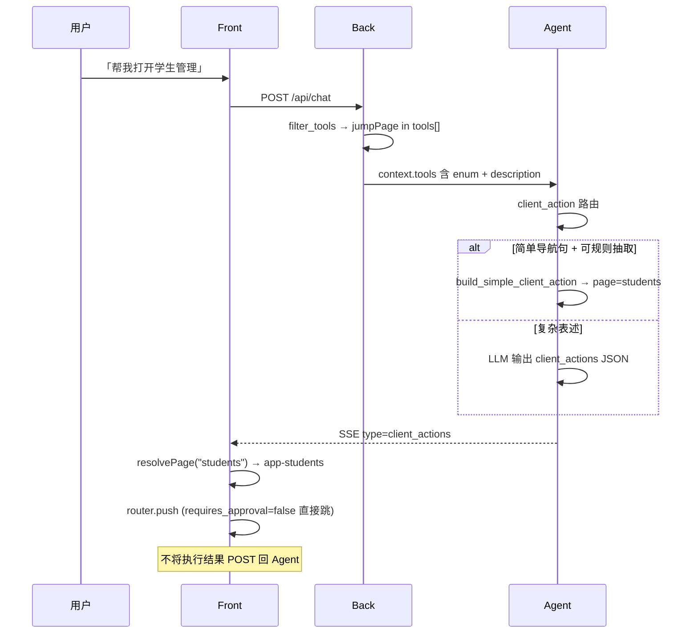

# jumpPage 前端工具完整实现（PRD）

## 文档定位

- 本文是 **Front 侧 client_actions 首个完整落地** 的产品与技术设计，聚焦 `jumpPage` 单工具。
- 不替代 [README.md](../../README.md) 的 `client_actions` 契约；**实现完成后需同步 README**（页面目录、演示话术、openTicket 移除）。
- 遵循 Front → Back → Agent 边界：Agent 只产出 JSON，Front 执行 `router.push`。
- **openTicket** 为早期「需审批工具」演示占位，本 PRD **范围外且应删除**（配置、测试样例、演示脚本中的引用一并清理）。

---

## 背景与现状

| 层 | 现状 | 缺口 |
|----|------|------|
| Back | `tools.demo.json` 有 `jumpPage`；`role-admin` / `role-sales` 可用 | `description` / `parameters` 未列出真实页面；仍含应删除的 `openTicket` |
| Agent | intent → ACTION 快捷路径或 deepagents JSON；白名单校验 | 测试/eval 仍用虚构 **`pageA`**，与 Front 路由无关 |
| Front | SSE 接收 `client_actions`；`handleClientActions` 仅 `confirm` + `console.log` | **未调用 Vue Router** |

演示平台实际路由（[front/src/router/index.ts](../../front/src/router/index.ts)）：

| 侧边栏文案 | Vue route name | path |
|------------|----------------|------|
| 首页 | `app-home` | `/app/home` |
| 学生管理 | `app-students` | `/app/students` |
| 角色管理（admin） | `app-admin-roles` | `/app/admin/roles` |
| 用户管理（admin） | `app-admin-users` | `/app/admin/users` |
| RAG 管理（admin） | `app-admin-kb` | `/app/admin/kb` |

历史文档中的 **`pageA` 是架构示例占位**，不是真实页面；继续保留会导致 Agent 产出 Front 无法解析的参数。

---

## 核心问题：大模型怎么知道 `jumpPage` 传什么？

**结论：模型不会「自动知道」应用有哪些页；必须通过每轮注入的工具定义 + 用户话术 +（可选）规则抽取，把自然语言映射到受控的 `page` 枚举值。**

### 信息来源（按优先级）

```text
用户本轮话术（「打开学生管理」）
        ↓
Back 注入的 ToolSpec（description + parameters JSON Schema）
        ↓ 写入 Supervisor system prompt（format_external_tools_for_prompt）
Agent intent / executor 路由
        ↓
  ┌─────────────────┬──────────────────────┐
  │ ACTION 快捷路径   │ DEEPAGENTS + LLM JSON │
  │ build_simple_   │ parse_client_actions  │
  │ client_action   │ _from_llm             │
  └─────────────────┴──────────────────────┘
        ↓
client_actions: [{ tool: "jumpPage", args: { page: "<canonical>" } }]
        ↓
Front page registry → router.push
```

| 渠道 | 机制 | 负责方 |
|------|------|--------|
| **ToolSpec 每轮白名单** | Back 把 `name`、`description`、`parameters`（含 `enum`）注入 `context.tools[]`；Agent 拼进 system prompt，**不注册为 LangChain tool** | Back 配置 |
| **用户原话** | 「跳转学生管理」「去 RAG 页面」→ 模型做语义对齐，选出 catalog 中最接近的 `page` 值 | LLM（或规则） |
| **ACTION 规则快捷路径** | `build_simple_client_action()` 用正则从用户句子里抽 `pageX`、路径 `/app/...`；**不依赖 LLM 背目录**，但只能处理简单、明确的导航句 | Agent（可选优化） |
| **Front 执行层** | 只接受 catalog 内已知 `page`；未知值 toast 提示，**不静默 fallback 到首页** | Front |

### 设计决策：`page` 参数用 canonical slug

采用 **短 slug**（非完整 URL），与 Vue route path 解耦，便于 LLM 与 eval 维护：

| `page`（Agent 产出） | 用户常见说法（写入 description） | Front 解析为 |
|---------------------|----------------------------------|--------------|
| `home` | 首页、主页、欢迎页 | `{ name: "app-home" }` |
| `students` | 学生管理、学生列表、学生页 | `{ name: "app-students" }` |
| `admin-roles` | 角色管理、角色页 | `{ name: "app-admin-roles" }` |
| `admin-users` | 用户管理、账号管理 | `{ name: "app-admin-users" }` |
| `admin-kb` | RAG 管理、知识库、文档管理 | `{ name: "app-admin-kb" }` |

**Back `tools.demo.json` 中 `parameters.page` 必须使用 JSON Schema `enum`**，使每轮 prompt 里出现明确可选值列表；`description` 补充 slug 与中文菜单名的对照表。

示例（实现时写入配置）：

```json
{
  "name": "jumpPage",
  "description": "Navigate the user to an in-app page. Allowed pages: home (首页), students (学生管理), admin-roles (角色管理, admin only), admin-users (用户管理, admin only), admin-kb (RAG/知识库管理, admin only). Use the slug exactly as listed.",
  "parameters": {
    "type": "object",
    "properties": {
      "page": {
        "type": "string",
        "enum": ["home", "students", "admin-roles", "admin-users", "admin-kb"]
      }
    },
    "required": ["page"]
  },
  "requires_approval": false,
  "roles": ["role-admin", "role-sales"]
}
```

> **为何不用 `pageA`：** 虚构 token 无法与 Front 路由对齐，且 eval 会误导后续开发。迁移后演示话术改为「打开学生管理」「跳转到首页」等。

> **角色与页面：** Back 工具白名单控制「谁能触发 jumpPage」；admin 专属页的 **二次拦截** 在 Front `beforeEach` / registry 内完成（与手动点菜单一致：非 admin 跳 admin 页 → 回 home）。

---

## 目标

1. 用户用自然语言要求跳转时，Agent 返回 **可执行** 的 `jumpPage` client_action（`page` 为 catalog slug）。
2. Front 解析并 **`router.push`**，用户可见页面切换；可选关闭或保持 ChatDrawer 打开。
3. 演示脚本不再依赖 `pageA` / Console 占位；**删除 openTicket** 及相关测试断言。
4. Agent eval / 单元测试与 catalog 对齐。

## 非目标

- 带 query 的深链（如 `/app/students?id=1`）— 二期。
- 跳转结果回喂 Agent（仍为一回合结束）。
- 通用前端工具框架抽象（仅实现 jumpPage + 可复用 registry 文件结构）。
- 服务端工单 / openTicket 任何形态。

---

## 端到端流程



---

## 分层设计

### 1. Back — 工具配置与 openTicket 移除

**文件：** [back/config/tools.demo.json](../../back/config/tools.demo.json)

- 删除 `openTicket` 条目。
- 按上文示例更新 `jumpPage` 的 `description` + `parameters.page.enum`。
- `roles` 保持 `["role-admin", "role-sales"]`（support 用户无 jumpPage，符合「销售/管理员演示导航」）。

**测试：** [back/tests/test_demo_chat_context.py](../../back/tests/test_demo_chat_context.py) 中 `_sample_tools()` 去掉 openTicket；并集/单角色断言改为仅 `jumpPage`。

### 2. Agent — 与 catalog 对齐（薄改动）

| 项 | 动作 |
|----|------|
| `build_simple_client_action` | 扩展 slug 抽取：识别 catalog slug、中文菜单名关键词（「学生管理」→ `students`）、保留 `/app/...` 路径 → slug 反向映射 |
| eval / 测试 | `pageA` → `students` / `home`；intent seed 话术改为「打开学生管理」 |
| `is_pure_client_tool_intent` | 可选：把「学生管理」等菜单词纳入导航意图（与 RAG 区分） |
| Supervisor prompt | 无需改代码；依赖 Back 注入的 enum description |

**不在 Agent 内维护页面列表副本**（避免与 Back 双源）；若后续页面增多，再考虑 `back/config/nav-pages.json` 生成 tools 片段。

### 3. Front — 执行层（本 PRD 主要交付）

**新增：** `front/src/client-actions/page-registry.ts`（或 `config/nav-pages.ts`）

```typescript
export type PageSlug = "home" | "students" | "admin-roles" | "admin-users" | "admin-kb";

export function resolveJumpPageTarget(page: string): RouteLocationRaw | null;
export function isPageAllowedForUser(page: PageSlug, isAdmin: boolean): boolean;
```

**修改：** [front/src/stores/chat.ts](../../front/src/stores/chat.ts)

- `handleClientActions`：`tool === "jumpPage"` → 校验 slug → `requires_approval`（当前为 false，保留分支）→ `router.push`。
- 失败 UX：`message.warning` — 未知 page / 无权限 / 未登录。

**可选 UX：**

- 跳转成功后 **不关闭** ChatDrawer（用户可继续对话）；若跳转后面板遮挡内容，可在 PRD 实现时二选一并在 README 注明。

**类型：** [front/src/types/index.ts](../../front/src/types/index.ts) 可增 `JumpPageArgs` 辅助类型；`ClientAction` 保持通用。

### 4. 文档

| 文档 | 更新 |
|------|------|
| README.md | client_actions 示例改为 `page: "students"`；演示步骤 |
| docs/demo-walkthrough.md | B4 话术改为真实页面；删除 openTicket 暗示 |
| docs/prd/demo-admin-console.md | 工具白名单示例去掉 openTicket（或注明 superseded） |

---

## 用户可见行为

| 场景 | 期望 |
|------|------|
| admin：「跳转到 RAG 管理」 | 进入 `/app/admin/kb` |
| alice（sales）：「打开学生管理」 | 进入 `/app/students` |
| alice：「打开用户管理」 | Agent 可能产出 `admin-users` → Front 拦截（与路由 guard 一致）→ 提示无权限或停留当前页 |
| 未知 slug | Front toast「未知页面」；不跳转 |
| `requires_approval: true`（未来） | confirm 后再 push；当前 jumpPage 为 false |

---

## 演示脚本（替换原 B4）

```text
1. admin 登录 → 打开对话抽屉
2. 发送：「请打开 RAG 管理页面」
3. 期望：SSE 含 client_actions jumpPage page=admin-kb；浏览器进入 RAG 管理；Network 仍只打 Back

4. alice 登录 → 「带我去学生管理」
5. 期望：进入 /app/students
```

---

## 测试计划

| 层 | 命令 / 范围 |
|----|-------------|
| Back | `cd back && uv run pytest tests/test_demo_chat_context.py -v` |
| Agent | `cd agent && uv run pytest tests/test_client_actions.py tests/test_executor_router.py tests/test_rag_router.py -v`；更新 eval seed 后跑 intent eval（若有 CI） |
| Front | 单元：`page-registry` slug 解析、admin 权限；手工走 demo-walkthrough B4 |
| E2E（可选） | Playwright：mock SSE client_actions → 断言 URL |

---

## 任务拆分（docs/prompts）

| 序号 | 任务卡 | 范围 |
|------|--------|------|
| 102 | [Back jumpPage catalog + 删 openTicket](./prompts/102-jumppage-back-tool-catalog.md) | tools.demo.json、context 测试 |
| 103 | [Agent catalog 对齐](./prompts/103-jumppage-agent-catalog-alignment.md) | executors 抽取、eval/intent 话术、pageA 清理 |
| 104 | [Front jumpPage 执行](./prompts/104-jumppage-front-execution.md) | page-registry、chat store |
| 105 | [文档收口](./prompts/105-jumppage-docs-final-alignment.md) | README、demo-walkthrough、maps、PRD、progress |

依赖：91（ChatDrawer SSE）✅ 已完成；102 依赖 101 ✅。**jumpPage 批次 102–105** ✅ 已于 2026-05-26 收口。

---

## 落地状态（2026-05-26）

| 任务 | 状态 | 落地要点 |
|------|------|----------|
| 102 Back catalog | ✅ | `tools.demo.json` 仅 `jumpPage`；`page` enum 五档；删除 `openTicket` |
| 103 Agent 对齐 | ✅ | `jump_page_catalog.py` 规则抽取；eval/intent seed 迁移至真实 slug |
| 104 Front 执行 | ✅ | `page-registry.ts` + `chat.ts` `router.push`；toast 未知/无权限 |
| 105 文档收口 | ✅ | README、demo-walkthrough、maps、本 PRD、progress |

### 已知偏差

- **catalog 双源**：Back `tools.demo.json` enum 与 Front `page-registry.ts` 手动同步；未引入共享 `nav-pages.json` 生成器（开放问题 #3 延期）。
- **Agent 结构测试**：部分 schema/SSE 契约测试仍用任意 `page` 字符串作占位，不代表演示跳转目标。
- **legacy 规则路径**：Agent `extract_jump_page_slug` 仍识别 `pageX` 等 legacy token；Front registry 仅接受 catalog slug。

### 开放问题决议

1. **跳转后是否关闭 ChatDrawer？** → **保持打开**（已实现）。
2. **sales 是否需要 jumpPage？** → **保留** `role-sales`（与 Back 配置一致）。
3. **catalog 单源？** → 一期维持 Back enum + Front TS 双维护；页面 >10 时再抽共享 JSON。

---

## 开放问题（历史记录）

1. **跳转后是否关闭 ChatDrawer？** 建议默认保持打开，演示对话连续性。
2. **sales 是否需要 jumpPage？** 当前 PRD 保留 role-sales；若仅 admin 演示可收窄 `roles`。
3. **catalog 单源：** 一期 Back JSON enum + Front TS registry 手动同步；页面 >10 时再抽共享 `nav-pages.json`。

---

## 附录：LLM 参数解析 FAQ

**Q：用户说「打开 pageA」会怎样？**  
A：`pageA` 不在 catalog enum 内，演示脚本已迁移。Agent 规则路径可能仍抽出 legacy `pageX` token；Front registry 无法解析 → toast「未知页面」。eval/演示话术应使用「打开学生管理」等真实菜单语。

**Q：用户说「打开学生管理」但没说 slug，模型怎么选？**  
A：依赖 ToolSpec `description` 中的「students (学生管理)」对照；enum 约束输出必须是五个 slug 之一。

**Q：为何 enum 放 Back 而不是 Front？**  
A：Back 每轮注入 Agent 的是权威工具定义；Front 只负责 slug → route 的执行映射，两者字段一致即可。

**Q：jumpPage 和 Agent 内置工具有什么区别？**  
A：内置工具在 LangGraph/deepagents 内执行；jumpPage 仅 JSON 输出，由浏览器执行，Agent 不等待结果。
