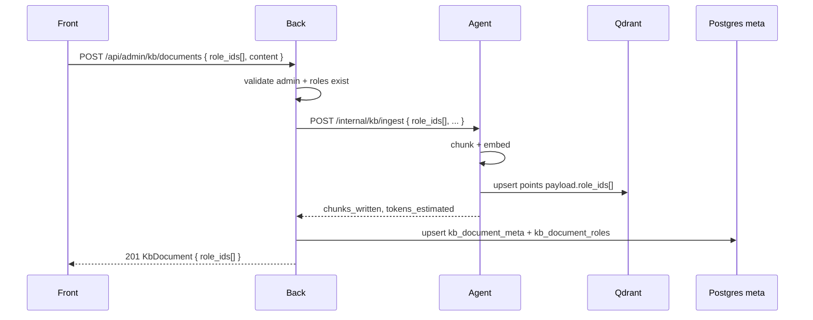
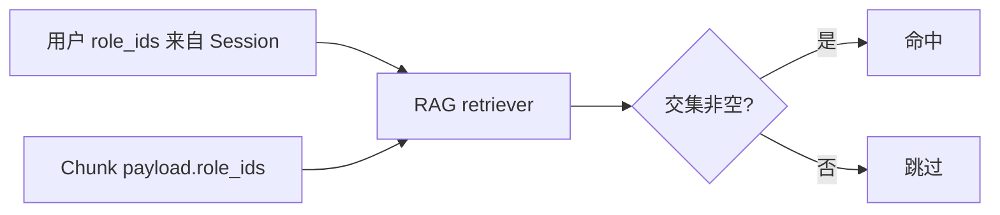

# KB 多角色 RAG 权限 PRD

## 文档定位

本文是 **知识库文档多角色可见性** 的产品与技术设计草案。

- 不替代当前 [README.md](../../README.md) 的运行契约；**落地后需同步更新 README、任务卡与 `docs/progress.md`**。
- 不改变 Front → Back → Agent 三层边界。
- **对话侧**已支持 `context.role_ids[]` + RAG OR 检索；本 PRD 补齐 **管理侧 ingest / meta / 向量 payload** 与之一致的多角色模型。

---

## 背景：当前不对称

| 环节 | 现状 | 问题 |
|------|------|------|
| 用户 Session / Chat | Back 注入 `role_ids[]` | 已支持多角色 |
| RAG 检索 | Qdrant 按 payload **`role_id`（单值）** OR 匹配用户任一角色 | 检索逻辑已 OR，但文档只有单角色 |
| KB 新建/编辑（Front） | 单选 `role_id` | 无法一次授权多角色 |
| Back `kb_document_meta` | 联合主键 `(doc_id, role_id)` | 同一逻辑文档若要授多角色，需重复 ingest 多份向量（浪费且难维护） |
| Agent ingest | `KbIngestRequest.role_id: str` | 单角色 |
| Qdrant payload | `"role_id": "role-sales"` | 单角色 |

**典型痛点**：一份「公司通用 FAQ」需同时给 `role-sales` 和 `role-support` 可见，管理员 today 只能选其一，或手工上传两次。

---

## 目标

1. **管理 UI**：新建、编辑 KB 文档时可选 **多个角色**（至少 1 个）。
2. **全链路契约**：`role_ids: string[]` 从 Front 经 Back、Agent 写入 Qdrant；Back meta 同步存储同一组 `role_ids`。
3. **一份文档、一套向量**：同一 `doc_id` 只 ingest 一次；每个 chunk point 的 payload 携带完整 `role_ids[]`，**不**按角色复制向量。
4. **检索一致**：用户绑定 `["role-sales", "role-support"]` 时，可见 payload 中 `role_ids` **与用户集合有交集** 的所有 chunk（OR 语义，与现对话 RAG 一致）。
5. **可演示**：admin 为一份文档勾选 sales + support；alice（sales）与 bob（support）对话均能命中；仅 admin 角色文档对 alice/bob 不可见。

## 非目标

- 按角色差异化正文（同一 doc_id 不同角色不同内容）——若需要，应建不同 `doc_id`。
- 文档级 ACL 细粒度（读/写/删分离）、租户隔离、非 admin 用户自助改 RAG 权限。
- 用户「临时勾选本次对话用哪些角色」——仍使用账号绑定的全部 `role_ids[]`。
- PDF/Word 解析、协同编辑、向量可视化。

---

## 核心设计决策

### D1：文档可见性 = payload 上的 `role_ids[]`

每个 Qdrant point payload（变更后）：

```json
{
  "role_ids": ["role-sales", "role-support"],
  "doc_id": "doc-abc123",
  "doc_name": "产品 FAQ",
  "version": "2",
  "chunk_id": "doc-abc123:2:0000",
  "text": "..."
}
```

- **废弃** payload 单字段 `role_id`（迁移期可读旧字段，见 §迁移）。
- 检索 filter：用户 `role_ids[]` 与文档 `role_ids[]` **有任意交集** 即命中。

Qdrant 过滤示意（与现有 [kb_store.py](../../agent/src/infrastructure/qdrant/kb_store.py) 扩展）：

```python
# 用户 roles = ["role-sales", "role-support"]
Filter(
    should=[
        FieldCondition(key="role_ids", match=MatchAny(any=user_role_ids)),
        # 迁移期 fallback：旧 payload.role_id in user_role_ids
    ]
)
```

### D2：Back meta 以 `doc_id` 为唯一主键

**不再**使用 `(doc_id, role_id)` 联合主键。

推荐表结构：

**`kb_document_meta`**（变更）

| 字段 | 类型 | 说明 |
|------|------|------|
| doc_id | varchar PK | 全局唯一 |
| doc_name | varchar | |
| version | varchar | |
| raw_content | text | 原文 |
| chunks_written | int | |
| tokens_estimated | int | |
| created_by | FK user | |
| created_at / updated_at | timestamptz | |

**`kb_document_roles`**（新建，多对多）

| 字段 | 类型 | 说明 |
|------|------|------|
| doc_id | FK → kb_document_meta | PK 之一 |
| role_id | FK → roles | PK 之一 |

- 列表/详情 API 返回 `role_ids: string[]`（由 junction 聚合）。
- 角色删除时 CASCADE 删 junction 行；若文档 `role_ids` 变空则禁止（至少保留 1 角色）。

> 备选：meta 表 JSONB `role_ids` 列。junction 表更利于 FK、索引与「按角色筛选文档列表」；**推荐 junction**。

### D3：编辑角色 = 更新 meta + 重打 payload（不必 re-embed）

- **仅改 `role_ids`、正文/version 不变**：Agent 提供 `PATCH` 或在 ingest 路径支持 **metadata-only update**——scroll 该 `doc_id` 全部 points，更新 payload 中 `role_ids`，**不**重新 embedding。
- **改正文或 version**：走现有 ingest（分块 → embed → upsert），新 points 写入新 `role_ids` + `version`，再按 `doc_name` 删 stale。

一期可简化为：**任何 PATCH（含只改角色）都 re-ingest**；二期再做 metadata-only 优化。PRD 默认 **一期 re-ingest**，实现成本低且行为一致。

### D4：API 以 `role_ids[]` 为唯一入参，不保留 `role_id` 单值

避免双字段歧义；Front/Back/Agent 统一数组，**minItems=1**，去重、trim、校验每个 id 在 `roles` 表存在。

---

## 用户故事

### US-1：管理员多角色上传

1. admin 进入 RAG 管理 → 新建文档。
2. 角色字段改为 **多选**（Naive UI `NSelect multiple`）。
3. 勾选 `role-sales`、`role-support`，上传 txt，提交。
4. 列表该文档「角色」列展示两个 Tag；chunks 只写一份。

### US-2：管理员调整可见角色

1. 打开文档详情，角色多选预填当前 `role_ids`。
2. 增加 `role-admin` 或去掉 `role-support`，保存。
3. Back 更新 junction + 触发 Agent ingest（或 metadata update）。
4. 对话侧：对应用户在其角色集合与文档角色有交集时可检索到。

### US-3：按角色筛选列表

1. 列表筛选用单选角色「role-sales」。
2. 返回所有 `role_ids` **包含** `role-sales` 的文档（不要求仅含该角色）。

### US-4：删除

1. 删除仅需 `doc_id`（不再需要 query `role_id`）。
2. Agent 删除该 `doc_id` 下全部 points；Back 删 meta + junction。

---

## 小迭代：换用户登录后重置 thread_id

> 与 KB 多角色无强依赖，可独立交付（建议 Front + chat store 单任务）。

### 背景

Front 将 `thread_id` 存在 `sessionStorage`（key：`common_agent_thread_id`），**未与 `user_id` 绑定**。同一浏览器 tab 内：

1. 用户 A 登录并对话 → 产生 thread T1（Back `chat_threads` 绑定 `user_id=A`）。
2. 登出后用户 B 登录 → 仍复用 T1。
3. B 拉历史 / 发消息可能 **403**（thread 属主校验），或 UI 短暂展示 A 的对话上下文（若曾加载过）。

Back 已有 thread 归属校验；缺口在 **Front 未在账号切换时换 thread**。

### 目标

- **同一用户**再次登录（含刷新、关 drawer 再开）：可继续沿用当前 tab 的 `thread_id`（sessionStorage 语义不变）。
- **不同 `user_id` 登录**（登出再登入、或直接换账号）：**必须**生成新 `thread_id`，清空本地 messages，不请求旧 thread 历史。
- **登出**：清空 chat store 内存态；可选清除 sessionStorage 中的 thread 与 `last_user_id` 标记。

### 行为规则

| 场景 | thread_id |
|------|-----------|
| 首次登录 / sessionStorage 无 id | 新建 UUID |
| 登录成功且 `user_id` 与上次一致 | 保留现有 id |
| 登录成功且 `user_id` 变化 | 新建 UUID，清空 messages |
| 用户点击「新开对话」 | 新建 UUID（现有 `startNewThread()`，不变） |
| 登出 | 中止流式；清空 messages；清除或作废 storage 中的 thread 绑定 |

### 实现要点（Front）

1. sessionStorage 增加 **`common_agent_last_user_id`**（或与 thread key 合并为 `{ user_id, thread_id }` JSON）。
2. `authStore.login` 成功或 `initialize` 拉到 `/api/me` 后，chat store 执行 **`ensureThreadForUser(user_id)`**：
   - 若 `last_user_id !== user_id` → `startNewThread()` + 更新 `last_user_id`。
3. `authStore.logout` / `clearSession` 时调用 **`chatStore.resetOnLogout()`**（abort 流式、清 messages、删 storage 项）。
4. 不在 Back/Agent 改契约；thread 归属仍以 Back 为准。

参考：[front/src/stores/chat.ts](../../front/src/stores/chat.ts)、[front/src/stores/auth.ts](../../front/src/stores/auth.ts)。

### 验收

- [ ] A 对话后登出，B 登录：抽屉内 thread_id 与 A 不同，历史为空，首条消息正常。
- [ ] B 登出后 A 再登录：再次新 thread，看不到 B 的消息。
- [ ] 同用户刷新页面：thread_id 不变，历史可加载。
- [ ] 同 tab 内「新开对话」仍手动换新 thread。

---

## 小迭代：登录页用户名回车聚焦密码

> 纯 Front 交互，可独立交付。

### 背景

[LoginView.vue](../../front/src/views/LoginView.vue) 中用户名输入框绑定了 `@keyup.enter="onSubmit"`。用户只填完用户名按回车时，会直接触发登录校验并提示「请输入用户名和密码」，**不会**把焦点移到密码框，不符合常见登录表单习惯。

### 目标

- 用户名输入框按 **Enter**：**聚焦密码输入框**，不提交表单。
- 密码输入框按 **Enter**：提交登录（保持现状）。
- 点击「登录」按钮：提交登录（保持现状）。

### 实现要点

1. 用户名 `NInput`：`@keyup.enter` 改为 `focusPassword()`（`ref` 调用 password input 的 `focus()`）。
2. 密码框保留 `@keyup.enter="onSubmit"`。
3. 可选：页面加载后自动 focus 用户名（非必须）。

### 验收

- [ ] 用户名非空、密码为空时按 Enter → 焦点在密码框，无错误 toast。
- [ ] 密码框按 Enter → 正常登录。
- [ ] 两框均填写后点按钮 → 正常登录。

---

## 小迭代：管理员身份由角色推导，去掉重复开关

> Front + Back 小改，可独立交付；与 KB 多角色无依赖。

### 背景

新建/编辑用户抽屉同时存在：

1. **角色**多选（含 `role-admin`）
2. **管理员**开关（`is_admin`）

二者语义重叠，且可能 **不一致**（例如勾了 `role-admin` 但未开管理员开关，或相反）。演示平台里 **能否进管理后台** 实际由 Back `users.is_admin` + 路由 `requiresAdmin` 决定；RAG/账号菜单也看 `is_admin`。用户心智应是：

> **绑定了 `role-admin` ⇒ 就是管理员；否则就不是。**

不需要两次选择。

### 目标

1. **移除**用户表单中的「管理员」开关（`NSwitch` / `formIsAdmin`）。
2. **创建/更新用户时**，Back 根据 `role_ids` **自动写入** `users.is_admin`：
   - `"role-admin" in role_ids` → `is_admin = true`
   - 否则 → `is_admin = false`
3. 列表「管理员」列保留，展示 **推导结果**（与是否含 `role-admin` 一致）。
4. API 写接口：**不再接受**客户端传入的 `is_admin`（忽略或 422 提示废弃）；读接口仍返回 `is_admin` 供 Front 路由与 `/api/me` 使用（与 DB 同步字段，非独立配置源）。

### 规则与边界

| 规则 | 说明 |
|------|------|
| 推导公式 | `is_admin := ("role-admin" in role_ids)` |
| 种子 `u-admin` | 必须保留 `role-admin`；不可删至非管理员（现有 `_assert_admin_constraints` 可简化为只校验 role） |
| 仅 `is_admin=true` 无 `role-admin` | 保存时按 role 重算；迁移/编辑一次即一致 |
| 管理 API 鉴权 | 仍为 `require_admin` 读 `user.is_admin`（字段与 role 保持一致即可） |

### 实现要点

**Front**（[UsersView.vue](../../front/src/views/admin/UsersView.vue)）

- 删除 `formIsAdmin` 及「管理员」表单项。
- `createUser` / `updateUser` 请求体去掉 `is_admin`。
- 列表「管理员」列可继续读 `row.is_admin`，或改为 `row.role_ids.includes('role-admin')`（二选一，展示一致即可）。

**Back**（[admin/users.py](../../back/src/admin/users.py)、[admin/routes.py](../../back/src/admin/routes.py)）

- `create_user` / `update_user`：在 `_validate_role_ids` 之后设置 `is_admin = ADMIN_SEED_ROLE_ID in role_ids`。
- 从 `UserCreateRequest` / `UserUpdateRequest` 移除 `is_admin` 字段（或标记 deprecated 且服务端忽略）。
- `_assert_admin_constraints`：种子用户仅强制 **必须含 `role-admin`**；「不可取消管理员标记」等价于不可从 role 中移除 `role-admin`。

**文档**：在 README 或 demo PRD 中写清：`role-admin` 为管理角色，与 `is_admin` 字段同步，非独立配置。

### 验收

- [ ] 新建用户只选 `role-sales` → 列表「管理员」为否，无法访问 `/app/admin/*`。
- [ ] 新建用户勾选 `role-admin`（可叠加其他角色）→ 「管理员」为是，可进管理后台。
- [ ] 编辑用户：去掉 `role-admin` → 自动非管理员；加上 → 自动管理员。
- [ ] 表单中无「管理员」开关。
- [ ] 种子 `admin` 用户仍不可被删或去掉 `role-admin`。

---

### Back · Admin

#### `POST /api/admin/kb/documents`

```json
{
  "role_ids": ["role-sales", "role-support"],
  "doc_name": "产品 FAQ",
  "content": "...",
  "doc_id": "optional",
  "version": "1"
}
```

- 校验：admin、`role_ids` 非空、各 role 存在、content ≤2MB UTF-8。
- 转发 Agent ingest → 成功 upsert meta + junction。

#### `GET /api/admin/kb/documents`

Query：`role_id`（可选，筛选「包含该角色」的文档）、`keyword`、`offset`、`limit`。

Response item：

```json
{
  "doc_id": "doc-abc",
  "role_ids": ["role-sales", "role-support"],
  "doc_name": "产品 FAQ",
  "version": "2",
  "raw_content": "...",
  "chunks_written": 3,
  "tokens_estimated": 890,
  "created_by": "u-admin",
  "created_at": "...",
  "updated_at": "..."
}
```

#### `GET /api/admin/kb/documents/{doc_id}`

- **移除** query `role_id`。
- 返回 meta + Agent chunk 预览。

#### `PATCH /api/admin/kb/documents/{doc_id}`

```json
{
  "role_ids": ["role-sales"],
  "doc_name": "可选",
  "raw_content": "可选",
  "version": "可选"
}
```

- `role_ids` 可选；若传则全量替换（非增量 patch）。
- 至少保留 1 个角色。

#### `DELETE /api/admin/kb/documents/{doc_id}`

- **移除** query `role_id`。

### Agent · Internal

#### `POST /internal/kb/ingest`

```json
{
  "role_ids": ["role-sales", "role-support"],
  "doc_id": "doc-abc",
  "doc_name": "产品 FAQ",
  "version": "1",
  "content": "..."
}
```

Response 不变（`doc_id`, `doc_name`, `version`, `chunks_written`, `tokens_estimated`）。

#### `GET /internal/kb/documents`

- Query：`role_id` 可重复或多值（`role_id=a&role_id=b`）→ 返回 **payload.role_ids 与查询集合有交集** 的文档摘要（去重按 `doc_id`）。

#### `GET /internal/kb/documents/{doc_id}`

- **移除** query `role_id`；按 `doc_id` 唯一确定。

#### `DELETE /internal/kb/documents/{doc_id}`

- **移除** query `role_id`；删除该 `doc_id` 全部 points。

### 对话 RAG（无请求体变更）

仍使用 `context.role_ids[]`；检索 adapter 改为对 payload **`role_ids[]`** 做 OR 匹配（兼读旧 `role_id`）。

---

## 前端（`KbDocumentsView`）

| 区域 | 变更 |
|------|------|
| 新建抽屉 · 角色 | `NSelect` → **multiple + filterable**；校验至少 1 项 |
| 详情抽屉 · 角色 | 同上，可编辑 |
| 列表 · 角色列 | 多个 `NTag` |
| 筛选 | 保持单选角色下拉；语义改为「包含该角色」 |
| 删除确认 | 文案展示全部 `role_ids`，去掉「单 role_id」表述 |
| API 类型 | `KbDocument.role_id` → `role_ids: string[]` |

Types / API 文件：[front/src/types/index.ts](../../front/src/types/index.ts)、[front/src/api/kb.ts](../../front/src/api/kb.ts)。

---

## 数据流



对话检索：



---

## 迁移与兼容

### 阶段 M1：代码双读

- 检索：`role_ids` 优先；若无则 fallback `role_id` 单值。
- Admin list/get：Back 仍可读旧 meta 行（若尚未迁移 DB）。

### 阶段 M2：数据迁移（Back + Qdrant）

1. **Postgres**
   - Alembic：新建 `kb_document_roles`；新建 `kb_document_meta_v2` 或 alter 表去联合 PK。
   - 迁移脚本：对同一 `doc_id` 多行的 meta **合并**为一条，`role_ids` = 所有旧 `role_id` 的并集；冲突字段（doc_name/version/content）取 `updated_at` 最新。
2. **Qdrant**
   - Scroll collection；`role_id` → `role_ids: [role_id]`；删除旧字段（或保留一版双写后删）。

### 阶段 M3：去兼容

- 移除 payload `role_id` 写入与读取 fallback。
- 移除 API 上所有单值 `role_id` 入参/出参。

---

## 实现范围（建议任务拆分）

| 序号 | 层 | 内容 | 依赖 |
|------|-----|------|------|
| T1 | Agent | `KbIngestRequest.role_ids[]`；ingest payload；`kb_documents` list/get/delete 按 doc_id | — |
| T2 | Agent | `roles_filter` 支持 payload `role_ids[]` + 旧字段 fallback | T1 |
| T3 | Back | Alembic + models + junction；`kb.py` / routes 改契约 | T1 |
| T4 | Back | `agent_kb.py` 转发字段；错误透传 | T1 |
| T5 | Front | 多选 UI + types + api | T3 |
| T6 | 迁移 | 脚本 + 双读窗口 | T1–T3 |
| T7 | 文档 | README API 表、demo-walkthrough、progress | T1–T5 |
| **T8** | **Front** | **换用户登录重置 thread_id（小迭代，可独立）** | — |
| **T9** | **Front** | **登录页用户名 Enter 聚焦密码（小迭代，可独立）** | — |
| **T10** | **Front + Back** | **管理员由 role-admin 推导，移除 is_admin 开关（小迭代，可独立）** | — |

测试要点：

- 单角色文档：行为与现网一致。
- 多角色文档：ingest 一次；sales/support 用户均可 retrieve；无交集用户不可 retrieve。
- PATCH 仅改 `role_ids`：retrieve 权限随之变化。
- 列表 `role_id` 筛选：包含关系正确。
- 迁移：旧 `(doc_id, role_id)` 行合并后 retrieve 不退化。

---

## 开放问题

1. **PATCH 只改角色是否必须 re-ingest？** 一期建议 re-ingest；若文档很大可二期做 payload-only update。
2. **同一 `doc_name` 不同 `doc_id` 是否仍按 doc_name 删 stale？** 维持现状（按 doc_name 清理旧 version），与 role 无关。
3. **角色管理页「文档数」统计**：改为「至少绑定该角色的文档数」（junction 计数），而非 meta 行数。

---

## 验收标准

- [x] 新建文档可选 ≥1 个角色，Qdrant 每个 point 含相同 `role_ids[]`。（任务 93）
- [x] 编辑可增删角色；保存后对话检索权限与 UI 一致（PATCH re-ingest）。（任务 95–96）
- [x] Front / Back / Agent 请求响应字段均为 `role_ids[]`；GET/DELETE 按 `doc_id`，列表可选单 `role_id` 筛选「包含该角色」。（任务 93–96）
- [x] 用户多角色对话时，RAG 命中「任一角色的文档 ∪ 多角色文档中有交集者」。（任务 94、87）
- [x] README、demo-walkthrough、maps、progress 已更新；相关 pytest 通过。（任务 98）
- [ ] （小迭代 T8）换账号登录后 thread_id 更新，且不加载上一用户对话历史。→ 任务 **99**
- [ ] （小迭代 T9）登录页用户名 Enter 聚焦密码，不误触提交。→ 任务 **100**
- [ ] （小迭代 T10）用户表单无管理员开关；含 `role-admin` 即管理员。→ 任务 **101**

---

## 落地状态与偏差（2026-05-26）

| 项 | 状态 | 说明 |
|----|------|------|
| Agent ingest / documents API `role_ids[]` | ✅ | 任务 93；list 用可重复 query `role_id`；get/delete 仅 `doc_id` |
| RAG `roles_filter` + payload 交集 + M1 fallback | ✅ | 任务 94；新 ingest 仍写 `role_id=role_ids[0]` |
| Back `002_kb_multi_role` + junction + Admin API | ✅ | 任务 95；`kb_document_meta.doc_id` PK |
| Front 多选 `role_ids[]` | ✅ | 任务 96 |
| Postgres / Qdrant 迁移 CLI | ✅ | 任务 97 |
| 文档收口（README / demo / maps / progress） | ✅ | 任务 98 |
| **M3 去兼容**（停写/停读 payload `role_id`） | ⏸ 未做 | 刻意保留 **迁移期双读**；见 [README.md](../../README.md) KB payload 小节 |
| Agent internal list query 命名 | ⏸ 偏差 | HTTP query 仍为 `role_id`（可重复），非 `role_ids`；语义为筛选交集，与 Back admin 列表一致 |
| `RequestContext.role_id` alias | ⏸ 兼容 | Chat context 仍接受 deprecated 单字段，派生为 `role_ids[]` |
| `users.is_admin` 与 `role-admin` | ⏸ 待 101 | 当前 DB `is_admin` + 种子；101 将改为仅 `role-admin` 推导 |

### 开放问题决议

1. **PATCH 只改角色是否必须 re-ingest？** → **是**。Back `update_document` 与改正文同路径，始终调用 Agent ingest 刷新 Qdrant payload（任务 95 实现）。
2. **同一 `doc_name` 不同 `doc_id` 是否仍按 doc_name 删 stale？** → **维持现状**，与角色无关（ingest 行为未改）。
3. **角色管理页「文档数」统计** → **已改**：`KbDocumentRole` junction 上对 `doc_id` **去重计数**（任务 95）。

### 验证入口

```bash
rg -n "role_ids" README.md back agent/src front/src/api/kb.ts
cd agent && uv run pytest tests/test_kb_ingest.py tests/test_role_ids_filter.py -v
cd back && uv run pytest tests/test_demo_kb.py -v
cd front && npm run build
```

---

## 参考代码（当前实现）

| 主题 | 路径 |
|------|------|
| 切分 + ingest | [agent/src/rag/ingest.py](../../agent/src/rag/ingest.py) |
| KB 文档 admin（Agent） | [agent/src/rag/kb_documents.py](../../agent/src/rag/kb_documents.py) |
| RAG OR 过滤 | [agent/src/infrastructure/qdrant/kb_store.py](../../agent/src/infrastructure/qdrant/kb_store.py) |
| Ingest schema | [agent/src/gateway/schemas_ingest.py](../../agent/src/gateway/schemas_ingest.py) |
| Back meta 服务 | [back/src/admin/kb.py](../../back/src/admin/kb.py) |
| Back routes | [back/src/admin/kb_routes.py](../../back/src/admin/kb_routes.py) |
| Front KB 页 | [front/src/views/admin/KbDocumentsView.vue](../../front/src/views/admin/KbDocumentsView.vue) |
| 原演示 PRD（单角色 KB） | [demo-admin-console.md](./demo-admin-console.md) §模块三 |
