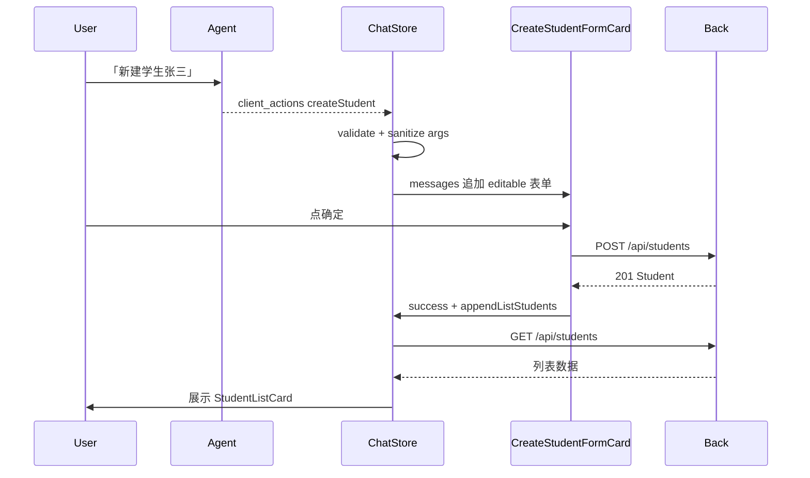
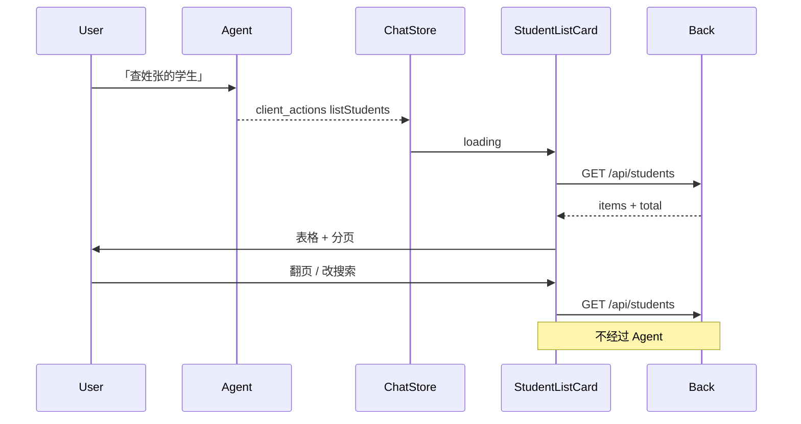

# 对话内学生表单与列表 client_actions（PRD）

## 文档定位

- 本文定义演示平台 **学生相关 client_actions 第二代** 的产品与技术方案。
- 不替代 [README.md](../../README.md) 的 `client_actions` 总契约；**实现完成后需同步 README、maps、demo-walkthrough、progress**。
- 遵循 Front → Back → Agent 边界：Agent 只产出结构化 JSON；**HTTP 读写由 Front 在对话框内直接调用 Back `/api/students`**。
- 侧边栏 [StudentsView](../../front/src/views/StudentsView.vue) **保留**为传统 CRUD 管理页；本 PRD 只改 **Agent 驱动的对话内体验**，不要求删除业务页。

---

## 背景与动机

### 现状（第一代 createStudent，待移除）

| 环节 | 行为 |
|------|------|
| Agent | 产出 `createStudent` + 可选预填 args |
| Front | `CreateStudentConfirmCard` 二次确认 → 跳转 `/app/students` → `studentUiStore.pendingCreate` → `StudentsView` 打开抽屉预填 |
| 用户 | 在业务页抽屉点「保存」才 POST |

问题：

1. **链路长**：确认卡片 → 关抽屉 → 换页 → 再等 watcher 开抽屉，体验割裂。
2. **与对话场景不符**：用户已在 ChatDrawer 里表达意图，却要先确认「是否打开表单」，再离开对话去业务页。
3. **缺列表能力**：Agent 无法把查询结果展示在对话里，用户必须自己去学生管理页搜索。

### 目标（第二代）

| 工具 | 新行为 |
|------|--------|
| **createStudent** | Agent 返回后 **立即** 在对话中展示可编辑表单；有 args 则预填；用户点「确定」POST；**无执行前确认卡片** |
| **listStudents**（新） | Agent 返回查询条件后，Front **立即** 在对话中展示表格 + 翻页 + 搜索；**无操作列** |
| **联动** | createStudent POST **成功后**，Front **自动** 触发一次 listStudents（默认参数见下文），在同一对话流中追加列表卡片 |

---

## 目标与非目标

### 目标

- 两个 client_action 的 UI **全部内嵌 ChatDrawer 消息流**。
- 参数契约与现有 Back API 对齐（复用 `StudentCreateRequest`、`StudentListParams`）。
- 列表卡片内支持 **用户本地交互**（改搜索词、翻页）→ 直接调 `GET /api/students`，**不回流 Agent**。
- 创建成功后 **Front 侧自动链式刷新列表**，无需用户再发一句「查一下列表」、也无需 Agent 第二回合。
- 删除第一代 createStudent 相关 Front 代码（确认卡片、studentUiStore、跨页意图、StudentsView watcher）。

### 非目标（第一期不做）

- 对话内 **编辑 / 删除** 学生（列表无操作列）。
- Agent 侧规则快捷路径抽取（「新建学生张三」→ 字段解析）；第一期仅 LLM JSON 路径。
- 替换或删除 `/app/students` 业务页。
- createStudent 成功后把新记录 **高亮** 或 **自动定位到所在页**（可二期优化；第一期用默认 list 参数刷新即可）。
- 多 action 编排（如「先 list 再 create」由模型一次产出多个 action）——第一期支持 **单条 action 顺序执行**；create 后 list 由 **Front 硬编码链式** 完成。

---

## 用户故事

1. **alice** 在首页对话：「帮我新建学生，姓名张三，学号 2025001」  
   → 对话里立刻出现表单，姓名/学号已填 → 她补全班级 → 点「确定」→ 成功 toast → 下方自动出现学生列表。

2. **alice**：「查一下姓张的学生」  
   → 对话里出现列表，搜索框带「张」→ 她可改搜索或翻页，表格即时刷新。

3. **alice**：「新建一个学生」  
   → 空表单出现在对话里，无预填字段。

4. 历史回放：过去的 create/list 卡片以 **只读 / historical** 展示，不可再次提交或翻页（与 jumpPage historical 一致）。

---

## 工具契约（Back `tools.demo.json`）

### 1. `createStudent`（修订）

**语义变更**：从「打开业务页表单」改为「在对话中展示创建表单」。

```json
{
  "name": "createStudent",
  "description": "Show an inline create-student form in the chat. Optional prefill: student_no, name, class_name, status (active=在读, inactive=休学). The user submits the form in chat; do not assume the student is already created.",
  "parameters": {
    "type": "object",
    "properties": {
      "student_no": { "type": "string" },
      "name": { "type": "string" },
      "class_name": { "type": "string" },
      "status": { "type": "string", "enum": ["active", "inactive"] }
    },
    "required": []
  },
  "requires_approval": false,
  "roles": ["role-admin", "role-sales"]
}
```

| 字段 | 必填 | 说明 |
|------|------|------|
| `student_no` | 否 | 预填学号 |
| `name` | 否 | 预填姓名 |
| `class_name` | 否 | 预填班级 |
| `status` | 否 | 预填状态；未传时表单默认 `active` |

- **`requires_approval` 改为 `false`**：收到 action 即渲染表单，无「确认打开」步骤。
- Agent 产出示例：

```json
{
  "client_actions": [{
    "tool": "createStudent",
    "args": { "name": "张三", "student_no": "2025001" },
    "requires_approval": false
  }]
}
```

### 2. `listStudents`（新增）

```json
{
  "name": "listStudents",
  "description": "Show a paginated student list inline in the chat. Optional filters: search (matches name/student_no/class_name), status (active/inactive), class_name. Pagination: offset (default 0), limit (default 10, max 100).",
  "parameters": {
    "type": "object",
    "properties": {
      "offset": { "type": "integer", "minimum": 0 },
      "limit": { "type": "integer", "minimum": 1, "maximum": 100 },
      "search": { "type": "string" },
      "status": { "type": "string", "enum": ["active", "inactive"] },
      "class_name": { "type": "string" }
    },
    "required": []
  },
  "requires_approval": false,
  "roles": ["role-admin", "role-sales"]
}
```

| 字段 | 默认 | 对应 Back API |
|------|------|---------------|
| `offset` | `0` | `GET /api/students?offset=` |
| `limit` | `10` | `limit=`（与 StudentsView 默认 pageSize 对齐） |
| `search` | 无 | `search=` |
| `status` | 无 | `status=` |
| `class_name` | 无 | `class_name=` |

Agent 产出示例：

```json
{
  "client_actions": [{
    "tool": "listStudents",
    "args": { "search": "张", "limit": 10 },
    "requires_approval": false
  }]
}
```

### Back / Agent 代码变更

| 层 | 变更 |
|----|------|
| Back | 更新 `tools.demo.json` 中 `createStudent` description + `requires_approval`；新增 `listStudents` |
| Back | `context.py` 无需改（自动加载） |
| Agent | `client_actions.py` 白名单自动生效；补 `listStudents` 解析测试 |
| Agent | **可选**：`rag/router.py` 将「查学生/新建学生」纳入纯 client 意图跳过 RAG |

**Back `/api/students` 无需改**——Front 对话框直接复用现有 REST。

---

## Front 交互设计

### 消息模型扩展

在 [types/index.ts](../../front/src/types/index.ts) 中，**删除** `CreateStudentPrompt` / 确认卡片状态机，**新增**：

```typescript
/** createStudent 内嵌表单消息 */
type CreateStudentFormMessage = {
  prefill: Partial<StudentCreateRequest>;
  status: "editable" | "submitting" | "success" | "error" | "historical";
  errorDetail?: string;
  createdStudent?: Student;  // success 时可展示摘要
};

/** listStudents 内嵌列消息 */
type ListStudentsMessage = {
  query: StudentListParams;           // 当前查询条件（含 offset/limit）
  status: "loading" | "ready" | "error" | "historical";
  data?: StudentListResponse;
  errorDetail?: string;
};

type ChatDisplayMessage = {
  // ...
  createStudentForm?: CreateStudentFormMessage;
  listStudents?: ListStudentsMessage;
};
```

### 组件

| 组件 | 路径 | 职责 |
|------|------|------|
| `CreateStudentFormCard.vue` | `front/src/components/chat/` | 学号/姓名/班级/状态下拉；「确定」「取消」；校验必填；调 `createStudent()` |
| `StudentListCard.vue` | `front/src/components/chat/` | 搜索框、状态/班级筛选（可选简化）、`NDataTable`、分页；**无操作列** |
| `ChatDrawer.vue` | 已有 | 按 `msg.createStudentForm` / `msg.listStudents` 分支渲染 |

**删除组件**：`CreateStudentConfirmCard.vue`

### createStudent 表单卡片

```
┌─ 新建学生 ─────────────────────┐
│ 学号 *  [________]             │
│ 姓名 *  [________]             │
│ 班级    [________]             │
│ 状态    [在读 ▼]               │
│ [确定]  [取消]                 │
└────────────────────────────────┘
```

| 状态 | UI |
|------|-----|
| `editable` | 可编辑，确定可点 |
| `submitting` | 确定 loading |
| `success` | 表单只读或折叠，展示「已创建：张三 (2025001)」 |
| `error` | 展示 field_errors / message，表单仍可改并重试 |
| `historical` | 只读快照，不可提交 |

- **取消**：卡片标记为 cancelled/closed，不 POST（不删消息，仅禁用表单）。
- **确定**：Front 调 [api/students.ts](../../front/src/api/students.ts) `createStudent()`；**不经过 Agent**。

### listStudents 列表卡片

```
┌─ 学生列表 ─────────────────────┐
│ 搜索 [________] [状态▼] [查询] │
│ ┌──────┬────┬────────┬────┐   │
│ │ 学号 │姓名│ 班级   │状态│   │
│ ├──────┼────┼────────┼────┤   │
│ │ ...  │    │        │    │   │
│ └──────┴────┴────────┴────┘   │
│        < 1 2 3 >  共 N 条      │
└────────────────────────────────┘
```

- 列：**学号、姓名、班级、状态**（与 StudentsView 一致，**无操作列**）。
- 翻页 / 搜索：更新卡片内 `query` → `fetchStudents(query)` → 刷新 `data`。
- 首次渲染：`handleClientActions` 收到 action 后立即 `status: loading` → 请求 → `ready`。

### 创建成功后自动 listStudents

**Front 硬编码链式**（不回流 Agent）：

```text
CreateStudentFormCard 确定
  → POST /api/students 成功
  → form.status = success
  → chatStore.appendListStudents({ offset: 0, limit: 10 })  // 默认参数
  → StudentListCard loading → GET /api/students → ready
```

默认刷新参数（可写入 PRD 常量 `DEFAULT_LIST_AFTER_CREATE`）：

```typescript
{ offset: 0, limit: 10 }
```

**不**自动继承 create 前的 search（第一期简单可靠）；二期可加「按新学号 search 定位」。

若同一回合 Agent 已产出 `listStudents`，create 成功后仍 **追加一条新 list 卡片**（以最新数据为准），避免静默更新历史卡片。

---

## 数据流

### createStudent



### listStudents



---

## chat store 职责（[stores/chat.ts](../../front/src/stores/chat.ts)）

| 函数 | 职责 |
|------|------|
| `handleClientActions` | 分支 `createStudent` / `listStudents`；**不再** enqueue 确认卡片 |
| `enqueueCreateStudentForm(action)` | 校验 args → push 带 `createStudentForm` 的消息 |
| `enqueueListStudents(action)` | 校验 args → push 带 `listStudents` 的消息 → 触发首次 fetch |
| `submitCreateStudent(messageId, payload)` | 表单提交（或由 FormCard emit，store 协调） |
| `onCreateStudentSuccess(messageId)` | 标记 success → `appendListStudents(DEFAULT_LIST_AFTER_CREATE)` |
| `refreshListStudents(messageId, query)` | 列表翻页/搜索 |
| `cancelCreateStudentForm(messageId)` | 取消编辑 |

**删除**：`confirmCreateStudent`、`cancelCreateStudent`（确认卡片版）、`executeCreateStudent`（跳转版）、`buildCreateStudentPromptMessage`、`CreateStudentPrompt` 相关。

### 校验模块

保留并复用 [create-student.ts](../../front/src/client-actions/create-student.ts) 的 `validateCreateStudentAction` / `sanitizeCreateStudentArgs`。

新增 [list-students.ts](../../front/src/client-actions/list-students.ts)（对齐 page-registry 模式）：

- `sanitizeListStudentsArgs(raw)` → `StudentListParams`
- `validateListStudentsAction(action)`
- 默认值：`offset=0`，`limit=10`，clamp limit ≤ 100

---

## 移除清单（第一代 createStudent）

实现本 PRD 时 **必须删除或回滚**：

| 文件 / 符号 | 处理 |
|-------------|------|
| [CreateStudentConfirmCard.vue](../../front/src/components/chat/CreateStudentConfirmCard.vue) | **删除** |
| [student-ui.ts](../../front/src/stores/student-ui.ts) | **删除** |
| `CreateStudentPrompt`、`createStudentPrompt` 类型 | **删除** |
| `chat.ts`：`executeCreateStudent`、`confirmCreateStudent`、`cancelCreateStudent`、`enqueueCreateStudentPrompt` | **删除/重写** |
| [StudentsView.vue](../../front/src/views/StudentsView.vue)：`pendingCreate` watch、`consumePendingCreateIntent`、`openCreateWithPrefill` 的 Agent 联动 | **删除**（保留页面自身 CRUD 与 `openCreate`） |
| README / demo-walkthrough **B4b**（确认卡片 + 跳转脚本） | **改写** |

**保留**：

- [StudentsView.vue](../../front/src/views/StudentsView.vue) 完整 CRUD 页（侧栏入口）
- [api/students.ts](../../front/src/api/students.ts)
- `create-student.ts` 校验（改 import 方即可）

---

## 实现任务拆分

任务卡已生成，见 [docs/prompts/](../prompts/)：

| ID | 任务卡 | 范围 | 依赖 |
|----|--------|------|------|
| 106 | [106-student-chat-back-tool-schema.md](../prompts/106-student-chat-back-tool-schema.md) | Back schema + 测试 | 105 |
| 107 | [107-student-chat-front-foundation.md](../prompts/107-student-chat-front-foundation.md) | 类型、list-students、拆第一代 | 106 |
| 108 | [108-student-chat-create-form-card.md](../prompts/108-student-chat-create-form-card.md) | CreateStudentFormCard | 107 |
| 109 | [109-student-chat-list-card.md](../prompts/109-student-chat-list-card.md) | StudentListCard | 107 |
| 110 | [110-student-chat-docs-final-alignment.md](../prompts/110-student-chat-docs-final-alignment.md) | create→list + 文档收口 | 106,108,109 |

进度见 [docs/progress.md](../progress.md)。

---

## 落地状态

| 项 | 状态 |
|----|------|
| PRD | ✅ 本文 |
| 任务卡 106–110 | ✅ 已拆分 |
| Back schema | ✅ **106** |
| Front 拆旧 + 类型 | ✅ **107** |
| 对话内表单 | ✅ **108** |
| 对话内列表 | ✅ **109** |
| 链式 list + 文档 | ✅ **110** |

---

## 测试计划

### Back

- `test_demo_chat_context.py`：白名单含 `jumpPage`、`createStudent`、`listStudents`；createStudent `requires_approval=false`

### Agent

- `test_client_actions.py`：`listStudents` 解析；空 args / 带 search+offset

### Front（手动）

1. 「新建学生张三，学号 xxx」→ 对话内表单预填，无确认卡片  
2. 确定 → POST 成功 → 下方自动出现列表  
3. 「查询学生列表」→ 列表卡片，翻页/搜索本地刷新  
4. 列表 **无** 编辑/删除按钮  
5. 历史消息中表单/列表为 historical，不可操作  
6. 侧栏 `/app/students` 仍可直接 CRUD  

### Front（可选单测）

- `sanitizeListStudentsArgs` 默认值与 limit clamp
- `sanitizeCreateStudentArgs` 已有逻辑复用

---

## 文档同步（实现时）

- [README.md](../../README.md) — client_actions 示例与工具表
- [docs/maps/client-actions.md](../maps/client-actions.md)
- [docs/demo-walkthrough.md](../demo-walkthrough.md) — 替换 B4b
- [docs/progress.md](../progress.md) — 任务 106–110

---

## 开放问题（默认决议）

| 问题 | 决议 |
|------|------|
| create 成功后 list 是否带 search=新学号？ | **第一期否**；全量第一页即可 |
| 列表卡片是否展示 `created_at`？ | **第一期否**；四列与 StudentsView 核心列一致 |
| 表单「取消」是否移除消息？ | **否**；保留消息并标记 cancelled，便于对话上下文连续 |
| Agent 一次返回 create + list 两个 action？ | **支持**；按数组顺序依次 enqueue；create 成功后再 append 一次 list（可能两条 list，可接受） |
