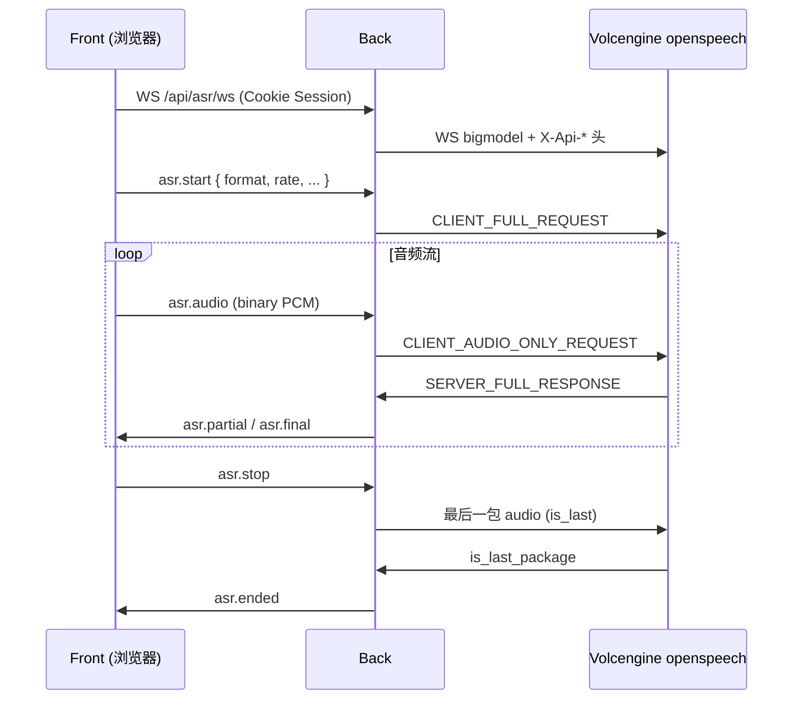

# 火山引擎流式语音识别（PRD）

## 文档定位

- 本文定义 **火山引擎 SAUC（Streaming ASR）** 在 CommonAgent 中的产品目标、边界与集成方案。
- 官方文档：[大模型流式语音识别 API](https://www.volcengine.com/docs/6561/1354869?lang=zh)（6561 / 1354869）。
- 仓库参考实现：`back/demo/sauc_python/`（`sauc_websocket_demo.py` + `readme.md`），**仅作协议与联调参考**，正式代码应迁入 `back/src/services/` 并加测试。
- 不替代 [README.md](../../README.md) 的三层边界；**实现完成后**需同步 README、`back/.env.example`、`back/src/settings/config.py`、demo-walkthrough、progress 与任务卡。
- **Agent 不参与** ASR 媒体与上游 WebSocket；遵循 **Front → Back → 火山 openspeech**，浏览器 **不得** 携带 `X-Api-Access-Key` / `X-Api-App-Key`。

---

## 背景与动机

当前仓库已有：

- 账号间 **WebRTC 音频通话**（[webrtc-account-call.md](./webrtc-account-call.md)）：媒体 P2P，Back 只做信令中继。
- 对话 **ChatDrawer** 以文本输入为主，无语音输入或通话实时字幕。

需求：选用字节 **流式语音识别**，为后续能力铺路，例如：

1. **通话页 / 通话中**：边说边出字幕（仅本地展示或写入会话，一期可只做 UI）。
2. **对话抽屉**：按住说话 → 流式转写 → 用户确认后发送文本消息（与 Agent 文本链路衔接）。

火山侧通过 **WebSocket 二进制协议** 推送 PCM 分片并接收 JSON 结果；官方 Python demo 已验证连接、分片、gzip 与响应解析流程。

---

## 执行摘要

| 能力 | 说明 |
|------|------|
| **上游** | `wss://openspeech.bytedance.com/api/v3/sauc/bigmodel`（真流式；另有 `bigmodel_async`、`bigmodel_nostream` 见 demo 注释） |
| **鉴权** | HTTP 握手头：`X-Api-Access-Key`、`X-Api-App-Key`、`X-Api-Resource-Id`、`X-Api-Request-Id`（demo 默认 Resource-Id：`volc.bigasr.sauc.duration`） |
| **密钥托管** | `VOLC_ASR_ACCESS_KEY`、`VOLC_ASR_APP_KEY` 仅存 **Back** `.env`（已写入本地 `back/.env`；示例见 `back/.env.example`） |
| **Back 代理** | 已登录用户经 **Back WebSocket** 上传音频帧；Back 用服务账号连火山并回传 `partial` / `final` 事件 |
| **音频格式** | 16 kHz、16 bit、单声道 PCM（与 demo `audio` 字段一致）；浏览器侧 `MediaRecorder` / `AudioWorklet` 需重采样或编码约定 |
| **Agent** | 无；若要把转写送入对话，由 Front 在拿到 `final` 后调用现有 `POST /api/chat` |

---

## 目标

1. **密钥不出浏览器**：所有火山凭证由 Back 读取环境变量注入上游握手头。
2. **流式体验**：边说边返回中间结果（`show_utterances` / 非 `enable_nonstream`），尾包可标记 `is_last_package`（与 demo `ResponseParser` 一致）。
3. **与 Session 绑定**：仅 Cookie Session 已登录用户可开 ASR WebSocket；`user_id` 由 Back 注入上游 JSON `user.uid`，不信任客户端自报。
4. **可测**：协议编解码单元测试（不连外网）；可选集成测试用 mock 上游 WS。
5. **可演示**：本地用 demo 同款 wav 或浏览器麦克风完成一条「说完 → 看到最终文本」路径。

## 非目标（第一期不做）

- 在 Front 或 Agent 配置火山 API Key。
- 语音合成（TTS）、说话人分离、自定义热词全量控制台同步（可二期接 `request` 扩展字段）。
- 通话录音持久化、合规存证、多语言自动检测（一期固定中文/普通话模型 `bigmodel`）。
- 替代 WebRTC 媒体路径（ASR 为 **旁路转写**，不经过 `RTCPeerConnection`）。
- 生产级配额监控、账单告警（PRD 只约定日志与错误码映射）。

---

## 上游协议要点（来自 demo）

以下与 `back/demo/sauc_python/sauc_websocket_demo.py` 对齐，实现时以 [官方文档](https://www.volcengine.com/docs/6561/1354869?lang=zh) 为准。

### WebSocket 端点

| URL | 用途 |
|-----|------|
| `wss://openspeech.bytedance.com/api/v3/sauc/bigmodel` | **推荐**：双向流式 |
| `wss://openspeech.bytedance.com/api/v3/sauc/bigmodel_async` | 异步流式 |
| `wss://openspeech.bytedance.com/api/v3/sauc/bigmodel_nostream` | 非流式（demo 默认，仅适合文件回放联调） |

环境变量 `VOLC_ASR_WS_URL` 默认指向 `bigmodel`。

### 握手头（Back → 火山）

```http
X-Api-Resource-Id: volc.bigasr.sauc.duration
X-Api-Request-Id: <uuid>
X-Api-Access-Key: <VOLC_ASR_ACCESS_KEY>
X-Api-App-Key: <VOLC_ASR_APP_KEY>
```

> **凭证说明**：控制台通常提供 **App Key** 与 **Access Key**（或文档所称 API Key）。demo 中 `Config.auth` 为 `app_key` + `access_key`。本地 `.env` 已保存用户提供的 Access Key；**App Key 若与 Access Key 不同，须在控制台补齐并写入 `VOLC_ASR_APP_KEY`**，否则握手可能失败。

### 二进制帧类型（摘要）

| 类型 | 方向 | 说明 |
|------|------|------|
| `CLIENT_FULL_REQUEST` | Client→Server | 首包：gzip JSON，含 `user`、`audio`、`request`（`model_name: bigmodel`，`enable_itn/punc/ddc`，`show_utterances: true`） |
| `CLIENT_AUDIO_ONLY_REQUEST` | Client→Server | 音频分片；最后一包 `seq` 取负并带 `NEG_WITH_SEQUENCE` |
| `SERVER_FULL_RESPONSE` | Server→Client | gzip JSON 转写结果 |
| `SERVER_ERROR_RESPONSE` | Server→Client | `code` + 错误 payload |

首包后按 **约 200ms** 音频时长分片（demo `--seg-duration`），与实时率接近；Back 代理时可按客户端帧聚合。

### 响应 JSON（业务关心字段）

实现时从 `payload_msg` 抽取（具体字段以官方文档与实测为准）：

- 中间/最终文本（utterance 列表或顶层 `result`）
- `is_last_package`：会话结束
- 非零 `code`：映射为 Back 关闭码与用户可读文案

---

## 架构与边界



| 层级 | 职责 |
|------|------|
| **Front** | 采集麦克风；重采样 16k PCM；经 Back WS 发二进制/JSON；展示 partial/final；可选写入 Chat 输入框 |
| **Back** | Session 校验；维护「用户会话 ↔ 火山 WS」；协议编解码（可复用 demo 逻辑重构为模块）；限流与超时 |
| **Agent** | 无；文本对话仍走现有 chat SSE |

硬约束（与 [AGENTS.md](../../AGENTS.md) 一致）：

- 浏览器只连 Back。
- 不与 `thread_id` checkpoint 强耦合；`thread_id` 仅作为 Front 展示/发送 chat 时的客户端字段。

---

## Back 环境变量契约

| 变量 | 必填 | 说明 |
|------|------|------|
| `VOLC_ASR_ACCESS_KEY` | 是 | 对应 demo `access_key` / `X-Api-Access-Key` |
| `VOLC_ASR_APP_KEY` | 是* | 对应 demo `app_key` / `X-Api-App-Key`（*若控制台仅发一个 key，以文档为准填同一值或留空策略在实现任务卡中验证） |
| `VOLC_ASR_WS_URL` | 否 | 默认 `wss://openspeech.bytedance.com/api/v3/sauc/bigmodel` |
| `VOLC_ASR_RESOURCE_ID` | 否 | 默认 `volc.bigasr.sauc.duration` |
| `VOLC_ASR_SEGMENT_MS` | 否 | 分片时长毫秒，默认 `200` |

实现时需同步：`back/.env.example`、`back/src/settings/config.py`、可选 `test_settings` 类守卫。

---

## Front ↔ Back 信令（建议一期）

路径建议：`WS /api/asr/ws`（与 `/api/calls/ws` 并列，独立 Pinia store 或 `call` store 扩展）。

| type | 方向 | 说明 |
|------|------|------|
| `asr.start` | C→S | 开始会话；可选 `scene: call \| chat` |
| `asr.audio` | C→S | 二进制 PCM 或 base64（一期推荐 **binary WS frame** 降开销） |
| `asr.stop` | C→S | 结束采集，触发最后一包 |
| `asr.partial` | S→C | 中间转写 |
| `asr.final` | S→C | 稳定句或整段 final |
| `asr.error` | S→C | `{ code, message }` |
| `asr.ended` | S→C | 上游 `is_last_package` 或正常关闭 |

未登录连接 → 关闭（与通话信令一致）。

---

## 与 WebRTC 通话的关系

| 场景 | 一期建议 |
|------|----------|
| 通话中字幕 | **可选二期**：从本地 `MediaStream` 分支采集发送 ASR，不经过对端；与 P2P 音频并行 |
| 通话页仅拨号 | 一期可先在 **通话页单独「语音转文字」按钮** 验证链路，降低与 `RTCPeerConnection` 耦合 |
| 信令冲突 | ASR WS 与 `call` WS 分离；`AppLayout` 可持两条连接 |

---

## 安全与隐私

- **禁止**将 `VOLC_ASR_*` 写入 Front `.env` 或 `VITE_*`。
- 日志不打印完整 Access Key；错误日志仅记录 `request_id` 与火山 `code`。
- 音频默认 **不落库**；若二期写入会话历史，需在 README 与隐私说明中标注。
- 用户麦克风需 **用户手势**（按钮「开始听写」/「接听后开启字幕」）。
- 用户在聊天/工单中粘贴的密钥应立即轮换；`.env` 不得提交 git。

---

## 实现拆分建议（`docs/prompts/`）

| ID | 建议任务 | 范围 |
|----|----------|------|
| 115 | Back：从 demo 抽取 `asr_protocol.py` + `volc_asr_client.py` + 单元测试 | 编解码、mock WS |
| 116 | Back：`WS /api/asr/ws` + Session + 上游连接池/单会话 | 115 |
| 117 | Front：`asr` store + 麦克风采集 + 通话页或 Chat 入口 UI | 116 |
| 118 | 文档：README、demo-walkthrough、progress、`.env.example` 与 Settings 对齐 | 115–117 |

依赖：演示平台 Session（任务 82+）已完成；与 WebRTC **111–114** 无硬依赖，可并行。

---

## 测试计划

### Back（单元）

- `RequestBuilder` / `ResponseParser` 对 demo 样例字节做 round-trip（可从录制文件 fixture）。
- 最后一包 `seq` 为负、gzip 解压失败、空 payload 分支。

### Back（集成 / 可选）

- mock 上游 aiohttp WS，验证 `asr.start` → 多帧 `asr.audio` → `asr.final` 转发。

### 手工

1. `cd back/demo/sauc_python && python3 sauc_websocket_demo.py --file <16k wav>`（配置 `.env` 密钥或临时 export）确认上游可用。  
2. 双步骤：浏览器登录 → Back 代理 WS → 说一句话 → UI 出现 final 文本。  

### Demo 目录策略

- **保留** `back/demo/sauc_python` 作为上游协议参考，不在 CI 中依赖外网。
- 正式实现位于 `back/src/services/volc_asr/`（名称实现时确定），demo 不直接 import 进生产路径。

---

## 开放问题

| # | 问题 | 一期建议 |
|---|------|----------|
| 1 | 用户仅提供 UUID 形态 key，是否即 `access_key`？ | 按 demo 写入 `VOLC_ASR_ACCESS_KEY`；**App Key 待控制台确认** |
| 2 | 第一期 UI 挂在通话还是 Chat？ | 优先 **Chat 语音输入** 或独立调试页，通话字幕二期 |
| 3 | 是否将 final 自动 `POST /api/chat`？ | **否**，默认填入输入框由用户发送 |
| 4 | 多 worker Back | 与通话信令相同：单进程内存会话；多 worker 需粘性会话或 Redis（二期） |

---

## 文档与契约变更清单（实现后）

- [ ] [README.md](../../README.md)：ASR 模块、WS 路径、环境变量；明确 Agent 不参与。
- [ ] [docs/maps/demo-platform.md](../maps/demo-platform.md)：ASR 序列与路由。
- [ ] [docs/demo-walkthrough.md](../demo-walkthrough.md)：新小节（如 B6 语音转写）。
- [ ] [docs/progress.md](../progress.md)：任务 115–118 登记与完成状态。
- [ ] `back/src/settings/config.py` + `back/.env.example` 与实现对齐。

---

## 修订记录

| 日期 | 说明 |
|------|------|
| 2026-05-27 | 初稿：火山 SAUC 集成目标、demo 协议摘要、Back 代理架构、环境变量、任务 115–118 建议 |
