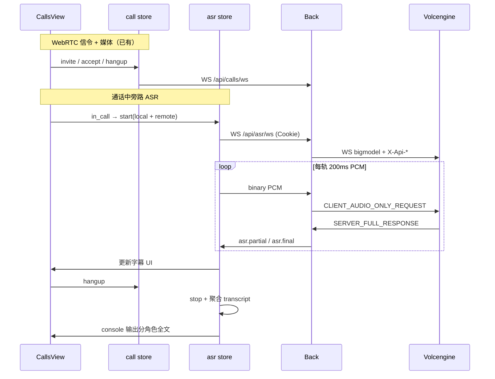

# 火山引擎流式语音识别 — 通话实时字幕（PRD）

## 文档定位

- 本文定义 **火山引擎 SAUC（Streaming ASR）** 在 CommonAgent **通话维度** 的产品目标、边界与集成方案。
- 官方文档：[大模型流式语音识别 API](https://www.volcengine.com/docs/6561/1354869?lang=zh)（6561 / 1354869）。
- 仓库参考实现：`back/demo/sauc_python/`（`sauc_websocket_demo.py` + `readme.md`），**仅作协议与联调参考**；正式代码迁入 `back/src/services/volc_asr/` 并加测试。
- 不替代 [README.md](../../README.md) 的三层边界；**实现完成后**需同步 README、`back/.env.example`、`back/src/settings/config.py`、demo-walkthrough、progress 与任务卡。
- **Agent 不参与** ASR 媒体与上游 WebSocket；遵循 **Front → Back → 火山 openspeech**，浏览器 **不得** 携带火山凭证。
- **与 Chat 解耦**：本需求 **不** 在 ChatDrawer / 对话维度做语音输入；后续若需要 Chat 语音输入，另开 PRD 或二期任务。

---

## 背景与动机

当前仓库已有：

- 账号间 **WebRTC 音频通话**（[webrtc-account-call.md](./webrtc-account-call.md)）：媒体 P2P，Back 只做信令中继；通话 UI 在 [`front/src/views/CallsView.vue`](../../front/src/views/CallsView.vue)。
- 对话 **ChatDrawer** 以文本输入为主，**不在本 PRD 范围内**。

需求（用户明确）：

1. **通话中**：在 CallsView 实时展示 **字幕**（partial → final 滚动更新）。
2. **通话结束**（挂断 / 对方挂断 / 拒接后若曾进入 in_call）：在浏览器 **控制台** 打印 **完整通话文字记录**；若火山或本地双轨方案能区分说话人，则 **分角色** 输出。
3. 密钥由用户提供，写入 **`back/.env`**（已配置 `VOLC_ASR_ACCESS_KEY`，**不得**提交 git）。

---

## 执行摘要

| 能力 | 说明 |
|------|------|
| **上游** | `wss://openspeech.bytedance.com/api/v3/sauc/bigmodel`（双向流式，200ms 分包最优） |
| **鉴权** | 新控制台：`X-Api-Key`（`VOLC_ASR_ACCESS_KEY`）、`X-Api-Resource-Id`、`X-Api-Request-Id`、`X-Api-Sequence: -1` |
| **密钥托管** | `VOLC_ASR_ACCESS_KEY` 等仅存 **Back** `.env` / `.env.example` |
| **Back 代理** | 已登录用户经 **`WS /api/asr/ws`** 上传 PCM；Back 连火山并回传 `asr.partial` / `asr.final` |
| **音频格式** | 16 kHz、16 bit、单声道 PCM（与 demo `audio` 字段一致） |
| **UI 入口** | **仅 CallsView**：`isInCall === true` 时展示字幕区；与 WebRTC 信令 WS 并行 |
| **挂断输出** | `console.log` / `console.group` 结构化打印全文；**不落库** |
| **Agent** | 无 |

---

## 目标

1. **密钥不出浏览器**：火山凭证由 Back 读取环境变量注入上游握手头。
2. **通话实时字幕**：进入 `in_call` 后自动（或接听手势后）开始 ASR；CallsView 展示当前 partial 与近期 final 句段。
3. **挂断完整记录**：通话结束时在 **Front 控制台** 输出整段 transcript；优先 **分角色**（见下文「说话人策略」）。
4. **与 Session 绑定**：仅 Cookie Session 已登录用户可开 ASR WebSocket；`user.uid` 由 Back 注入 Session `user_id`。
5. **可测**：协议编解码单元测试（不连外网）；Back WS 集成测试 mock 上游；可选手工双浏览器通话联调。

## 非目标（第一期不做）

- ChatDrawer 语音输入、自动 `POST /api/chat`、Agent 消费转写文本。
- 通话录音持久化、合规存证、后台管理页查看历史 transcript。
- 在 Front / Agent 配置火山 API Key。
- 替代 WebRTC 媒体路径（ASR 为 **旁路转写**）。
- 生产级配额监控、账单告警。
- TTS、热词控制台全量同步（可二期扩展 `request` 字段）。

---

## 用户故事

1. **alice** 在 CallsView 呼叫 **bob** → bob 接听 → 双方进入通话 → CallsView 出现 **实时字幕区域**，alice 说话时字幕更新，bob 远端语音也有字幕（双轨或混音方案见下）。
2. 通话中字幕以 **partial** 闪烁更新、**final** 稳定句追加到列表（UX 可滚动，最新在底或顶，实现时二选一）。
3. **alice** 点 **挂断** → 字幕区清空或折叠 → 浏览器控制台打印：

   ```text
   [Call Transcript] call_id=... duration=...
   [本地 · Alice] 你好，能听到吗？
   [对方 · Bob] 能听到，很清楚。
   ...
   ```

4. 若火山返回 `enable_speaker_info` 聚类 ID 而无本地双轨，控制台以 `说话人 1/2` 或映射后的角色名打印。
5. 凭证缺失或上游失败 → CallsView 字幕区展示可读错误，**不阻断** WebRTC 通话本身。

---

## 说话人策略（分角色）

WebRTC 1:1 通话中，每个浏览器同时持有 **本地麦克风** 与 **远端 MediaStream**。有两种互补方案：

### 方案 A（推荐，一期）：双轨 ASR + 业务角色名

| 轨道 | 音频源 | 上游会话 | 控制台角色标签 |
|------|--------|----------|----------------|
| local | `getUserMedia` 麦克风 | `asr.start { scene:"call", track:"local" }` | `本地 · {当前用户 display_name}` |
| remote | `remoteStream`（Web Audio 分支） | `asr.start { scene:"call", track:"remote" }` | `对方 · {peerDisplayName}` |

- Back 允许同一用户 **两个** 并发 ASR 上游会话（`track` 区分），或单 WS 多路复用（实现时二选一，需在 README 写清）。
- 字幕 UI：**按时间戳合并** 两路 `final`/`partial` 展示（简单实现可先 **上下分栏**：「我说 / 对方说」）。
- 挂断时按轨道聚合输出，**不依赖** 火山说话人聚类，1:1 场景角色最清晰。

### 方案 B（可选增强）：火山 `enable_speaker_info`

官方 `request` 支持：

- `enable_speaker_info: true` — 说话人聚类分离
- `ssd_version: "200"` — 配合 ASR 2.0 SSD（文档建议 ASR2.0 时开启）
- `show_utterances: true` — 分句；分句 `additions` 可含 `speaker` 等扩展字段（以实测为准）

**限制**（官方文档）：

- 默认不开启；双向流式优化接口需 `enable_nonstream: true` 才与部分能力组合。
- 混音单路上识别时，聚类结果为 `speaker` ID，需映射为「说话人 1/2」，**不如方案 A 直观**。

**一期决议**：以 **方案 A 双轨 + 业务角色名** 为主；首包可仍带 `show_utterances: true`；`enable_speaker_info` 作为 **联调可选**，若双轨已满足分角色控制台输出则不必强开。

---

## 上游协议要点（来自 demo + 官方文档）

实现时以 [官方文档](https://www.volcengine.com/docs/6561/1354869?lang=zh) 为准；与 `back/demo/sauc_python/sauc_websocket_demo.py` 对齐。

### WebSocket 端点

| URL | 用途 |
|-----|------|
| `wss://openspeech.bytedance.com/api/v3/sauc/bigmodel` | **推荐**：双向流式，边说边出字 |
| `wss://openspeech.bytedance.com/api/v3/sauc/bigmodel_nostream` | 流式输入，适合 demo 文件回放联调 |
| `wss://openspeech.bytedance.com/api/v3/sauc/bigmodel_async` | 异步流式 |

`VOLC_ASR_WS_URL` 默认 `bigmodel`。

### 握手头（Back → 火山）

```http
X-Api-Key: <VOLC_ASR_ACCESS_KEY>
X-Api-Resource-Id: <VOLC_ASR_RESOURCE_ID>
X-Api-Request-Id: <uuid>
X-Api-Sequence: -1
```

> **凭证说明**：仅支持**新版本控制台**单 API Key；`VOLC_ASR_APP_KEY` 已废弃、不再发送。`VOLC_ASR_RESOURCE_ID` 默认 ASR 2.0（`volc.seedasr.sauc.duration`）；1.0 账号用 `volc.bigasr.sauc.duration`。`back/demo/sauc_python` 为旧鉴权参考，**勿**作协议真相；联调问题背景见 [volc-asr-fix-handoff.md](./volc-asr-fix-handoff.md)。

### 首包 JSON（摘要）

```json
{
  "user": { "uid": "<session user_id>" },
  "audio": {
    "format": "pcm",
    "codec": "raw",
    "rate": 16000,
    "bits": 16,
    "channel": 1
  },
  "request": {
    "model_name": "bigmodel",
    "enable_itn": true,
    "enable_punc": true,
    "enable_ddc": true,
    "show_utterances": true,
    "enable_nonstream": false
  }
}
```

### 二进制帧（摘要）

| 类型 | 方向 | 说明 |
|------|------|------|
| `CLIENT_FULL_REQUEST` | C→S | 首包 gzip JSON |
| `CLIENT_AUDIO_ONLY_REQUEST` | C→S | PCM 分片；**serialization=none（`ser=0`）**；最后一包负 `seq` + `NEG_WITH_SEQUENCE` |
| `SERVER_FULL_RESPONSE` | S→C | gzip JSON，`result.text` / `result.utterances[]` |
| `SERVER_ERROR_RESPONSE` | S→C | 非零 `code` |

分包 **100–200ms**，双向流式推荐 **200ms**（与 demo `--seg-duration 200` 一致）。

### 响应字段（业务关心）

- `result.text`：整段文本
- `result.utterances[]`：`text`、`start_time`、`end_time`、`definite`（需 `show_utterances: true`）
- `utterances[].additions.speaker`：开启 `enable_speaker_info` 时可能出现（以实测为准）
- `is_last_package`：上游会话结束

---

## 架构与边界



| 层级 | 职责 |
|------|------|
| **Front CallsView** | 通话中字幕 UI；`in_call` 时驱动 `asr` store；挂断触发控制台 dump |
| **Front asr store** | 连接 `/api/asr/ws`；local/remote 采集与重采样；维护 partial/final 与时间线 |
| **Front call store** | 提供 `remoteStream`、`activeCall`、`callStartedAt`；`hangup` 时通知 asr 结束 |
| **Back** | Session 校验；火山 WS 代理；协议编解码（`back/src/services/volc_asr/`） |
| **Agent** | 无 |

硬约束（与 [AGENTS.md](../../AGENTS.md) 一致）：

- 浏览器只连 Back；**禁止** `VITE_VOLC_ASR_*`。
- ASR WS 与 `call` WS **分离**；`AppLayout` 可并存两条连接。
- 不与 `thread_id` / checkpoint 耦合。

---

## CallsView 交互（一期）

挂载点：[`front/src/views/CallsView.vue`](../../front/src/views/CallsView.vue) 的 `in-call-panel` 区域。

| 状态 | UI |
|------|-----|
| 非通话 | 无字幕区 |
| `outgoing` | 可选「连接中…」；**不**开 ASR |
| `in_call` | 字幕面板：当前 partial + 近期 final 列表；可显示「字幕识别中…」 |
| 挂断后 | 字幕隐藏；**控制台** 输出完整记录（见下） |

### 控制台输出格式（建议）

```javascript
console.group(`[Call Transcript] ${callId} (${duration})`);
for (const line of transcriptLines) {
  console.log(`[${line.role}] ${line.text}`); // role: 本地 · Alice / 对方 · Bob
}
console.groupEnd();
```

- `transcriptLines` 由 asr store 在 `asr.ended` 或 call `phase → idle` 时聚合。
- 开发环境默认开启；生产是否保留由实现任务决定（建议保留 `console`，不展示给终端用户）。

---

## Back 环境变量契约

| 变量 | 必填 | 说明 |
|------|------|------|
| `VOLC_ASR_ACCESS_KEY` | 是 | 新控制台 API Key → 上游 `X-Api-Key` |
| `VOLC_ASR_APP_KEY` | — | **已废弃**（旧 `X-Api-App-Key`，不再发送） |
| `VOLC_ASR_WS_URL` | 否 | 默认 `wss://openspeech.bytedance.com/api/v3/sauc/bigmodel` |
| `VOLC_ASR_RESOURCE_ID` | 否 | 默认 `volc.seedasr.sauc.duration`（ASR 2.0）；1.0 为 `volc.bigasr.sauc.duration` |
| `VOLC_ASR_SEGMENT_MS` | 否 | 默认 `200` |

同步：`back/.env.example`、`back/src/settings/config.py`（任务 **115**）。

---

## Front ↔ Back 信令（ASR）

路径：`WS /api/asr/ws`（与 `/api/calls/ws` 并列）。

| type | 方向 | 说明 |
|------|------|------|
| `connected` | S→C | 连接成功 `{ user_id }` |
| `asr.start` | C→S | `{ scene: "call", track: "local" \| "remote", call_id?: string }` |
| `asr.track` | C→S | `{ track }` — 紧随其后的 **binary** 帧为该 track 的 PCM |
| `asr.stop` | C→S | `{ track?: "local" \| "remote" }` — 省略则结束该用户全部 track |
| `asr.partial` | S→C | 中间转写 `{ track, text, start_time?, end_time? }` |
| `asr.final` | S→C | 稳定句 `{ track, text, start_time?, end_time? }` |
| `asr.error` | S→C | `{ code, message }` |
| `asr.ended` | S→C | 该 track 上游结束 `{ track }` |

未登录 → 关闭 WS（与通话信令一致）。PCM 为 WebSocket **binary** 帧（16 kHz、16 bit、单声道），非 JSON `asr.audio`。

---

## 与 WebRTC 通话的关系

| 项 | 说明 |
|----|------|
| 媒体 | WebRTC P2P 音频 **不变**；ASR 从 `localStream` / `remoteStream` **旁路** 采集 |
| 生命周期 | `call.accepted` / 本地 `in_call` → 启动双轨 ASR；`call.hangup` / `call.ended` → stop + 控制台 dump |
| 权限 | 接听已触发 `getUserMedia`；remote 轨从 `ontrack` 的 `MediaStream` 用 `AudioContext` 抽 PCM |
| 冲突 | 两路 ASR 与一路 call WS 并存；注意 `AudioContext` 采样率与 16 kHz 重采样 |

---

## 安全与隐私

- **禁止**将 `VOLC_ASR_*` 写入 Front 或提交 `back/.env`。
- 日志不打印完整 Key；错误仅记录 `request_id` 与火山 `code`。
- 音频与 transcript **默认不落库**；仅浏览器控制台输出（一期）。
- 用户在聊天中粘贴的密钥应轮换。

---

## 实现拆分（`docs/prompts/`）

| ID | 任务 | 范围 |
|----|------|------|
| [115](../prompts/115-volc-asr-protocol-client.md) | Back 协议客户端 + Settings | demo 抽取、单元测试 |
| [116](../prompts/116-volc-asr-back-ws-proxy.md) | Back `WS /api/asr/ws` | Session、上游桥接 |
| [117](../prompts/117-volc-asr-front-mic-ui.md) | Front 采集 + CallsView 字幕 + 控制台 dump | **通话维度**，非 Chat |
| [118](../prompts/118-volc-asr-docs-final-alignment.md) | README / demo-walkthrough / progress 收口 | 115–117 完成后 |

依赖：演示平台 Session（82+）✅；WebRTC 通话（111–114）✅（CallsView 与 `remoteStream` 已存在）。

---

## 测试计划

### Back

- 协议 round-trip、`seq` 负尾包、gzip 失败分支（**115**）。
- mock 上游：`asr.start` → PCM → `asr.partial`/`final`/`ended`（**116**）。

### Front

- `npm run build`；可选 vitest mock WS（**117**）。

### 手工（B6 建议脚本）

1. `back/demo/sauc_python` + wav 确认上游凭证可用。  
2. 双浏览器：`alice` / `bob` 登录 → CallsView 通话 → 双方说话 → 字幕更新 → 挂断 → 双方控制台均有分角色 transcript。  

---

## 开放问题

| # | 问题 | 一期决议（已落地） |
|---|------|-------------------|
| 1 | 用户 UUID 是否即 API Key？ | 写入 `VOLC_ASR_ACCESS_KEY`，映射 `X-Api-Key`；`VOLC_ASR_APP_KEY` 废弃 |
| 2 | UI 在 Chat 还是 Calls？ | **仅 CallsView**；Chat 语音输入不在本批次 |
| 3 | 分角色方案 | **双轨 ASR + 本地/对方 display_name**；火山 `enable_speaker_info` 未强开 |
| 4 | transcript 存哪？ | **仅 console**；不落库、不自动 chat |
| 5 | 多 worker Back | 单进程内存会话；与通话信令一致 |

---

## 落地状态

| ID | 任务卡 | 完成日期 | 说明 |
|----|--------|----------|------|
| 115 | （废弃，无卡） | 2026-05-27 | 协议客户端并入 116 |
| 116 | [116-volc-asr-back-ws-proxy.md](../prompts/116-volc-asr-back-ws-proxy.md) | 2026-05-27 | `WS /api/asr/ws`、`volc_asr/`、`test_asr_ws` + `test_volc_asr_protocol` |
| 117 | [117-volc-asr-front-mic-ui.md](../prompts/117-volc-asr-front-mic-ui.md) | 2026-05-27 | `asr` store、`useAsrCapture`、CallsView 字幕 + 挂断 console dump |
| 118 | [118-volc-asr-docs-final-alignment.md](../prompts/118-volc-asr-docs-final-alignment.md) | 2026-05-27 | README、demo-walkthrough **B6**、demo-platform、progress 收口 |
| 119 | [119-volc-asr-fix-auth-env.md](../prompts/119-volc-asr-fix-auth-env.md) | 2026-05-27 | 新控制台 `X-Api-Key` + `X-Api-Sequence: -1`；默认 ASR 2.0 `resource_id` |
| 120 | [120-volc-asr-fix-protocol-pcm.md](../prompts/120-volc-asr-fix-protocol-pcm.md) | 2026-05-27 | 首包 `format: pcm`；audio-only `ser=0` |
| 121 | [121-volc-asr-fix-proxy-lifecycle.md](../prompts/121-volc-asr-fix-proxy-lifecycle.md) | 2026-05-27 | `full_request` code 检查；无 PCM 静默 stop；45000081 抑制 |
| 122 | [122-volc-asr-fix-front-track-start.md](../prompts/122-volc-asr-fix-front-track-start.md) | 2026-05-27 | 分轨延迟 `asr.start`；`localStream` ref + watch |
| 123 | [123-volc-asr-fix-docs-final.md](../prompts/123-volc-asr-fix-docs-final.md) | 2026-05-27 | README/PRD/handoff/progress 与实现对齐 |

| 能力 | 状态 | 说明 |
|------|------|------|
| Back 代理 | ✅ | `WS /api/asr/ws`；`VOLC_ASR_*` 仅 Back |
| Front 双轨字幕 | ✅ | local + remote PCM；「我说 / 对方说」分栏 |
| 控制台 transcript | ✅ | 挂断 `console.group`；标签 `本地 · {name}` / `对方 · {name}` |
| Chat / Agent | ⏭ | 明确非目标；不自动 `POST /api/chat` |

**修复批次 119–123**（2026-05-27）：鉴权、pcm/ser=0 协议、proxy 生命周期、Front 分轨 `asr.start` 时序；详见 [volc-asr-fix-handoff.md](./volc-asr-fix-handoff.md)（历史现象）与 [progress.md](../progress.md)。

**已知偏差（可接受）**：

- PRD 初稿 `asr.audio` 类型已改为实现态：`asr.track` JSON + binary PCM。
- 任务 115 无独立任务卡，协议与客户端在 116 交付。
- 参考 demo `back/demo/sauc_python` 为旧鉴权示例，**勿**作协议真相。

进度总览：[docs/progress.md](../progress.md)。

---

## 文档与契约变更清单（实现后）

- [x] [README.md](../../README.md)：ASR 模块、WS 路径、`VOLC_ASR_*`、CallsView 字幕、Front 无密钥
- [x] [docs/maps/demo-platform.md](../maps/demo-platform.md)：ASR 与 call WS 并列序列图
- [x] [docs/demo-walkthrough.md](../demo-walkthrough.md)：**B6** 通话字幕演示（边界核对 **B7**）
- [x] [docs/progress.md](../progress.md)：任务 115–118
- [x] `back/src/settings/config.py` + `back/.env.example`

---

## 修订记录

| 日期 | 说明 |
|------|------|
| 2026-05-27 | 初稿：火山 SAUC、Back 代理、任务 115–118 |
| 2026-05-27 | **修订**：明确 **CallsView 通话字幕** 为首期唯一 UI；挂断 **控制台分角色** transcript；双轨 ASR 策略；Chat 移出范围 |
| 2026-05-27 | 落地：116–118 完成；PRD 落地状态表；demo-walkthrough **B6**；信令表对齐 `asr.track` + binary PCM |
| 2026-05-27 | 修复批次 119–123 收口：新控制台鉴权、pcm/ser=0、proxy/Front 时序；README env 表与 handoff 归档 |
