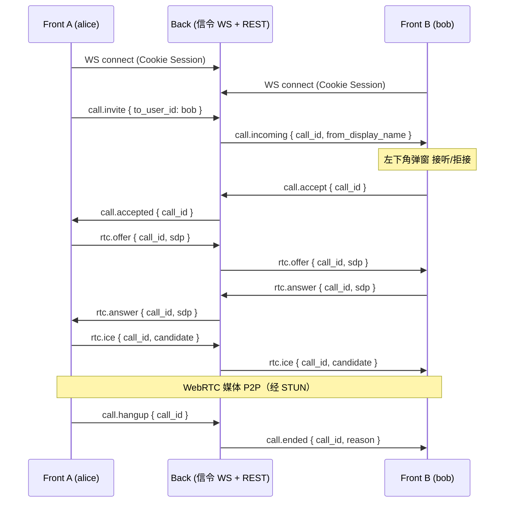

# 账号间 WebRTC 通话（PRD）

## 文档定位

- 本文定义演示平台 **账号对账号实时通话（第一期：1:1 音频为主）** 的产品与技术方案。
- 不替代 [README.md](../../README.md) 的三层边界；**实现完成后需同步 README、demo-walkthrough、demo-platform 地图、progress 与任务卡**。
- **Agent 不参与** 呼叫信令与媒体路径；遵循 **Front → Back**（HTTP + WebSocket），浏览器 **不得** 直连 Agent。
- 与智能对话（ChatDrawer / SSE）**并行存在**：来电弹窗挂载在 `AppLayout`，不依赖当前是否在对话抽屉内。

---

## 背景与动机

当前演示平台已有：

- Cookie Session 与 `user_id`（`GET /api/me`）；
- 种子账号 `admin` / `alice` / `bob`（见 [demo-admin-console.md](./demo-admin-console.md)）；
- 全局 ChatFab + ChatDrawer，无实时 P2P 能力。

需求：用 **两个浏览器、两个已登录账号** 演示「系统内互打电话」，用于协作演示、后续扩展远程协助等场景。仓库内 **尚无 WebRTC / WebSocket 信令** 实现，需从零增加 Back 信令层与 Front 媒体层。

---

## 执行摘要

| 能力 | 说明 |
|------|------|
| **通话页** | 路由 `/app/calls`：展示可呼叫用户列表，选择对方并「呼叫」 |
| **来电 UI** | 任意 `/app/*` 页 **左下角** 固定层弹窗：显示来电方昵称，**接听** / **拒接** |
| **通话中** | 接听后进入通话态：本地/远端音频（视频二期可选）、**挂断** |
| **信令** | Back **WebSocket** 交换 `offer` / `answer` / `ice-candidate` 与呼叫状态事件 |
| **媒体** | 浏览器 `RTCPeerConnection`；开发环境默认公共 STUN |

演示路径（建议写入 demo-walkthrough）：

1. 浏览器 A：`alice` 登录 → 通话页 → 呼叫 `bob`  
2. 浏览器 B：`bob` 登录任意页 → 左下角来电 → 接听  
3. 双方说话验证音频 → 任一方挂断 → 对方 UI 同步结束  

---

## 目标

1. **新页面可发起呼叫**：登录用户从列表选一个 **非本人** 的已启用用户并发起 1:1 呼叫。
2. **全局来电感知**：被叫在 **未打开通话页** 时也能收到来电弹窗（WebSocket 长连接在 `AppLayout` 级建立）。
3. **接听 / 拒接 / 挂断** 状态在双方 UI 一致；拒接或挂断后释放麦克风并关闭 PeerConnection。
4. **鉴权在 Back**：仅已登录 Session 可连信令；只能向 **存在的、非自己的** `user_id` 发起呼叫；信令消息带 `from_user_id` 由服务端根据 Session 覆写，**不信任客户端自报身份**。
5. **可测**：Back 信令单元/集成测试（mock WS）；Front 组件测试 + 可选 Playwright 双上下文手工脚本。

## 非目标（第一期不做）

- Agent / `client_actions` 触发呼叫或代拨号。
- 群组会议、通话录制、屏幕共享、聊天文字条。
- 通话历史持久化、未接来电列表、推送（浏览器 Push / 移动端）。
- 生产级 TURN 部署与运维文档（PRD 只约定配置项与本地 STUN 默认）。
- 按角色 RBAC 限制「谁能打给谁」（一期：凡登录用户可呼叫任意其他用户；见开放问题）。
- 视频为 **可选二期**；第一期 UI 以 **音频通话** 为主，若实现视频需同步更新权限与带宽说明。

---

## 用户故事

1. **alice** 打开「通话」页，看到用户列表（不含自己），点击 **bob** 旁的「呼叫」→ 状态变为「呼叫中…」，听到回铃（可选）或等待。  
2. **bob** 正在「学生管理」页 → 左下角出现来电条：「Alice 正在呼叫您」→ 点 **拒接** → 弹窗消失；alice 侧显示「对方已拒接」。  
3. **bob** 再次来电 → 点 **接听** → 进入通话页或全屏通话条，显示通话时长与 **挂断**；双方可对话。  
4. **alice** 点 **挂断** → bob 侧自动结束通话并释放设备。  
5. **admin** 呼叫 **alice** 时，alice 若已在与 bob 通话中 → Back 返回「忙线」或向主叫返回 `busy` 事件（一期建议 **忙线拒绝新来电**）。

---

## 架构与边界



| 层级 | 职责 |
|------|------|
| **Front** | 通话页 UI；`call` Pinia store；`RTCPeerConnection`；`getUserMedia`；`AppLayout` 内 WS 客户端 + `IncomingCallToast`；挂断/拒接 |
| **Back** | `GET /api/calls/peers` 可呼叫用户列表；`WS /api/calls/ws` 信令中继与房间状态；Session 校验；**不转发媒体** |
| **Agent** | 无 |

硬约束（与 [AGENTS.md](../../AGENTS.md) 一致）：

- 浏览器只连 Back；信令 URL 与 API 同域或配置 `VITE_BACK_ORIGIN`。
- `user_id` 以 Session 为准；信令 payload 中的 `from_user_id` 由 Back 注入。
- 不与 `thread_id`、checkpoint 产生耦合。

---

## 页面与交互

### 路由与导航

| 项 | 值 |
|----|-----|
| 路径 | `/app/calls` |
| 路由名 | `app-calls` |
| 权限 | `requiresAuth: true`（所有登录用户） |
| 侧边栏 | 新增菜单项 **「通话」**（位于「学生管理」之后） |

### 通话页（`CallsView`）

布局建议（Naive UI，与 [StudentsView](../../front/src/views/StudentsView.vue) 风格一致）：

- 标题：「通话」
- 表格或列表列：`display_name`（fallback `username`）、`username`、操作「呼叫」
- 顶部状态区（按 store 状态切换）：
  - `idle`：仅列表
  - `outgoing`：「正在呼叫 {name}…」+ **取消呼叫**
  - `in_call`：「与 {name} 通话中」+ 计时 + **挂断**；可选 `<audio autoplay>` 绑定远端 `MediaStream`
- 列表数据：`GET /api/calls/peers`（排除当前用户；可按 `username` 排序）

### 来电弹窗（全局）

- 挂载位置：[AppLayout.vue](../../front/src/components/layout/AppLayout.vue)（与 `ChatFab` 同级），`position: fixed; left: 16px; bottom: 16px; z-index` 高于内容、低于全屏 modal（建议 `z-index: 2000`）。
- 仅当 `callStore.incomingCall !== null` 显示。
- 内容：来电方 `display_name`、次要文案「语音通话」、按钮 **接听**（primary）、**拒接**（default）。
- 拒接：发送 `call.reject`，关闭弹窗，不申请麦克风。
- 接听：发送 `call.accept`，跳转 `router.push({ name: 'app-calls' })` 或在弹窗升级为迷你通话条（二选一，**建议跳转通话页** 以复用同一套 in-call UI）。

### 通话中挂断

- 主叫/被叫共用 **挂断** 按钮 → `call.hangup` + 本地 `peerConnection.close()` + `getUserMedia` tracks `stop()`。
- 收到 `call.ended` / `call.rejected` / `call.busy` / `call.failed` 时同样清理。

### 与 ChatDrawer 的关系

- 来电弹窗在 **左下**；ChatFab 在 **右下**（现有）。两者不互斥，但同时来电时仅展示一条来电（一期单通话）。

---

## Back API 与信令契约

### REST

#### `GET /api/calls/peers`

- 鉴权：Session 必填。
- 响应：`{ "items": [ { "user_id", "username", "display_name" } ] }`
- 规则：返回 `users` 表中所有用户 **除当前 Session 用户**；一期不过滤 `is_admin`。
- 实现可复用 [admin/users.py](../../back/src/admin/users.py) 的查询逻辑，但路由放在 **非 admin** 命名空间（普通登录即可）。

### WebSocket

#### 连接

- URL：`GET` upgrade → `WS /api/calls/ws`（或 `/api/ws/calls`，实现时二选一并写死 README）。
- 鉴权：握手时读取 Session（与 HTTP 相同 Cookie）；失败则 `4401` 关闭。
- 连接成功后服务端推送：`{ "type": "connected", "user_id": "..." }`。

#### 服务端维护状态（内存，一期）

每个 `call_id`（UUID）：

- `caller_id`, `callee_id`
- `state`: `ringing` | `accepted` | `ended`
- 关联双方 WS 连接（用户不在线则 `call.failed` / `callee_offline`）

用户级：

- `user_id → WebSocket` 映射（单连接：新连接踢掉旧连接或拒绝第二条，**建议踢掉旧连接** 并推送 `session.replaced`）。

#### 客户端 → 服务端消息

| type | 字段 | 说明 |
|------|------|------|
| `call.invite` | `to_user_id` | 发起呼叫；服务端生成 `call_id`，向 callee 发 `call.incoming` |
| `call.cancel` | `call_id` | 主叫取消（响铃阶段） |
| `call.accept` | `call_id` | 被叫接听 |
| `call.reject` | `call_id` | 被叫拒接 |
| `call.hangup` | `call_id` | 任一方挂断 |
| `rtc.offer` | `call_id`, `sdp` | SDP offer 字符串 |
| `rtc.answer` | `call_id`, `sdp` | SDP answer |
| `rtc.ice` | `call_id`, `candidate` | `RTCIceCandidate` JSON（`candidate`, `sdpMid`, `sdpMLineIndex`） |

校验：

- 仅 `caller_id` 可 `call.cancel`；仅 `callee_id` 可 `call.accept` / `call.reject`；双方均可 `call.hangup` 与 `rtc.*`（且必须属于该 `call_id` 参与方）。
- `to_user_id` 不得等于当前用户；目标用户必须存在。

#### 服务端 → 客户端消息

| type | 字段 | 说明 |
|------|------|------|
| `call.incoming` | `call_id`, `from_user_id`, `from_display_name` | 被叫响铃 |
| `call.ringing` | `call_id`, `to_user_id` | 主叫：对端已开始响铃（可选） |
| `call.accepted` | `call_id` | 被叫已接听，双方可开始交换 SDP |
| `call.rejected` | `call_id` | 被叫拒接 |
| `call.canceled` | `call_id` | 主叫取消 |
| `call.ended` | `call_id`, `reason` | 挂断；`reason`: `hangup` \| `peer_disconnected` \| `error` |
| `call.busy` | `call_id` | 被叫正在其他通话 |
| `call.failed` | `call_id`, `code` | 如 `callee_offline`, `invalid_state` |
| `rtc.offer` | `call_id`, `sdp` | 转发 |
| `rtc.answer` | `call_id`, `sdp` | 转发 |
| `rtc.ice` | `call_id`, `candidate` | 转发 |

错误统一：`{ "type": "error", "code": "...", "message": "..." }`。

---

## Front 技术方案

### 模块划分

| 模块 | 路径建议 |
|------|----------|
| API | `front/src/api/calls.ts` — `fetchPeers()` |
| Store | `front/src/stores/call.ts` — 状态机、`RTCPeerConnection`、WS 收发 |
| WS 封装 | `front/src/composables/useCallSignaling.ts` — 连接、重连、心跳 |
| 页面 | `front/src/views/CallsView.vue` |
| 来电 UI | `front/src/components/call/IncomingCallToast.vue` |
| 类型 | `front/src/types/call.ts` |

### 状态机（Pinia）

```
idle → outgoing (invite) → in_call (accepted + PC connected)
idle → incoming (incoming toast) → in_call (accept)
outgoing → idle (reject | cancel | failed | hangup)
in_call → idle (hangup | ended)
```

### WebRTC

- 第一期：`audio: true`, `video: false`（或 `video` 默认 false，设置项二期）。
- `RTCPeerConnection` 配置：

```ts
{
  iceServers: [{ urls: import.meta.env.VITE_WEBRTC_STUN_URL ?? "stun:stun.l.google.com:19302" }]
}
```

- 流程：`invite` 后等待 `call.accepted` → caller 创建 offer → answer → trickle ICE。
- 断开：关闭 PC、停止所有 `MediaStreamTrack`。

### WebSocket 生命周期

- 在 `AppLayout` `onMounted`：已登录则 `connectSignaling()`；`onUnmounted` / logout 时 `disconnect()`。
- 断线重连：指数退避，最大 30s；重连后 **不自动恢复通话**（一期视为挂断）。

### 环境变量（Front）

| 变量 | 说明 |
|------|------|
| `VITE_WEBRTC_STUN_URL` | STUN 地址（可选，有默认） |
| `VITE_CALL_WS_PATH` | 可选，默认 `/api/calls/ws` |

Back 若需 CORS / WS 同源：开发时 Vite proxy 将 `/api` 代理到 `8080`（与现有 chat API 一致）。

---

## Back 技术方案

| 项 | 说明 |
|----|------|
| 路由 | `back/src/api/call_routes.py` + `back/src/services/call_signaling.py` |
| 依赖 | FastAPI `WebSocket`；现有 Session 中间件 |
| 进程模型 | 单进程内存路由表（演示足够）；**多 worker 部署时一期不支持**（README 需注明） |
| 测试 | `back/tests/test_call_signaling.py` — TestClient 双 WS 客户端模拟 invite/accept/sdp |

不在 `common_agent_back` 新增通话历史表（一期）。

---

## 安全与隐私

- 所有信令经 Back 鉴权；禁止匿名 WS。
- 不记录 SDP/ICE 到数据库（一期）。
- `getUserMedia` 需用户手势触发：**接听** 按钮作为手势入口（符合浏览器策略）。
- 生产需 HTTPS（`localhost` 开发例外）；WSS 与 Secure Context。
- 限流（二期）：同一用户每分钟 invite 次数。

---

## 测试计划

### Back

- 未登录 WS → 关闭 / 401。
- A invite B → B 收到 `call.incoming`；B reject → A 收到 `call.rejected`。
- accept 后 offer/answer/ice 双向转发字段不丢。
- B 离线 → A 收到 `call.failed` `callee_offline`。
- B 通话中 → A 新 invite → `call.busy`。

### Front（Vitest）

- `call` store：状态迁移（mock WS）。
- `IncomingCallToast`：渲染来电方名称；emit accept/reject。

### 手工（demo-walkthrough 新小节 B5）

- 双浏览器 / 双 Profile：`alice` 呼叫 `bob`，接听、挂断各一次。
- 被叫在 `/app/students` 页验证左下角弹窗。
- 拒接后主叫状态恢复 `idle`。

---

## 任务卡（`docs/prompts/`）

| ID | 任务卡 | 范围 | 依赖 | 落地状态 |
|----|--------|------|------|----------|
| 111 | [111-webrtc-back-signaling.md](../prompts/111-webrtc-back-signaling.md) | Back：`GET /api/calls/peers` + `WS /api/calls/ws` + 测试 | 110 | ⬜ |
| 112 | [112-webrtc-front-calls-page.md](../prompts/112-webrtc-front-calls-page.md) | Front：call store、WS、通话页、侧边栏 | 111 | ⬜ |
| 113 | [113-webrtc-front-incoming-audio.md](../prompts/113-webrtc-front-incoming-audio.md) | 左下角来电、WebRTC 音频、挂断 | 112 | ⬜ |
| 114 | [114-webrtc-docs-final-alignment.md](../prompts/114-webrtc-docs-final-alignment.md) | README、demo-walkthrough B5、demo-platform 地图 | 111–113 | ⬜ |

进度总览：[docs/progress.md](../progress.md)。

---

## 开放问题

| # | 问题 | 一期建议 |
|---|------|----------|
| 1 | 是否只允许呼叫「同角色」用户？ | **否**，任意登录用户互拨，便于 alice↔bob 演示 |
| 2 | 视频是否入一期？ | **否**，仅音频；UI 预留「语音通话」文案 |
| 3 | 主叫取消 vs 被叫拒接文案区分？ | 区分：`对方已拒接` / `已取消呼叫` |
| 4 | 多标签页同账号登录？ | 后连 WS 踢前者；被踢标签显示「连接已替换」 |
| 5 | TURN 何时必须？ | 对称 NAT / 跨网段失败时再配；PRD 记录 `VITE_WEBRTC_TURN_*` 为二期 |

---

## 文档与契约变更清单（实现后）

- [README.md](../../README.md)：新增「通话」模块说明、WS 路径、环境变量；明确 Agent 不参与。
- [docs/maps/demo-platform.md](./maps/demo-platform.md)：路由表 + 信令序列。
- [docs/demo-walkthrough.md](./demo-walkthrough.md)：B5 双账号通话脚本。
- [docs/progress.md](./progress.md)：任务 111–114 与 PRD 链接。

---

## 修订记录

| 日期 | 说明 |
|------|------|
| 2026-05-27 | 初稿：通话页、左下角来电、接听/拒接/挂断、Back WS 信令、任务拆分建议 |
| 2026-05-27 | 规划：任务卡 **111–114** 与 progress 登记 |
